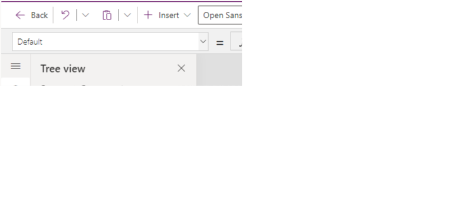
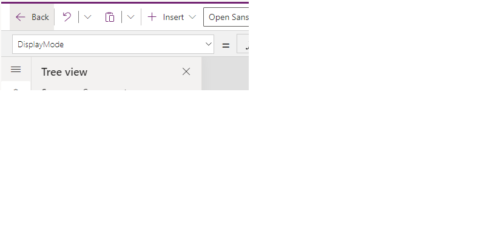
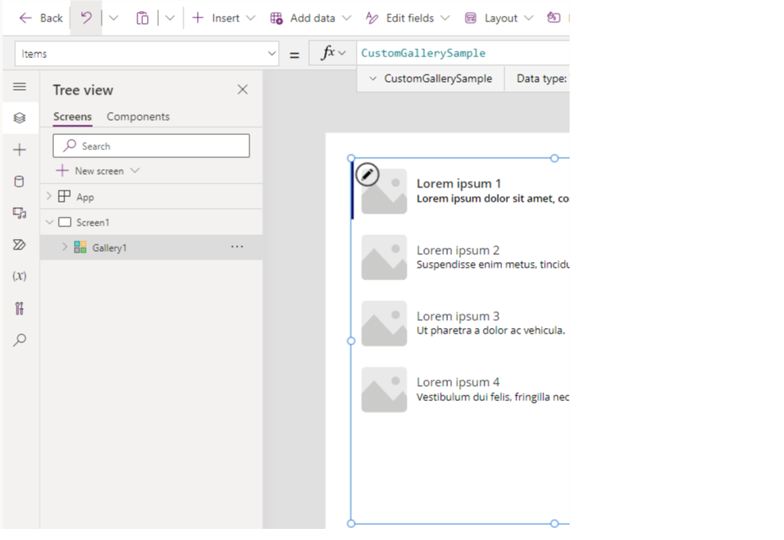
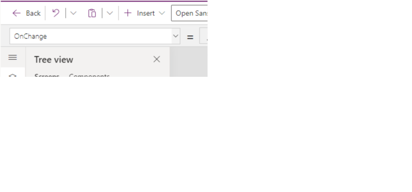
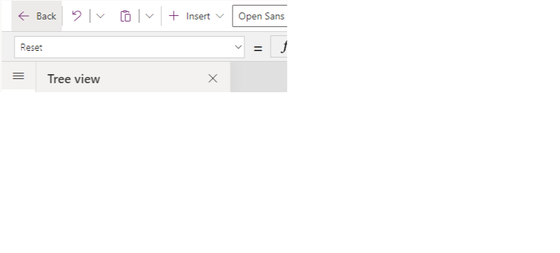
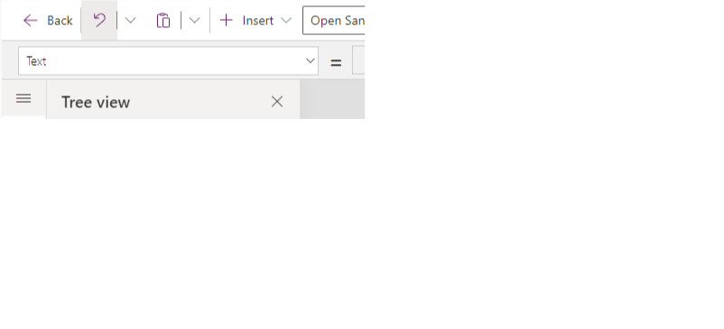
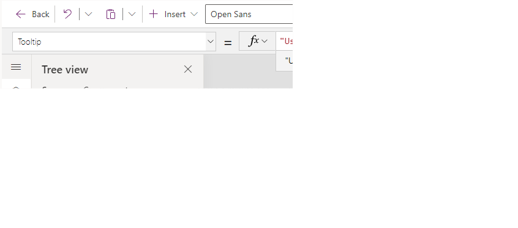

Controls are one of the biggest components of a Power App because implementation determines how your app interacts with your data, what actions are available to a user, and what conditions might need to be met before another action can be taken. You can configure the appearance and behavior of a control by setting one of its properties. Because controls are designed with specific use cases in mind, the properties for each control are slightly different. Let's take a look at some important properties to be aware of using a text and gallery control as an example.

-   **Default** - The initial value of a control before it’s changed by the user. For example, when working with a Drop-down control you could set the default value to appear when users see the control.

	> [!div class="mx-imgBorder"]
	> 

-   **DisplayMode** - Values can be **Edit, View,** or **Disabled**. Configures whether the control allows user input (**Edit**), only displays data (**View**), or is disabled (**Disabled**). For more information about display modes, see Use basic formulas to make better canvas apps in Power Apps learning path.

    > [!div class="mx-imgBorder"]
	> 

-   **Items** - The source of data that appears in a control such as a gallery, list, or chart.

    > [!div class="mx-imgBorder"]
	> 

-   **OnChange** - How the app responds when the user changes the value of a control. For example, when a user selects a different value in a Dropdown control.
    
	> [!div class="mx-imgBorder"]
	> 

-   **OnSelect** - How the app responds when the user taps or selects a control.
    
	> [!div class="mx-imgBorder"]
	> 

-   **Reset** - Whether a control reverts to its default value. For more information, see [Reset function in Power Apps](/power-apps/maker/canvas-apps/functions/function-reset/?azure-portal=true).

	> [!div class="mx-imgBorder"]
	> 

-   **Text** - Text that appears on a control or that the user types into a control.

	> [!div class="mx-imgBorder"]
	> 

-   **Tooltip** - Explanatory text that appears when the user hovers over a control.

	> [!div class="mx-imgBorder"]
	> 

-   **Visible** - Whether a control appears or is hidden.

	> [!div class="mx-imgBorder"]
	> 

To view a list of all the controls and their properties, see [Controls and properties in Power Apps](/power-apps/maker/canvas-apps/reference-properties/?azure-portal=true).