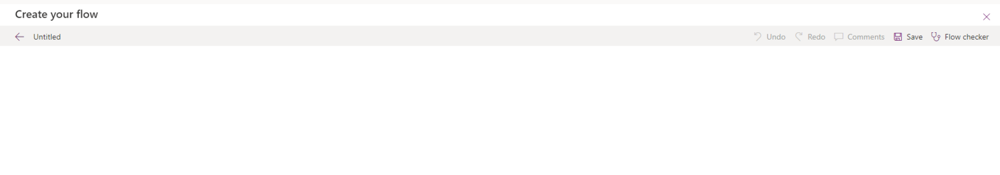
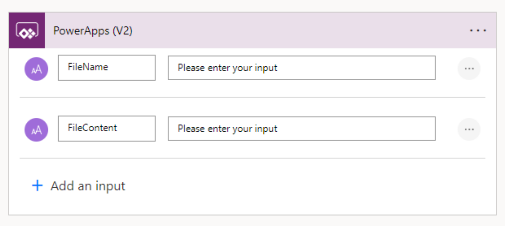
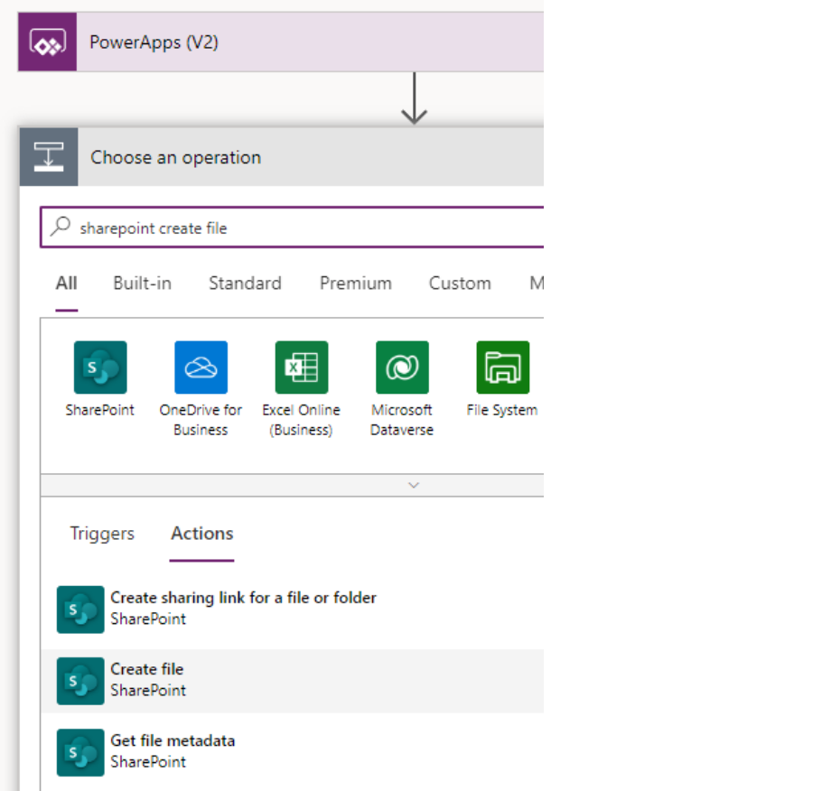
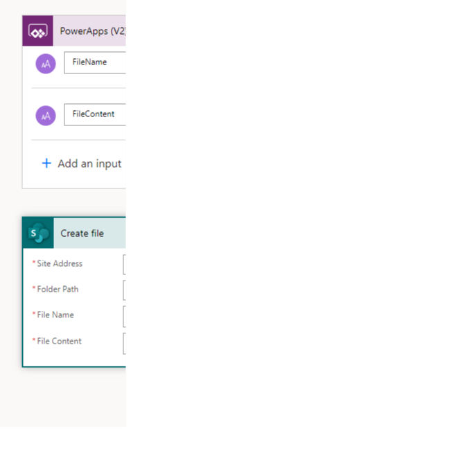
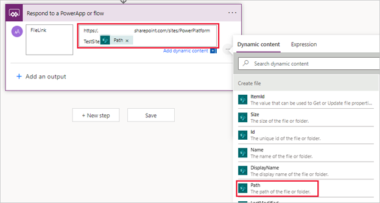

It's possible to save a file to a SharePoint document library using Power Apps and a simple Power Automate flow. In this unit, we learn how to do that with a hands-on exercise. This technique involves using an attachment control (from a form control) and an image control along with a flow to send a modestly sized, single file to a SharePoint document library.

## Introduction

What we're going to do is to use the attachment control to load our file into Power Apps. Then we use an image control to display our file in base 64 format. We then capture the JSON of the base 64 code from the image control and pass that code to Power Automate. Power Automate recodes the base 64 code to binary code and create a file in our document library. Finally, we pass a link to the file back to Power Apps to enable us to open the saved file in our browser.

To begin this technique, first determine a SharePoint document library where you're saving the file. You also need a SharePoint list that we can temporarily connect to our app so that we can add an **Edit form** to the app. We must use a list, because that is how we can grab an attachment control; a document library can't add attachments.

Let's follow these steps together.

## Exercise

1. Go to the [Power Apps Maker Portal](https://make.powerapps.com/?azure-portal=true) and create a new **Blank Canvas** app.

1. Add SharePoint as a data source. Select **connect to data** from the new blank canvas screen or the **Add data** button.

1. In the **Select a data source** popup, find and select **SharePoint**.

   > [!NOTE]
   > If you are unfamiliar with SharePoint, please refer to this module regarding creating and using your SharePoint site with Power Apps. [Get started with Power Apps and SharePoint.](/training/modules/get-started-power-apps-sharepoint/?azure-portal=true)

1. In the **Connect to a SharePoint site** panel that appears on the right side of the screen, select your SharePoint site, or enter the site URL (for the SharePoint home page) in the URL input field.

1. In the **Choose a list** panel, select both a list and a document library to use for the app, then select **Connect**. Remember, we only use the list so that we can use the form control that includes attachments, so choose a small list with limited columns for best results. Before we move on, your app should now show two items in the **Data** tab, a SharePoint document library and a SharePoint list.

### Add the needed controls

1. Insert an **Edit form** into the app, by selecting **Insert** > **Edit form**.

1. To connect the form to your SharePoint list, look at the Properties panel on the right side of your screen, and select your SharePoint list from the **Data source** dropdown.

1. Within your **Edit form** control, find and select the **Attachments** control. You don't need the entire data card, just the Attachments control itself. In the Tree view, the Attachments control has a small paper clip icon to the left of the name that starts with **DataCardValue**. Copy the Attachments control.

1. Now paste your Attachments control on your canvas screen. You might notice that your app is showing errors. That's because you pasted a copy of this control outside of the form where it was integrated. We'll fix this momentarily.

1. Delete the **Edit form** control from your app, but not the Attachment control you just pasted. We only added the Edit form control so we could copy the Attachment control, so we no longer need it.

1. Let's fix the errors in our Attachment control. First resize it and place it in the upper right corner of your screen. We need to correct some errors within the control properties because it's still behaving as though it's part of a form control. Once you complete the following property changes, your control won't have any errors:

   **Items** - delete *Parent.Default* and leave it blank

   **BorderColor** - delete the entry and make it *Color.Black* (or an appropriate color)

   **Tooltip** - delete *Parent.Default* and leave it blank

   **DisplayMode** - delete *Parent.Default* and make it *DisplayMode.Edit*.

1. Change the name of your Attachment control to something meaningful like **AttachmentControl**. (In our formulas below we use the name AttachmentControl.)

1. Insert an **Image** control on your screen (outside of the attachment control).

1. Update the **Image** property of your Image control to:

   `Last(AttachmentControl.Attachments).Value`

### Create the flow

1. Now that we have the controls that we need, let's create a Power Automate flow. We can do this within Power Apps by selecting the **Power Automate** button from the left-side navigation rail to bring up the Power Automate panel.

1. From the Power Automate panel, select **Create new flow**.

1. From the **Create your flow** popup, select **+ Create a flow**.

1. Your **Create your flow** canvas appears, showing an untitled flow with Power Apps as the trigger. Select the **PowerApps (V2)** action, and then select **+ Add an input**.

   > [!div class="mx-imgBorder"]
   > [](../media/powerapps.svg#lightbox)

1. Change the *Input* to **FileName**.

1. Select  **+ Add an input** again, and change this new *Input 1* to **FileContent**.

   > [!div class="mx-imgBorder"]
   > [](../media/powerapps-input.svg#lightbox)

1. Select **+ New Step**  icon to add an action.

1. In the **Choose an operation** dialog, search for, and select the SharePoint **Create file** operation.

   > [!div class="mx-imgBorder"]
   > [](../media/create-file.svg#lightbox)

1. Once you insert the **Create file** action, you need to fill in four mandatory entries. For **Site Address**, select the site address from the dropdown. It should be the same SharePoint site from where you attached the document library to the app.

1. For **Folder Path**, notice that the prompt lets you know that you must start with an existing library. A folder icon appears on the right side of the field. You can select that icon, and then find and select the folder where you want to save the file.

1. For the file name, we're going to get that from Power Apps. Place your cursor in the **File Name** input field and select **FileName** in the Dynamic content popup. When you do this, Power Automate populates this field with a dynamic input from your *PowerApps (V2)* trigger.

1. Place your cursor in the **File Content** input field. Pay close attention to this step. Switch to the **Expression** tab in the dynamic content popup, by selecting **Expression**. We're going to use the expression `base64toBinary` to change our input from Power Apps to binary data. Begin inputting `base64toBinary` in the expression field and select `base64toBinary`. Next add a parenthesis, then with your cursor between the parentheses, switch back to your **Dynamic content** tab and select `FileContent`. In the expression field, you should now see the following formula:

   `base64ToBinary(triggerBody()['text_1'])`

1. Select **OK**. In your **Create file** action, you should now have values for all four inputs, with your **File Content** input showing an ***fx*** input with the `base64toBinary` formula. You can hover over this input and see the formula we created.

   > [!div class="mx-imgBorder"]
   > [](../media/base-binary.svg#lightbox)

1. At this point, our flow takes the file name and the file content from Power Apps, and it creates a file in our designated SharePoint document library. For the last part of this flow, let's return the link to our newly created file to Power Apps. Select **+ New step** to add another action.

1. In the **Choose an operation** input field, type *powerapps*. Then select **Respond to a PowerApp or flow**.

1. In the **Respond to a PowerApp or flow** action, select **+ Add an output**.

1. Select **Text**.

1. Where it says **Enter a title** type: *FileLink*

1. Where it says **Enter a value to respond**, let's select some combined text and dynamic content. First, enter the home page address for your SharePoint site. It should match the address for your Create file step in the flow (it begins with https and ends with the name of your SharePoint site). After that select **Path** from the dynamic content of your Create file step.

   > [!div class="mx-imgBorder"]
   > [](../media/path.png#lightbox)

1. Rename your flow to something like **SaveImageToSharePoint**.

1. Save your flow. Power Apps saves the flow and lists it in the Power Automate tab so we can use it in our app.

### Complete the app

1. Back on your app screen, let's add a **Button** control and rename it *Upload File*. Go to the **OnSelect** property for your button. Here's where we need to use some text manipulation to create the base 64 text string that we feed our Power Automate flow. Here's an example of the code we're going to input:

   ```powerappsfl
   Set(varImageJSON, JSON(imageControlName.Image, JSONFormat.IncludeBinaryData));

   Set(varImageB64, Mid(varImageJSON, Find(",", varImageJSON) + 1, Len(varImageJSON) - Find(",",varImageJSON) - 1) );

   Set(varFileLink, YourFlowName.Run(Last(AttachmentControl.Attachments).Name, varImageB64).filelink);

   Reset(AttachmentControl)
   ```

   Here's the explanation of what's happening in this code, line-by-line:

   - **First** - We're creating a variable with the JSON text string from our image control. In the formula, replace *imageControlName* with the name from your image control

   - **Second** - We're creating a base 64 text string from our JSON text string. Our JSON text string includes the base 64 text string, we just need to cut off the ends; that's what this formula does. We define where we want to start the string with the **Mid** function. We find the comma in our image JSON variable and start at the next text position, then we subtract one position at the end. This formula provides a usable base 64 text string.

   - **Third** - We pass two inputs to our flow, the name of the file (which comes from our attachments control) and the base 64 text string as the file content. We're also setting up a variable called *varFileLink* based on the link being returned from Power Automate.

   - **Fourth** - We're resetting our attachment control, so that we can add another file.

1. Once you paste the sample text, replace the control names with the actual names of the attachment and image controls in your app (it might be helpful to return to the tree view).

1. Add a second button control and title it **View file**.

1. Make the **OnSelect** property of the new button: `Launch(varFileLink)`. The new button takes us to that file so we can view it in our browser.

### Test your app

1. Put your app in **Preview** mode and attach a file to your attachment control. You can either select one from your computer or you can drag and drop a file into the attachment control. If you attach an image, a thumbnail appears in your image control.

1. Select your **Upload File** button. After a moment, your image disappears from the image control.

1. Select your **View File** button. One of three things happens. If you uploaded an image, the image file opens in a separate browser tab. If you submitted a document or spreadsheet, it opens the file in a desktop or browser app. Other file types might download to your browser and give you the option to open them.

## Next steps (optional)

Congratulations! You created an app with the ability to upload a file to a SharePoint document library through Power Apps. There's nothing else you need to do, but you can take this functionality to the next level with the following steps:

1. Make your image control invisible. **Do not delete it**. However, it's unnecessary to view this control. It just needs to be part of the app. Therefore, you might want to rename it with something including **DoNotDelete**. You can also resize it and move it somewhere inconspicuous.

1. Copy your code from the **Upload File** button and add it to the **OnAddFile** property of your **Attachment** control. Then you can delete the Upload File button.

1. With the drag and drop capability of this control, you can erase the text in the **NoAttachmentsText** and the **AddAttachmentText** and make the fill *transparent*. You can add text or an image behind it so that your users get the idea to drag and drop a file in it.

1. With the data coming back from the flow, you can use the link anywhere else in your app.

1. You can insert a gallery into your app with the **Items** property pointing to your SharePoint document library. You can then use the item's **Thumbnail** with the image control in the gallery, with a formula for the **Image** property such as: `ThisItem.Thumbnail.Small`. The Thumbnail record is powerful and comes in sizes **Large**, **Medium** and **Small**. It depicts a viewable portion of just about any file.

## Summary

Using the Attachment control with an image control and a simple flow is a powerful way to save a file to a SharePoint document library from Power Apps. You can add this functionality to any portion of your app where you want to save a file. Understanding that the image control you inserted with the attachments control provides the JSON text string, with the base 64 text string imbedded in it, is the key to this working. The Power Automate step that turns the base 64 into binary data is all that Power Apps needs to deposit your file into a SharePoint document library.
