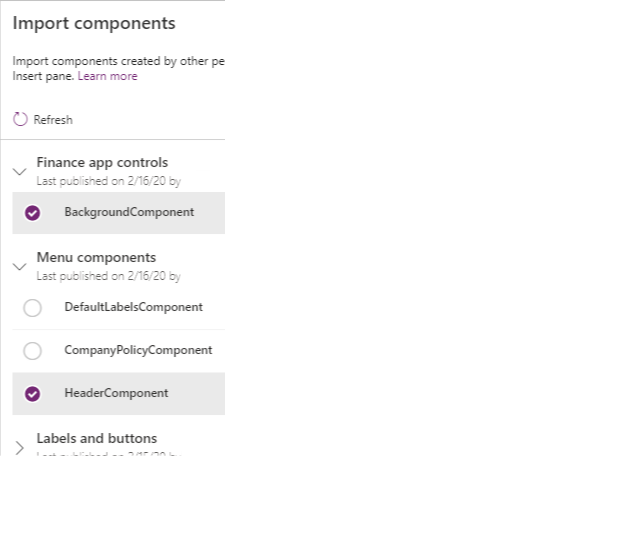
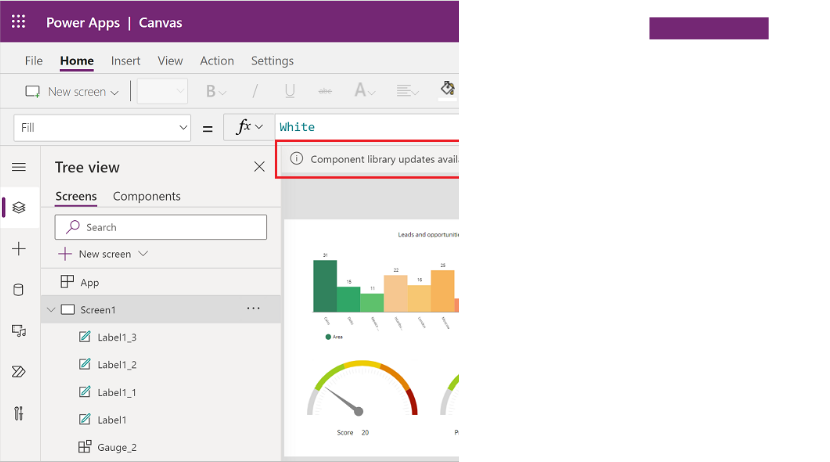
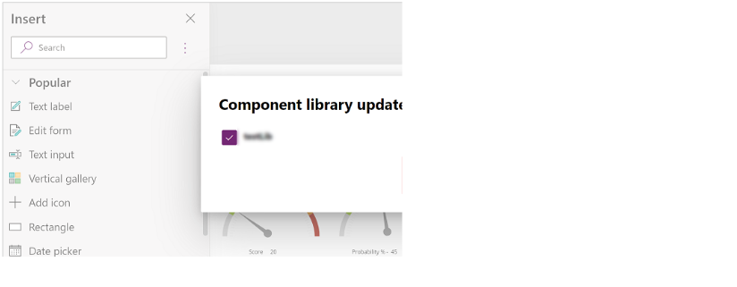
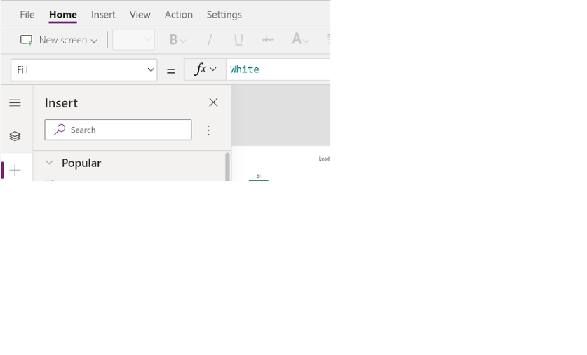
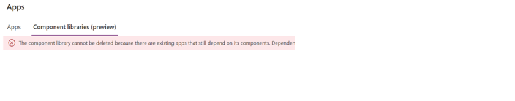

As an app maker that is designing controls, you might find that you're making the same type of control over and over. For example, an organization might want all their applications to contain a header that includes items such as a menu control, and a series of buttons for navigation. While the items displayed in the menu and the individual screens you're navigating to might be different from app to app, the process for creating the menu and the buttons is going to be the same.

To simplify this process, organizations can create component libraries. Component libraries are containers of component definitions that app makers can easily reuse across multiple applications. Instead of creating the same application header over and over in different applications, an organization can provide the application header in a component library. Makers select the component they want to use, and configure it based on the application they're deploying it to.

Component libraries make it easy to:

- **Discover and search components:** App makers can easily search for different components within your organization and insert them into their individual applications, which reduces the amount of time they spend while making apps.

- **Easily publish updates:** When a change is made to a component in a library, the updates are available to all makers as they access the components.

- **Notify app makers of available component updates:** One of the many advantages to using a component library is that an app maintains dependencies on the components it uses. App makers are alerted when the updates to dependent components become available.

Component libraries are the recommended way to reuse components across apps. They can significantly simplify the process of making apps.

While the primary focus in this module is to introduce what a component library is and how to use the components in them, if you want to learn more about creating components, see: [Canvas component overview](/power-apps/maker/canvas-apps/create-component/?azure-portal=true).

## Work with component libraries

Component libraries can be accessed in the Power Apps Maker portal by going to **Apps**, and then select **Component Libraries**. After a component library is created, published, and shared with you, your apps can consume the components from this component library by importing the library.

To import from a component library, edit an existing app or create a new app. After the app opens in canvas app studio, select **Insert** or the **+** on the left navigation. Then select **Get more components** to list the component libraries available in the current environment:

> [!div class="mx-imgBorder"]
> 

You see the list of component libraries available in the current environment on the right side of the screen. Select an individual component from a component library. Or use **Select all** to import all of the components from the library at once:

> [!div class="mx-imgBorder"]
> 

> [!div class="mx-imgBorder"]
> 

## Work with updated components

From time-to-time changes might be made to a component. For example, you might update the color of a button, or if it's a component that contains visuals such as charts, there might be changes to some of the visuals. Once a component is updated and published existing apps that use the component library can also be updated to reflect the changes.

There are two ways apps using the components from library can get the latest changes.

### Method 1: Component update notification on app edit

Makers of other apps are notified of updated components being available. The notification appears when makers edit the apps in canvas app studio. They can choose to update the components:

> [!div class="mx-imgBorder"]
> 

Select **Review**, and you see the option to update the component:

> [!div class="mx-imgBorder"]
> 

Select **Update** to update the components.

> [!div class="mx-imgBorder"]
> 

### Method 2: Proactive check for updates

This method is to check for the app update proactively while working on the app in Studio.

To do this check, select Insert component panel on the left-side, and then select **...** (ellipsis) next to the search button. And then, select **Check for updates**.

> [!div class="mx-imgBorder"]
> 

If there are updates in the components used from library, the maker gets the message to review and get the latest changes. Upon review and update, the app gets updated with the latest components.

## Delete a component library

If a canvas app references a component library, the component library can't be deleted. This is true for both Power Platform and non-Power Platform environments. Remove the component from the app before deleting the library. You can find information about the apps using the component library in:

- Either the solution dependencies view,

- Or the message that is shown when you try to delete a library.

> [!div class="mx-imgBorder"]
> 

## Component library permissions

Sharing a component library works the same way you share a canvas app. When you share a component library, you allow others to reuse the component library. Once shared, others can edit the component library and import components from this shared component library for creating and editing apps. If shared as a co-owner, a user can use, edit, and share a component library but not delete or change the owner.

Other considerations when sharing component libraries to security groups:

- You can't use the [sharing UI](/power-apps/maker/canvas-apps/share-app?azure-portal=true#share-an-app) when sharing component libraries created as part of a solution. Instead, use the [Set-PowerAppRoleAssignment cmdlet](/powershell/module/microsoft.powerapps.administration.powershell/set-adminpowerapproleassignment?azure-portal=true#parameters) with **CanEdit** permission level to share the component libraries with the selected security group.

- Component libraries created in a Power Platform environment [without a Dataverse database](/power-platform/admin/create-environment?azure-portal=true#create-an-environment-in-the-power-platform-admin-center) shared as **Co-owner** automatically grant **CanEdit** permission to the selected security group.

## Power Platform creator kit

Organizations are always looking to streamline their app creation process and provide consistent experiences across applications. One-way organizations can do this is by using the Creator Kit. The Creator kit helps create Power Apps experiences on the web and mobile platforms with convenient components that are ubiquitous in modern software. The kit contains:

- A component library,

- Several commonly used [Power Apps component framework controls](/power-apps/developer/component-framework/overview/?azure-portal=true),

- A set of templates,

- Other utilities that increase developer productivity.

The Creator Kit isn't typically used by traditional app makers. It's often used by developers. All controls and components included in the kit use the [Fluent UI](https://developer.microsoft.com/fluentui#/?azure-portal=true) framework to help you easily create consistent, beautiful, and effective user experiences for custom business applications.

To learn more about using the Power Platform Creator Kit, see: [Power Platform Creator Kit.](/power-platform/guidance/creator-kit/overview/?azure-portal=true)
