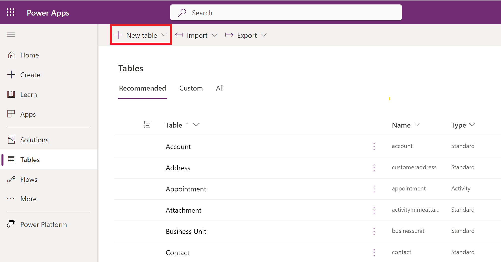
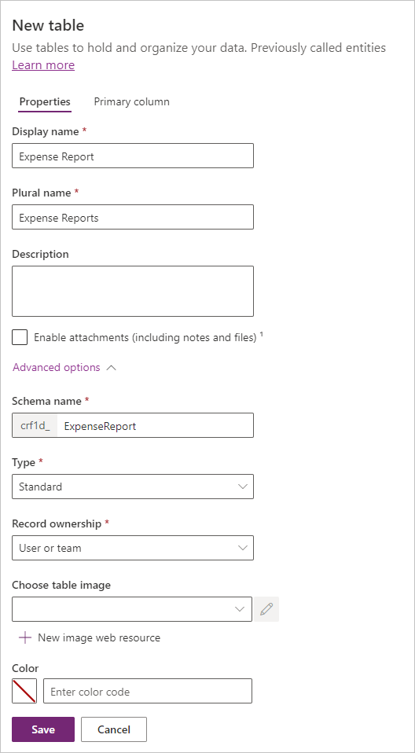
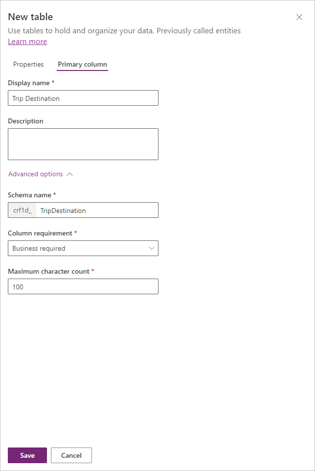
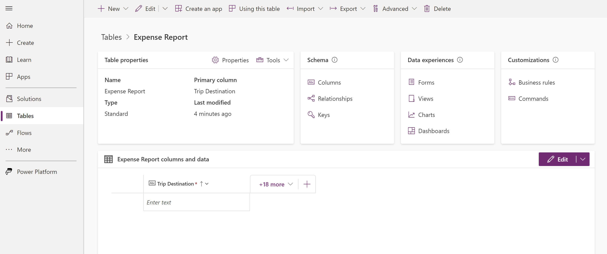
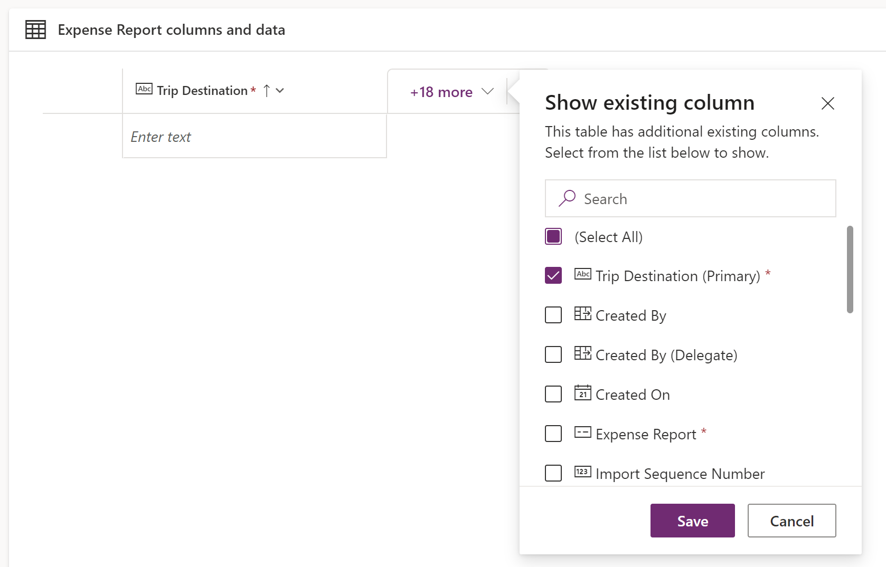
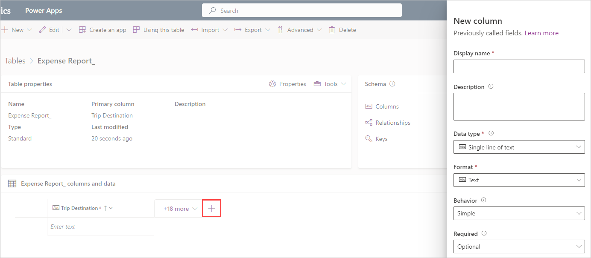
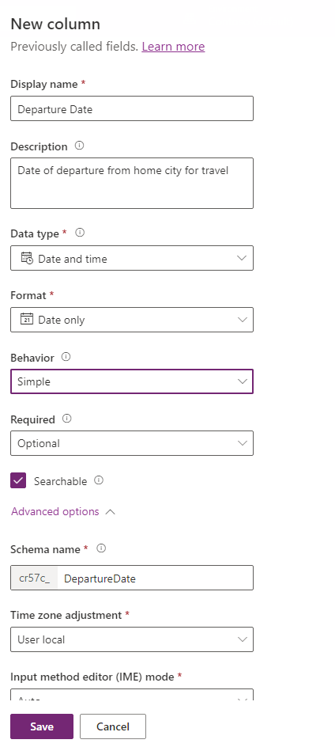
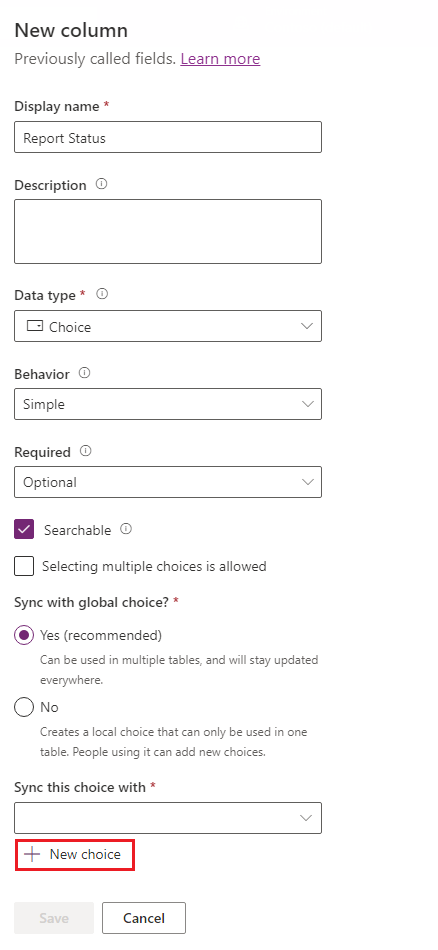
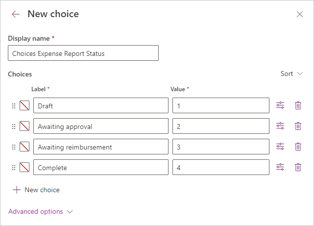

While using predefined tables in Dataverse is quick and simple, you might not always find one that fits your business needs. In this exercise, you use the Expense Report table to practice creating a custom table.

### Create a new table

To create a new table in Dataverse, follow these steps:

1. In your browser, go to [https://make.powerapps.com](https://make.powerapps.com/?azure-portal=true). From the left navigation menu, select **Tables**. If you don't see the Tables on the left select **More** and  the flyout menu will contain **Tables**.

1. Select **New table** at the top.

    > [!div class="mx-imgBorder"]
    > 

    A flyout **New table** pane opens on the right side of your screen, enabling you to input information about your new table. The **Display name** field is shown first and it becomes the name of the table in Dataverse. You use the **Plural name** in model-driven apps and when you're writing to Dataverse through Microsoft Power Automate. If you enter a display name, you'll notice how the **Plural name** autopopulates with an "s" after it, but you can also change the plural version manually. For this exercise, you keep your display name singular and your plural name as something that makes logical sense. The next field is **Description**.

    You can also include attachments by selecting the box **Enable attachments**, which is just under the **Description** field. If your scenario includes taking pictures of receipts or plane tickets, you might want to select this feature. The subject of attachments isn't covered in this learning path. You can enable attachments after creating the table, so you don't need to know on creation of the table whether your solution requires this functionality.

    Under **Advanced options**, you can find **Schema name**, which is a system table name. All custom tables begin with a series of letters and numbers, which will differ from tenant to tenant. This information can't be changed. Your system name should be similar to your display name but with no spaces or symbols other than an underscore. As you enter your display name, other names populate. In this case, you don't need to change the other names, but you should always ensure that they make sense.

    Other **Advanced options** include **Type** (which we leave as **Standard**), **Record ownership** (which defines who can perform operations on a row), **Choose table image** and **Color** (which allow for customization of the table and aren't covered in this module). If you continue scrolling down, you see other advanced options that aren't covered in this module.

    Now, you can select the **Primary Column** tab at the top. Here the **Display name** can be changed. This column isn't the **ID** column, but it acts as a primary field for users to distinguish records. This exercise uses trip destination because it's easily distinguishable for users. If you want to expand this table to all expense reports and not solely to travel-related expense reports, you would use something else, such as a title column. The **Primary Column** will always be a text column.

    Here you can also change the **Schema Name** of the primary column under **Advanced options**. Again, in this case, we shouldn't change this field.

1. Enter the table information to match the following screenshot and then select **Save**.

    > [!div class="mx-imgBorder"]
    > 

    > [!div class="mx-imgBorder"]
    > 

    After a few moments, your table will appear in the browser editor.

    > [!div class="mx-imgBorder"]
    > 

    On the bottom portion of the screen, you see the pane called **Expense Report columns and data**. Your primary column **Trip Destination** is there along with **18 more** that aren't displayed. You can select the **18 more** to see what other columns are currently available to display in your table. Dataverse has created several columns to help you organize and secure your information. All columns won't be used in this exercise; however, take a moment to look through them in case you need to use them later. Notice that there's a search field that enables quickly finding your data fields for inclusion.

    > [!div class="mx-imgBorder"]
    > 

### Create the columns

Now that you've created the table, you need to add a few more columns for your solution:

1. In the **columns and data** pane, select the plus (New column) button to the right of **18 more**. Doing so brings up a **New column** pane on the right side of the screen.

    > [!div class="mx-imgBorder"]
    > 

    On the **New column** pane, fill out the **Display name** and **Schema Name** fields as you did previously. In the **Data type** field, you define a data type. Defining a data type is important for data validation or to ensure that your users only enter the correct data into that column. For example, if you have an expense date, you don't want someone to enter "three weeks ago" into the field. This information wouldn't be valuable for accounting. Instead, you need to ensure that the user enters an actual date. For more information about the various types of data that's allowed in Dataverse, see [Types of columns](/power-apps/maker/data-platform/types-of-fields/?azure-portal=true).

    In the **Required** field, you can make any column required, meaning that the user must populate that field before saving the record. Make sure that users won't need to save as a draft before you make all fields required instead of optional. Additionally, you can write similar data validation inside your canvas app. For example, you can ensure that some fields populate before users save as a draft but that more fields populate before users can push the expense report to the next stage.

    For more information, see [Getting started using Dataverse](/training/paths/get-started-cds//?azure-portal=true#).

    The **Description** area allows you to describe the column or your decisions in defining it.

1. Enter the following new column information and then select **Save**.

    - **Display name** - Departure Date

    - **Description** - Date of departure from home city for travel

    - **Data type** - Date Only (use the dropdown to find this option)

    - **Required** - Optional (default setting)

    > [!div class="mx-imgBorder"]
    > 

1. Continue by creating the following columns:

    - **Display name** - Arrival Date

        - **Description** - Date of return to home city from travel

        - **Data type** - Date Only

        - **Required** - Optional

    - **Display name** - Total

        - **Description** - Total expenses from trip

        - **Data type** - Currency

        - **Required** - Optional

    - **Display name** - Notes

        - **Description** - Any notes or additional information on trip and expenses
        - **Data type** - Multiple lines of text > Plain text

        - **Required** - Optional

    For the final field, you add a **Choice** column.

1. Add another new column and enter **Report Status** in the **Display name** field.

1. On the **Data type** dropdown menu, select **Choice**.

1. A new field titled **Sync this choice with** will appear. Select **New choice**.

    > [!div class="mx-imgBorder"]
    > 

1. In the **New choice** pane appearing on the right of the screen, under **Display name** enter "Choices Expense report status" and add the following choices:

    - Draft

    - Awaiting approval

    - Awaiting reimbursement

    - Complete

    The **Value** just denotes the backend value that we use to reference that choice. For this learning path, we start at 1 and increment the value of all by 1.

    > [!div class="mx-imgBorder"]
    > 

1. Select **Save** and the **New choice** pane disappears.

1. Back at the **New column** pane for your **Report Status** column, we need to go to the **Sync this choice with** entry field. When you select the dropdown in the entry field, you see a list of all of the available choice lists available in your environment. Since we want the one we created, begin entering "Choices Expense" in field and select **Choices Expense Report Status**.

1. Ensure that the **Required** field is set to **Optional** (the default setting) and then select **Save**.

You've now created your first custom table in Dataverse. Now, you can use the previous steps to create your Expense Report Details table with the information that is provided in the following section. To assess how much you've learned, try going through the steps without looking back.

### Table information

Create a new table called **Expense Report Detail** by using the following details:

- **Display name** - Expense Report Detail

- **Primary name column display name** - Expense

### Column information

Now, create columns for this table by using the following columns and detailed information:

- **Display name** - Category

  - **Description** - Category of expense

  - **Data type** - Single line of text

  - **Required** - Optional

- **Display name** - Transaction Date

  - **Description** - Date transaction for expense

  - **Data type** - Date Only

  - **Required** - Optional

- **Display name** - Amount

  - **Description** - Amount of expense

  - **Data type** - Currency

  - **Required** - Optional

Congratulations on completing your second data table!
