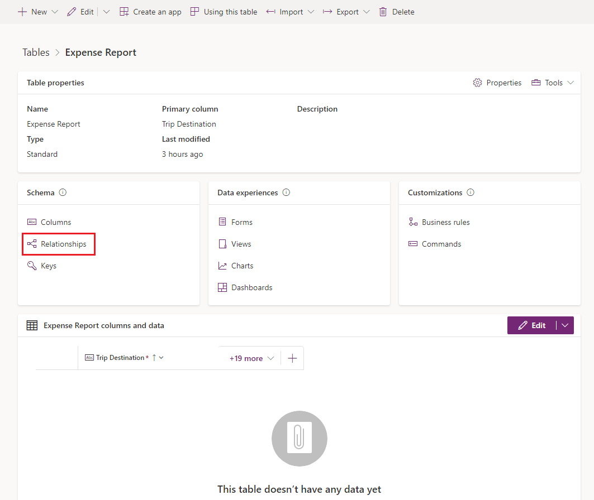
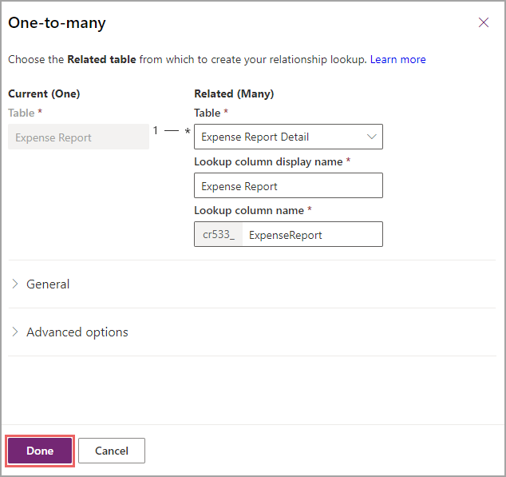
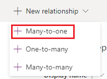
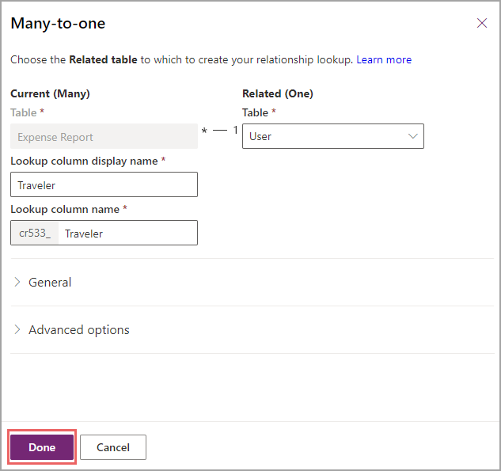
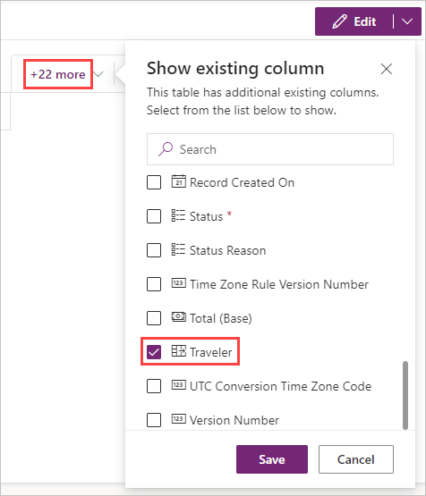

> [!VIDEO https://www.microsoft.com/videoplayer/embed/RWQA6R]

Now that you have all tables that you plan to use and have columns inside them, you need a way to relate those tables. In the previous exercise, you didn't add user information in the Expense Report table or Expense Report information in the Expense Report Details table. Dataverse helps make connecting all of these tables easier.

### Relate expense report to expense report details

To relate expense report to expense report details, follow these steps:

1. In your browser, go to [https://make.powerapps.com](https://make.powerapps.com/?azure-portal=true).

1. On the left navigation pane, select **Tables**. If you don't see the Tables on the left, you can select **More** then in the flyout menu find and select **Tables**.

1. Select the **Expense Report** table that you created in the previous unit. If you can't find it, use the search field in the top right of the ribbon under the settings.

1. When you are in the **Tables >** **Expense Report** screen, in the **Schema** pane select **Relationships**. Some out-of-the-box relationships display in a list. These relationships help Dataverse work, but we want to create one for our purposes.

   > [!div class="mx-imgBorder"]
   > 

1. In the top left part of the ribbon, select **New relationship** to create a new one.

    In a drop-down list, Dataverse will prompt you to choose which type of relationship that you want. As discussed in the previous module and in the first unit of this module, you're creating a *one-to-many* relationship because only one expense report exists for many details (or line items).

1. Select **+ One-to-many**.

    After you select your relationship, a **One-to-many** pane appears on the right to request a table to which you can relate your expense reports.

1. Select the dropdown list and then select your other custom table, **Expense Report Details** (hint: it's in alphabetical order).

    After you select a table, Dataverse will display a few more fields. These fields define the name of the column in your Expense Report Details table, which is a lookup to your Expense Report table. You can keep the automatically populated column name, but you can change it if you anticipate that the name will be confusing.

1. Select **Done**.

    > [!div class="mx-imgBorder"]
    > 

    Now that you know how to define a one-to-many relationship, you can go to the **User** table and complete the same task because one user exists for many expense reports.

1. Select **New relationship**. This time, select **+ Many-to-one**.

    > [!div class="mx-imgBorder"]
    > 

1. In the **Many-to-one** pane, enter `User` in the **Related Table** entry field and select the **User** table from the dropdown list. The **Lookup column display name** field appears on the Expense Report side, which will always happen on the *many* side of the relationship.

1. Though you didn't need to rename the lookup column for the other relationship, name this column **Traveler** for clarity, and then select **Done**.

    > [!div class="mx-imgBorder"]
    > 

1. Return to your **Tables > Expense Report** screen by selecting **Expense Report** in the screen title at the top left. Now, let's show your related **Traveler** column in your table.

1. In the **columns and data** pane, look in the **+22 more** to find the **Traveler** column. Select the checkbox to the left of this column and then **Save**.

    > [!div class="mx-imgBorder"]
    > 

Congratulations, you have successfully defined relationships inside Dataverse, allowing you to relate information inside your app.
