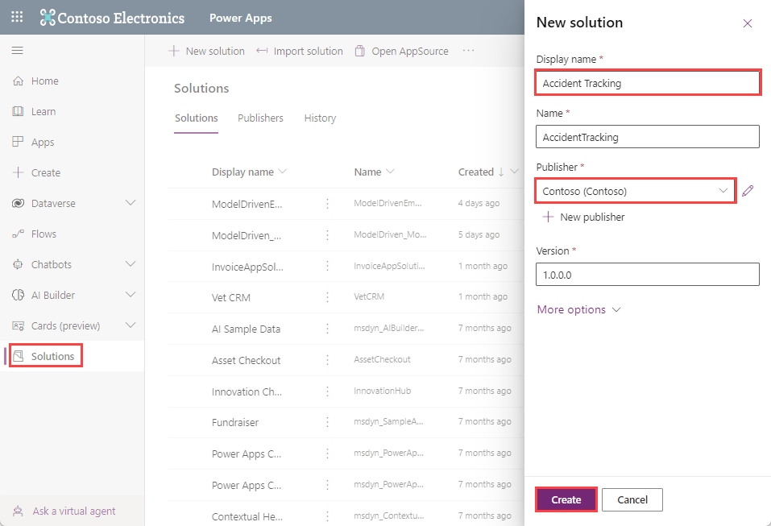
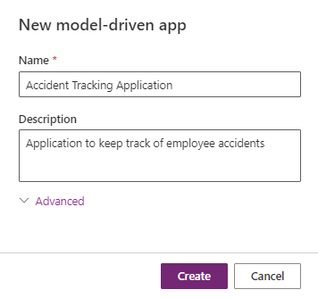
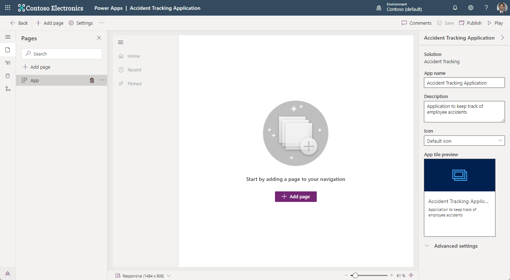
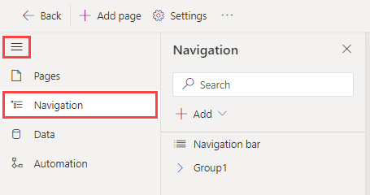
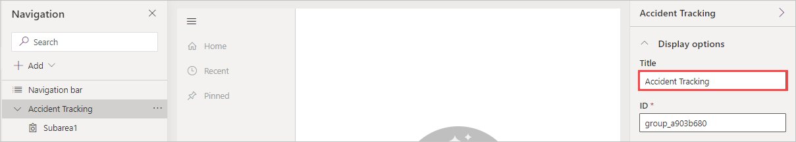
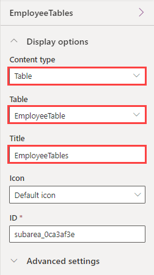
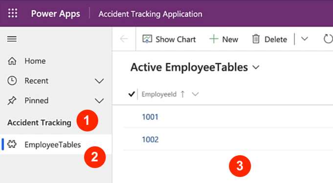

In this module, you'll continue working on the accident tracking application.

> [!VIDEO https://www.microsoft.com/videoplayer/embed/RWSyMp]

>[!NOTE]
> If you haven't completed the previous modules within this learning path, download the [packaging files](https://github.com/MicrosoftDocs/mslearn-developer-tools-power-platform/tree/master/power-apps/create-model-driven-app). These files contain the completed work on the accident tracking app thus far.

Previously, using a Microsoft Excel workbook to track accidents gave users one location to view, review, and add new accident records. The goal of building a model-driven app is to achieve the same concept. It will package all tables, views, and forms into a business application where users can complete all activities that are related to accident tracking.

The best way to get familiar with model-driven apps is to create a **solution** within Power Apps. A **solution** is a package that can contain Dataverse tables, forms, views, apps, flows, and other components. By building your model driven-app in a solution, you can easily move it to other environments or preserve a copy in your source control repository. During the app creation process, you'll learn more about the different components of Microsoft model-driven apps and how to work with the new app editor.

The concept of the model-driven app is to have one business application where app users can review and update all records that are related to a business process. In this module's scenario, you'll create a model-driven app where users can view and update employees, locations, accident types, and report accidents efficiently.

## Create a new model-driven app

To create a new model-driven app, follow these steps:

1. Go to [make.powerapps.com](https://make.powerapps.com/?azure-portal=true) and sign in with your Microsoft credentials.

1. Select **Solutions > + New solution**.

1. In the **New solution** pane under **Display name**, enter **Accident Tracking**. Under **Publisher**, select the environment that you wish to create the solution. Select the **Create** button in the bottom left of the pane.

    > [!div class="mx-imgBorder"]
    > 

1. After a few moments, your tables will appear as objects inside your **Accident Tracking** solution. Next we'll create a **Model-driven app**. To do so, go to the command bar and select **+ New** > **App** > **Model-driven app**.

1. Give your app a name. For this exercise, name it **Accident Tracking Application**.

1. Give your app a description to help users understand the general purpose and usage of the app. Let's enter **Application to keep track of employee accidents**

    > [!div class="mx-imgBorder"]
    > 

1. Select **Create**. After a few moments, your new app will appear in the app designer screen.

    > [!div class="mx-imgBorder"]
    > 

1. Let's add navigation to your app. From the app designer, you'll notice a vertical navigation menu on the upper left side of the app screen, which starts on **Pages**. If you expand this menu with the **hamburger button**, you'll see four sections of the app designer, including **Pages**, **Navigation**, **Data** and **Automation**.  Select **Navigation**.

    > [!div class="mx-imgBorder"]
    > 

1. Look on your screen where you have **Group1** listed under **Navigation bar**. Go ahead and select it. In the **Display options** on the right side of the screen, under **Title** give it a meaningful name. For the purposes of this exercise let's retitle it **Accident Tracking**. As you change it, you'll notice that **Group1** has now become **Accident Tracking** under the **Navigation** pane on the left side of the screen.

    > [!div class="mx-imgBorder"]
    > 

1. Next, we're going to begin bringing in some data. Select **Subarea1** in the **Navigation** pane just under **Accident Tracking**.  

1. In the **Display options** pane on the right side of the screen under the **Content type** dropdown, select **Table**. Under **Table**, search for your **EmployeeTable**. Under **Title** rename it **EmployeeTables**.  You'll notice that your app now displays a page for your app in the pane in the center of the screen.

    > [!div class="mx-imgBorder"]
    > 

1. Go to the top right of the command bar and select **Publish** to both save and publish your app. (**Save** merely saves and **Publish** does both.)

1. Take a moment to **Play** your app to review what you've accomplished so far.

    > [!div class="mx-imgBorder"]
    > 

In the preceding screenshot, observe the location of certain elements:

- **Accident Tracking** is the **Group**

- **EmployeeTables** is the **Sub Area**

- **Active EmployeeTables** shows our employee data that we created previously.
