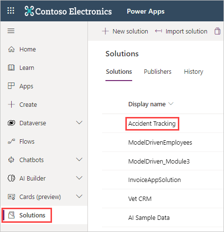
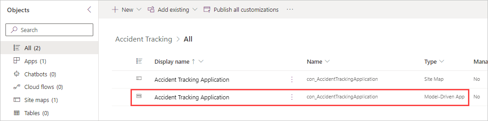
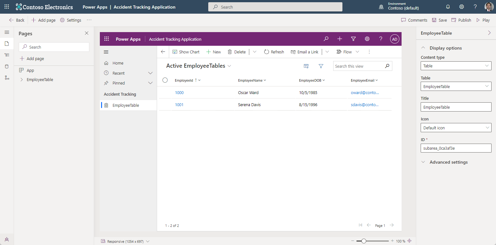
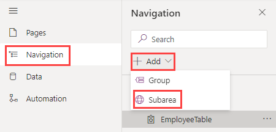
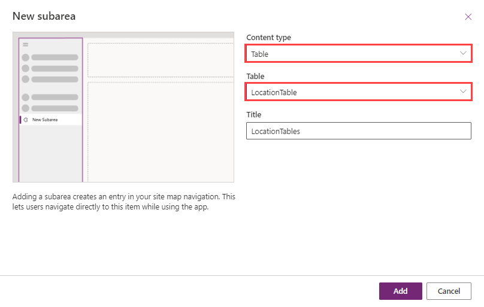
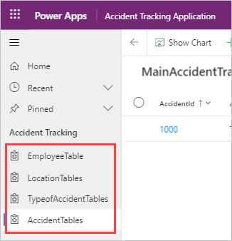

In this exercise, you'll add the other tables that you created in prior modules.

>[!NOTE]
> If you haven't completed the previous modules within this learning path, download the [packaging files](https://github.com/MicrosoftDocs/mslearn-developer-tools-power-platform/tree/master/power-apps/create-model-driven-app). These files contain the completed work on the accident tracking app thus far.

1. Return to your browser tab with the **App Designer** open to continue where you left off in the previous section (and you can skip down to step 3 below). If you've closed the **App Designer** browser tab, go to [make.powerapps.com](https://make.powerapps.com/?azure-portal=true), and under **Solutions**, find and select your **Accident Tracking** solution.

    > [!div class="mx-imgBorder"]
    > 

1. In the **Accident Tracking** solution explorer, find/select your **Accident Tracking Application** that is the **Model-Driven App** under **Type**.

    > [!div class="mx-imgBorder"]
    > 

1. The **App Designer** should now be on your screen and looking similar to this screenshot:

    > [!div class="mx-imgBorder"]
    > 

1. In the left side nav menu, select **Navigation**.

1. In the Navigation pane, select **+ Add** > **Subarea**.

    > [!div class="mx-imgBorder"]
    > 

1. In the **New subarea** popup, under **Content type** select **Table**, for your **Table** search for and select your **LocationTable**. Then select **Add**. (The **Title** will auto-populate as **LocationTables**, and you can rename it if you desire, but for the exercise we'll leave it as is.)

    > [!div class="mx-imgBorder"]
    > 

1. Now in the **App Designer** you'll notice the **LocationTables** subarea under the **Accident Tracking** group. Repeat the process you used to add subareas for the **TypeofAccidentTable** and the **AccidentTable**. Starting with **+ Add** > **Subarea** in the **Navigation** pane (see step 5 above).

1. Select **Publish**.

1. Your app should now show four subareas below **Accident tracking**.

    > [!div class="mx-imgBorder"]
    > 
