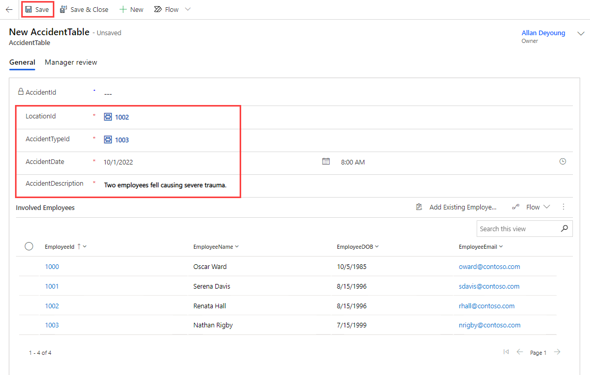
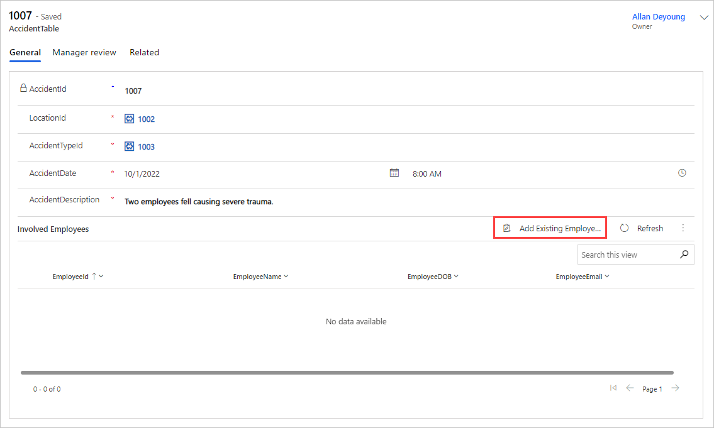
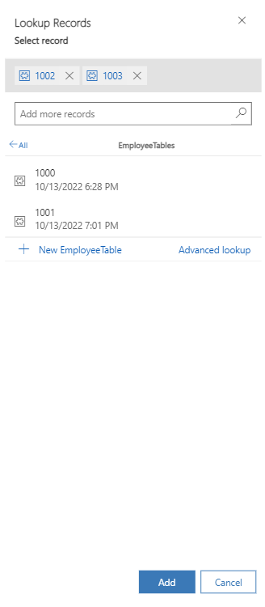
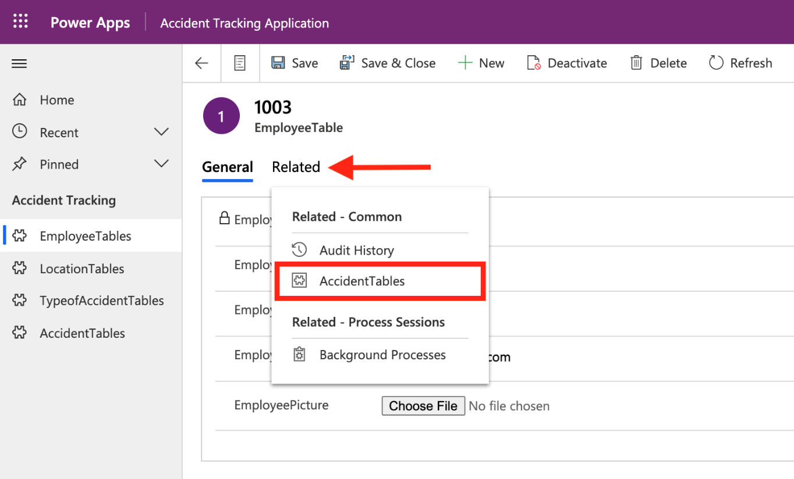
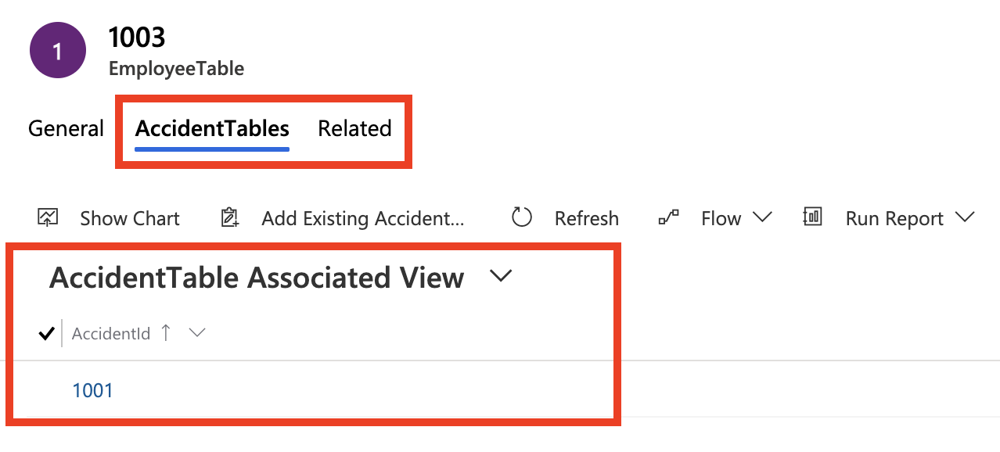
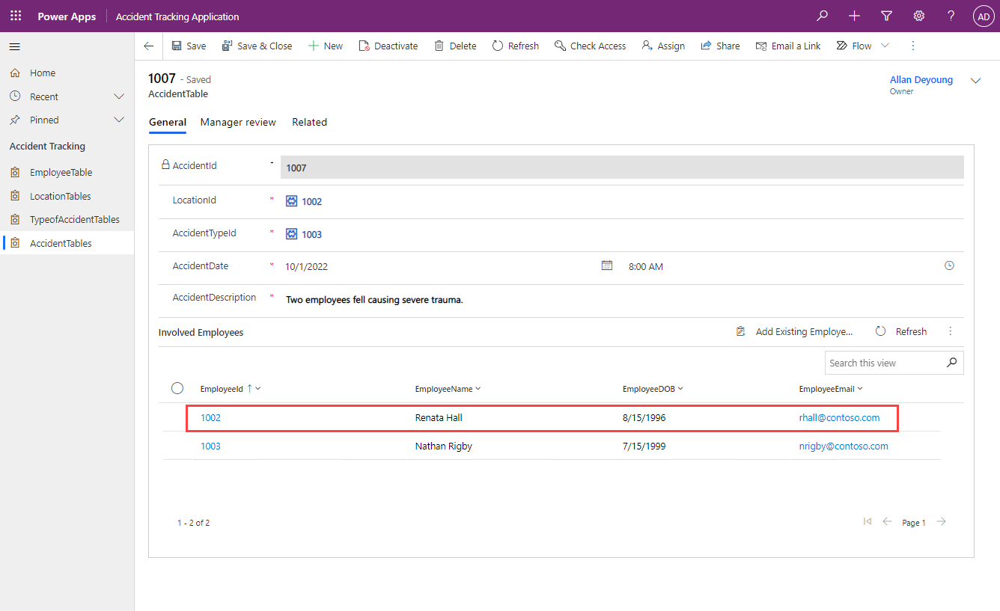

An important aspect of model-driven apps is the data model and how the different tables relate to each other. This section reviews how those relationships help simplify data navigation and allow users to view:

- Accidents that an employee has been involved in.

- Accidents that have occurred in a particular location.

- A list of all accidents.

Finding the related records for the preceding information is possible because of the table relationships that are built during your data modeling module. In the next exercises, you'll accomplish this task by using the **Related** view in model-driven apps.

## Create new records by using model-driven apps

To observe how the app functions, start by creating new records:

1. Under **Solutions**, find and select **Accident Tracking** then select the **Accident Tracking Application** Model-driven App.

1. Select the **EmployeeTable** under **Accident Tracking** and then select **+ New** in the command bar.

   This step will direct you to the main form that you modified in the previous unit. In the next steps, you'll create two new employees.

1. Create the first new employee with the following information:

    - **EmployeeName** - Renata Hall

    - **EmployeeDOB** - 8/15/1996

    - **EmployeeEmail** - rhall@contoso.com

1. Select **Save** and then add a new employee picture file.

    **EmployeePicture** - Choose any picture.

1. Create another new employee with the following information:

    - **EmployeeName** - Nathan Rigby

    - **EmployeeDOB** - 7/15/1999

    - **EmployeeEmail** - nrigby@contoso.com

1. Select **Save** and then add a new employee picture file.

    **EmployeePicture** - Choose any picture.

1. Create a new location. Go to **LocationTables** from the app, select **+ New**, and then add the following information:

    - **LocationName** - Contoso East

    - **LocationCountry** - USA

1. Select **Save & Close**.

1. Create a new type of accident. Go to **TypeofAccidentTables** from the app, select **+ New**, and then add the following information:

    - **AccidentName** - Head Trauma

    - **AccidentSeverity** - 5

1. Select **Save & Close**.

1. Create a new accident. Go to **AccidentTables** from the app, select **+ New**, and then add the following information:

    - **LocationId** - From the dropdown menu, select **Contoso East**.

        > [!TIP]
        > If you press the **Enter** key while on the dropdown menu, the location names will be revealed instead of their IDs.

    - **AccidentTypeId** - From the dropdown menu, select **Head Trauma**.

    - **AccidentDate** - 10/1/2022

    - **AccidentDescription** - Two employees fell causing severe trauma.

1. Under **Involved Employees**, you'll see a view of our subgrid EmployeeTable, but to add the employees involved in this incident, we have to save the record first, else you'll get an error message letting you know that the record doesn't exist.  So select **Save** from the command bar to save the new Accident.

    > [!div class="mx-imgBorder"]
    > 

1. Once your record has been save, notice that there are currently no employees listed for this particular incident. You can now select **Add Existing EmployeeTable** to the right of the header for the **Involved Employees**.

    > [!div class="mx-imgBorder"]
    > 

1. In the Lookup Records pane (remember you can Enter in the Search field to show all records), select the Employee IDs that correspond with Renata Hall and Nathan Rigby. Then select **Add** to add these employees to the event.

    > [!div class="mx-imgBorder"]
    > 

1. Once the screen refreshes, you should now see the two employees listed under **Involved Employees** in your entered accident. Select **Save & Close**.

## View related records from model-driven apps

In this section, you'll learn how to navigate in the app to find information with related data. Previously, you created relationships between your tables to help make this process easier.

You can create a many-to-many relationship between your **EmployeeTable** and **AccidentTable** because multiple employees can be involved in multiple accidents. In this scenario, you want to review the accidents that **Renata Hall** has been involved in.

1. Go to **EmployeeTable** from the model-driven app.

1. Select the record for **Renata Hall**.

1. Select **Related > AccidentTables**.

    > [!div class="mx-imgBorder"]
    > 

   You'll be directed to a view that lists the accidents that **Renata Hall** has been involved in.

    > [!div class="mx-imgBorder"]
    > 

1. Select any record to bring up the accident details.

    > [!div class="mx-imgBorder"]
    > 

You can also complete this related action from the **LocationTables** to view all accidents that have occurred in that location. The reason is because of the one-to-many relationship that you built in a previous module between **LocationTable** and **AccidentTable**. By using the same concept, you can use the related action to view the accidents that belong to a particular accident type. These actions are standard from model-driven apps if relationships exist between the tables.
