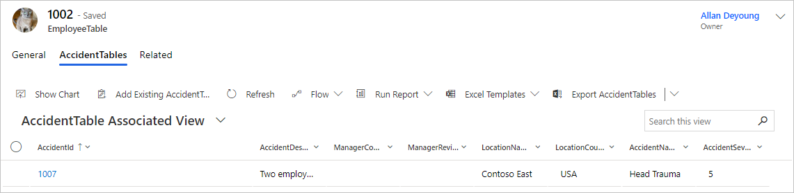
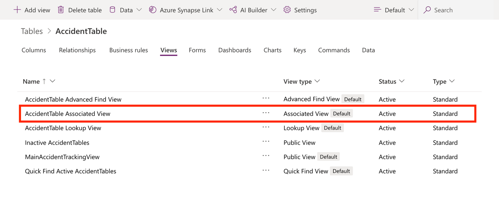
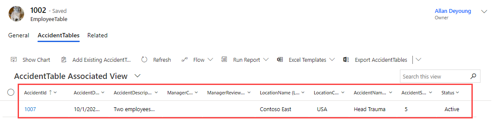

Previously, you learned that by using the related action, you can view the accidents that an employee has been involved in. In this section, you’ll learn how to modify that view to add more details about the accident. As a result, users can view the accident details without having to select each accident individually.

> [!div class="mx-imgBorder"]
> 

The preceding image shows that the name of the view is **AccidentTable Associated View**. You can modify the view to add more details about the accident. To do so, follow these steps:

1. Go to **Tables** in Microsoft Dataverse.

1. Find the **AccidentTable** in the list of tables.

1. Select **Views** and then find and select **AccidentTable Associate View** to open it the designer studio.

    > [!div class="mx-imgBorder"]
    > 

1. In the **Table columns** designer, ensure that these fields are added or already in the view from your **AccidentTable** to see details of the event in the view (remember you can drag and drop to adjust the order):

    - **AccidentDescription**

    - **AccidentDate**

    - **ManagerComments**

    - **ManagerReviewed**

1. Now switch to the related table columns by selecting the **Related** tab from under the **Table columns** pane on the left, and add/confirm the following fields:

    - **LocationName**

    - **AccidentName**

    - **AccidentSeverity**

    - **Status**

1. Select **Publish** to save and finish the process.

1. Return to your **Accident Tracking Application**.

1. Go to **EmployeeTables** and then select the **Renata Hall** record.

1. Select **Related** > **AccidentTables**.

    The view that you updated should now be visible, along with the added fields.

    > [!div class="mx-imgBorder"]
    > 

This exercise demonstrates that, after you update/publish a view, the results will be shown in your model-driven app. Changes in table views and forms automatically reflect in model-driven apps.
