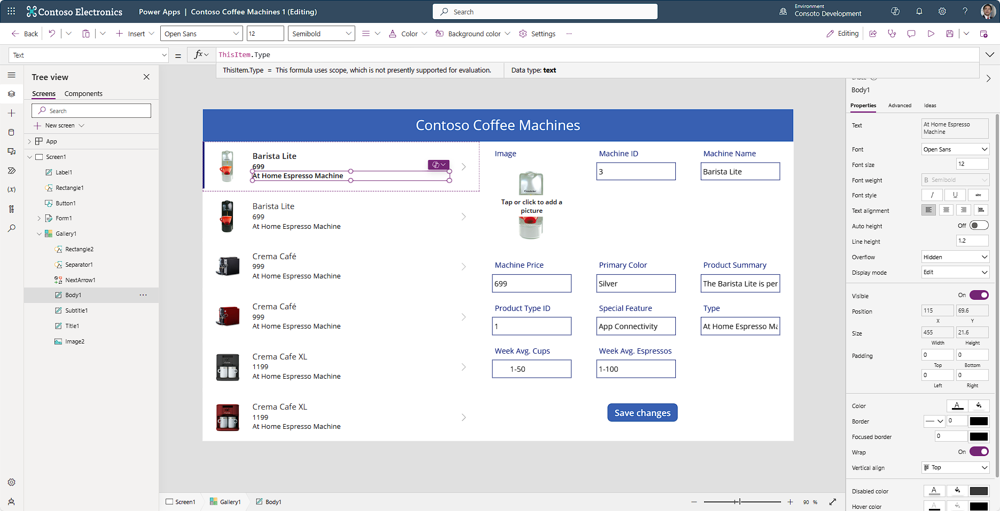

We're going to continue to develop our Power Apps skills in this module by reenforcing and broadening the skills we learned in the previous module, Get started with Power Apps canvas apps.

We're going to continue to work on the app we ended with in the last module, so if you haven't completed that module, go back, and complete it, since this module continues to build on that one.

> [!VIDEO https://www.microsoft.com/en-us/videoplayer/embed/RW1glMX]

## Modify Gallery fields

The first order of business is for us to look at our Gallery control on Screen1. Notice how you can select each field in it (Title1 and Subtitle1). Look in the Tree view panel on the left side of the screen and you see that as you select a gallery field, it highlights that control in the tree view. Also, notice how each of them is a text label. Lastly, notice how when you select each control, in the formula (***fx***) input field you see ThisItem.'Machine Name' (for the Title1 label) or ThisItem.Type (for the Body1 label). What this means is that this field is displaying the text value that is in that table column, for that row of data.

Since the rows of data continue to the bottom of the gallery, you can't select these fields anywhere else, other than the top row. So, modify the text properties of one of these labels for the first item and you see that portrayed down the list.

You can quickly adjust the fields being displayed in the gallery by first selecting the gallery, then if you look over in the Properties panel on the right side of the screen, you can see a dropdown next to Layout, which currently shows "Image, title, and subtitle".

Let's modify our gallery layout and fields so that we show some more information about the product in a way that users can understand. Follow this procedure:

1.  Ensure that you select the gallery control called **Gallery1**. It's currently the only gallery on your screen. If you've done it correctly, Gallery1 is highlighted a dark grey in your **Tree view** panel.

1.  In the **Properties** panel on the right side of your screen, change the **Layout** to "Image, title, subtitle, and body".

1.  In your gallery control, select the newly added **Body1** label and notice that it's showing ThisItem.'Primary color' as the value for the **Text** property in the formula (***fx***) field.

1.  Change the **Text** property of the **Body1** label to read: ThisItem.Type

> [!div class="mx-imgBorder"]
> 

## Modify Form fields

Next let's look at modifying the form. It's good practice to only show the fields that you want to be able to update. We modify our form so that we remove the fields related to ID, including Machine ID and Product Type ID. Also, we reposition some fields in our form to make it more readable.

Follow these steps to make changes to your form:

1.  Select your form control on your Screen or from the **Tree view** panel. In the Properties panel, select **Edit fields**.

1.  In the popup **Fields** panel, when you hover over a field value, an ellipsis appears for **More actions**. Select the ellipses for the **Machine ID** field and then select **Remove**. Also do this for the **Product Type ID** field.

1.  While still in the Fields panel you can reposition fields by using drag and drop. First, drag and drop the **Product Summary** field to the bottom of the list, then drag and drop the **Image** below that.

1.  Our Product Summary field is multi-line, so let's make a change to that field by expanding the **Product Summary** field in the Fields panel. Expand by clicking on the field name. Notice how the Control type has a dropdown option under it, which currently reads "Edit text".

1.  Set the Control type option for the **Product Summary** field to "Edit multi-line text".

1.  Close the **Fields** panel.

1.  Finally, let's adjust the height of the Product Summary field to show the entire product summary. Select the form data card for Product Summary, then select the DataCardValue text input control.

1.  Now drag the bottom of the text input field towards the bottom of the card to expand the viewable portion of the control. The scrollbar disappears when you've expanded it adequately.

Remember that any line of data, or record, in the data source is available as gallery information and as form information. Text labels expect text, so if they have text, you see the text portrayed. You can change the fields displayed in your gallery, including what fields are displayed and the size of the input fields.