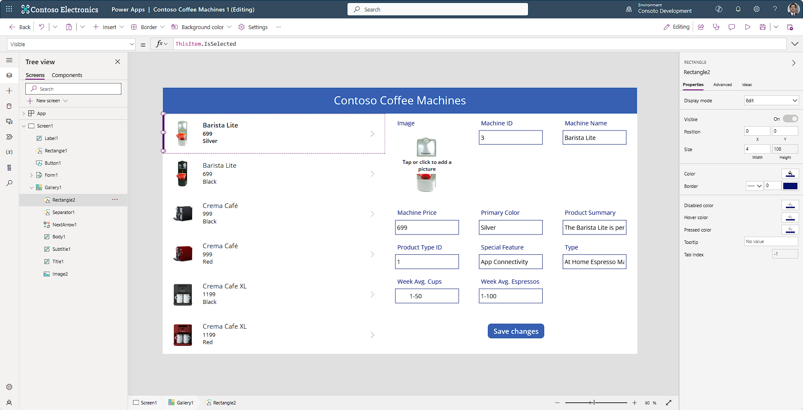

In this unit, we're going to examine the controls that we've already added to our app, both at the Gallery and the Form, we're also going to add some screens to our app to get ready for our next unit.

## Controls in Power Apps

A control is a UI element that produces an action or shows information. Many controls in Power Apps are like controls that you've used in other apps: labels, text-input boxes, drop-down lists, navigation elements, and so on.

In addition to these typical controls, Power Apps has more specialized controls, which you can find on the **+ Insert** button, which includes a search field to help you find what you're looking for.

A few controls that can add interest and impact to your apps include:

-   **Galleries** - Controls that are layout containers that hold a set of controls that show records from a data source.

-   **Forms** - Controls that show details about your data and let you create and edit records.

-   **Media** - Controls that let you add background images, include a camera button (so that users can take pictures from the app), a barcode reader for quickly capturing identification information, and more.

-   **Charts** - Controls that let you add charts, including *Power BI* data, so that users can perform instant analysis of their data.

To see what controls are available, select the **+ Insert** tab, and then expand the different fields. As you do, you'll see the utility of the search field to assist you in quickly finding what you're looking for. Try entering a few values in the search field to see the behavior.

## Gallery controls and properties

Inside of the gallery on the screen you should see different controls. The type of control has an icon just to the left of the name indicating what type of control it is. Notice how you have two shape controls including a rectangle and a separator. Go ahead and select the rectangle control in your Tree view. You'll see that it defaults to the **OnSelect** property, which says "Select(Parent)". Unless you designate a different **OnSelect** property for any of these gallery controls, they'll all default to Select(Parent), meaning that selecting that control selects the Gallery itself.

Now select the **Gallery** control (not a label or shape in it, you might need to find it in your **Tree view**) and look at the **OnSelect** property. It's currently set as false, so that means that selecting any control in your gallery will do nothing, until you define an action.

Reselect the **Rectangle** control from your gallery in the **Tree view**. Now go to the **Visible** property by selecting the dropdown value to the left of the formula (***fx***) input field. Notice that all the properties available for the control are in a scrollable list, so that you can find/select the **Visible** property. The Visible property is one that every control has. Notice that this control has **ThisItem.IsSelected** in the formula field.

> [!div class="mx-imgBorder"]
> 

**IsSelected** is a Boolean value, evaluating to "true" or "false", for whether this item in the Gallery is selected or not. Only one item in our Gallery can be selected at any time, so this value can only be "true" for one item. If you put your app in **Preview** mode. Try selecting some different coffee makers and notice how the Rectangle control only appears to the one that you've selected. The visible rectangle also corresponds to the item displayed in the form next to the gallery.

Other notable controls are the **Separator**, which is also a rectangle, but is always visible (it's currently colored white, so it doesn't appear on our white screen), and an Icon titled "NextArrow1", which currently does nothing other than select the parent from the gallery, and an Image control. Let's say we wanted to change the NextArrow1 to an edit pencil, to give the user an indication that they must press that control to edit that coffee machine. Remember that the header bar reflects some changeable properties for the selected control? Select the Icon dropdown button in your header and you'll see the Edit pencil icon displayed under Actions. Go ahead and select it to change the right arrow to an Edit icon.

Let's discuss the image control briefly. Since we defined an image field in your data, Power Apps was able to discern what goes into this field from the data. If you had another image to display here, you could put that into the Image property of this control. For example, if you had an item that was missing an image in the image field, you could use a formula to check whether the image field was blank and if so, to display a different image. The image field simply wants an image.

Since we've already covered labels, let's move to the controls in your form.

## Form controls and properties

Let's quickly cover the two most important properties for the form. The **DataSource** is the table of data connected to the form. This is important so that when your form gets updated, it knows where to write the data. The second important property is the **Item**. The item, for our app, is the item selected from our gallery.

Inside of the form, when you select a Field, that field is portrayed as a **DataCard** in the Tree view. Notice how each **DataCard** contains four different controls. The two most important controls in your **DataCard** are the label control, which will initially include the name **DataCardKey**, and the text input control, which will initially include the name **DataCardValue**. The other two controls are optional and depend on whether the data is required or not. The **StarVisible** is a text label with an asterisk in it that appears if you designate that field as required (either in your form or in the data). The **ErrorMessage** is another text label that appears if you try to submit a form and that input is missing. You can look at the Visible properties for these controls. **Visible** evaluates to: "true" or "false". The **And()** function you'll see in the **StarVisible** control means that both conditions, separated by a comma, must be true for the function to evaluate as "true".

Many of the properties inside of form controls aren't changeable unless you "unlock" the card, and this is for good reason. Though a form control is meant to make it easier to input data, it's a lot less flexible for design purposes. If we were to add or remove fields from our existing form, our controls would resize themselves automatically, and we would lose the edits that we made (remember the Product Summary text input). In future learnings, we'll learn more about customizing data entry, but let's avoid customizing form cards for now.

For our Coffee Machines form data, the only nontext input control is in the **Image** **DataCard**. Notice how this card has one additional control along with the four we've previously seen, the **Add picture** control. The **Add picture** control is a media control that allows you to select an image from your device (or an online location) to replace the existing image. When you "Tap or select to add a picture", you'll see an **Open** popup window that allows you to select an image file and then **Open** that image in the form.

Two important properties important to know for each data card are the **Default** property and the **Update** property. The **Default** property tells which column from our data provides the default value for that card. The **Update** property tells from which input control comes the data that Power Apps uses to update that record's data.

Select the **Product Summary** card, just the card and not the text input field inside of the card. Notice that the **Default** value for the card is ThisItem.'Product Summary', which is the value you see in the **DataCardValue** text input field. Switch to the Update property for the card and notice that this card receives the update information from the card's DataCardValue.Text. So, when we submit the form, Power Apps takes whatever's written in that text input field and updates the 'Product Summary' for that item.

It's possible to unlock and add other controls in a card, and to change the update property of the card, as long as the control that you're adding provides the type of data that your data source expects!

Finally, we must provide Power Apps a **SubmitForm** command to get it to save any changes we enter into our form. In our case, we have the "Save changes" button below the form, which suits that purpose. If you select the button (while in edit mode), notice that the **OnSelect** property is **SubmitForm(Form1)**, which takes each updated form card and writes that back to our data source.

## Adding screens

Up to now, our app has only had a single screen. In the next two units, we're going to add some more functionality as we continue to customize our app. Follow this procedure to add screens to your app:

1.  Select your **Screen1** in the **Tree view** panel, then select the **New screen** button from either the command bar or from the top of the **Tree view** panel, and then select the **Blank** screen template.

1.  Repeat to add a third screen.

1.  Let's rename our three screens. To do this double click on **Screen1** in the Tree view panel and rename it "Catalog Screen".

1.  Repeat the process to rename **Screen2** as "Home Screen" and **Screen3** as "Admin Screen".

1.  Finally, let's reposition the screens in the Tree view. You can do this by selecting the ellipsis button, then the **Move up** command.

Now that we have a better understanding of gallery and form controls and we know how to add screens to our app, let's continue to modify our app to enhance the UX.
