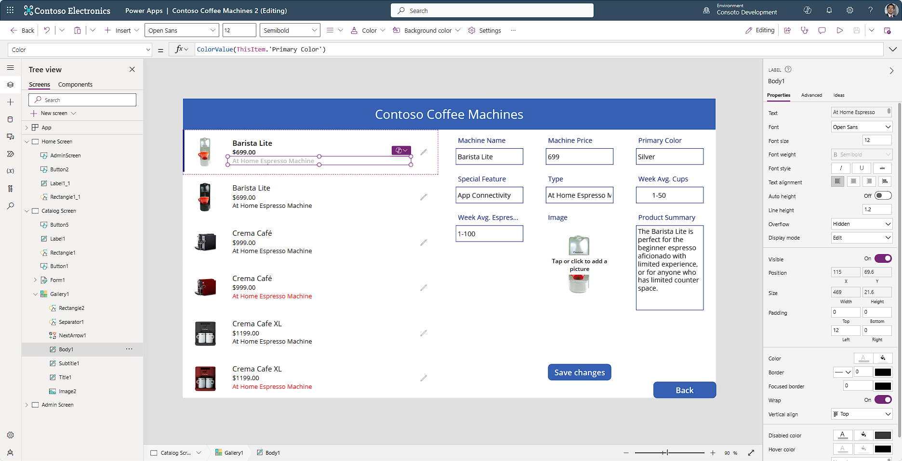

Did you know that we can add formulas to our controls in Power Apps? Remember that a text label just needs text, and an image control needs an image, for example. If you provide what Power Apps is looking for as an input, you can put in any variation so long as the formula reflects the type of input the control expects.

In the following exercise, we're going to modify our gallery so that the "Machine Price" will show a currency value, and we're going to modify the text color of our "Type" field to appear as the coffee machine color. This app builds upon the app that we created in the last unit, so if you haven't completed that yet, please go back to the last unit to complete it.

When you have your "Contoso Coffee Machines" app open, continue with the steps below:

1.  Select "Catalog Screen" from the **Tree view** panel.

	> [!NOTE]
	> You can also switch screens from the drop-down menu in the lower corner of the current display screen. If you select the drop-down, the screen you're currently on will have a check mark next to it and be highlighted dark gray.

1.  Select your Gallery and then select the **Subtitle1** control and look for the **Text** property, which displays ThisItem.'Machine Price'.

1.  To add the currency symbol for US dollars, set the Text property to:

	`Text(Value(ThisItem.'Machine Price'), "$ ##.00")`

	Remember the order of mathematical operations when using a formula, anything inside of parenthesis occurs first. Our formula is taking the value of 'Machine Price', since our data table had it entered as Text, we're declaring this as numeric by wrapping it in the Value() function. Then we're formatting the result as Text adding the dollar sign along with number and then cents values, even if the value in cents is zero.

	> [!NOTE]
	> If your formula returns an error, the language setting of your Power Apps environment can affect some separators and operators. For example, the above formula is expressed in a language and region that uses dot or period as the decimal separator, such as Japan or the United Kingdom.
	>
	> However, this same formula in a language and region where a comma is used for the decimal separator, such as France or Spain, would need to be: `Text(ThisItem.Price; "$ ##,00")`
	>
	> The property selection operator \".\" (dot or period) in ThisItem.Price is always the same, no matter what the decimal separator is; but notice that the decimal separator and the chaining operation separator changed to a comma and semicolon, respectively. Internally the formula doesn't change, all that changes is how it's displayed and edited by the author.

1.  Now let's change the **Color** property of our **Body1** label in our gallery. Select the **Body1** control.

1.  Using the formula (***fx***) dropdown find the **Color** property for Body1. Regard how the formula reads "Black". If you select inside of the formula input field, you'll see that it reads "Color.Black". Just below the formula input field, Power Apps shows a formula showing **Color.Black =** and a square that is filled in as black. Also, it declares that the **Data type** is **Color**.

	> [!NOTE]
	> Some fields, like Color fields, only show the complete formula value when you select the formula input field. When entering a color value, you must include all the formula pieces so that Power Apps understands the input. In this case the formula must be Color.Black.

1.  Let's change the **Color** property of the **Body1** label to Color.Purple. You might have noticed that as soon as you typed the word "Color", Power Apps began automatically suggesting possible values for the rest of that field below the formula bar. In this syntax, Power Apps will recognize all the available HTML colors.

1.  Now, briefly glance to the right at your form (without selecting it) and notice that we have a field titled "Primary Color". Our data is written so that we can use this field's value in our formula. In the Color property field for your Body1 label, change your input to the following formula:

	`ColorValue(ThisItem. 'Primary Color')`

	Did you see that now the color of the text in the **Body1** label matches the Coffee Machine's **Primary Color**? Power Apps can use the **ColorValue** formula to change the text name of a color into a color value. You can see just below the formula bar that Power Apps displays the data type as **Color**, and it changes the color for all the gallery items based on the machine's primary color.

	> [!div class="mx-imgBorder"]
	> 

1.  Next, we'll add some headers to the new screens we created. To do that, we'll copy some controls from our Catalog screen and paste them on the new screens. Holding down the **Shift** key, select the **Rectangle1** and **Label1** controls from the top of your "Catalog Screen" (you can also select them from the **Tree view**). Right click and select "Copy" or use your Ctrl + C keys to copy the controls onto your device's clipboard.

	> [!TIP]
	> There is some nice functionality when you 'Right click' a control or multiple selected controls. These features will pop up on your screen next to the selected control(s). You can not only Cut and Copy, but you can also Group, Reorder, Align, or add comments (for other users). Depending on the control type you'll see features such as Font, Size, Color and Fill.

1.  Now, select the "Home Screen" and paste the two controls there. Reposition them so they're both centered at the top of the screen.

1. Next, select the "Admin Screen" and repeat the paste. Also reposition the controls again.

1. Next, using the **Text** property of the label controls that we inserted, we'll change the name to reflect the screen that we're currently on. Select the label control in the header of your "Admin Screen". Remember that all a label control needs is text. Input the following into the Text property of your header label control:

	`‘Admin Screen’.Name`

	> [!TIP]
	> You may have noticed that as you began typing 'Admin Screen', Power Apps displayed some potential information from the 'Admin Screen' that you could use as text in this label. Labels are a vitally important control to add to your app when you're developing it because they can display information that you might not see otherwise. You can add/remove them from your app as required.

1. We simply used the **Name** property from our 'Admin Screen'. Let's do the same now with the Home screen by entering the following in the Text formula:

	`‘Home Screen’.Name`

Our app is taking shape now as we enhance the UX with formulas. In the next unit, we'll walk through how to add some navigation to our app.