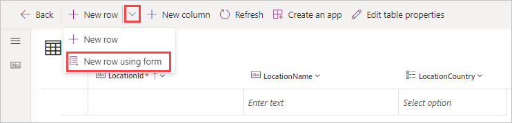
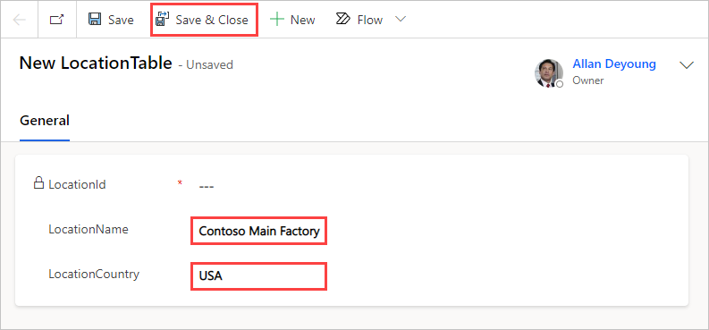
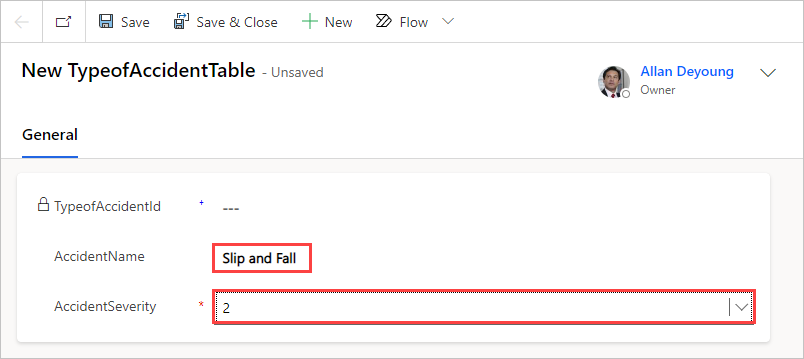
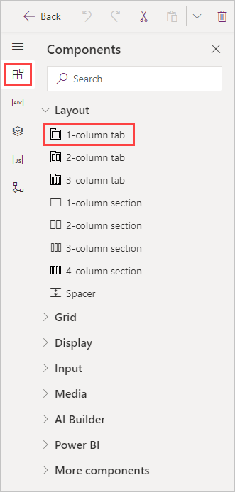
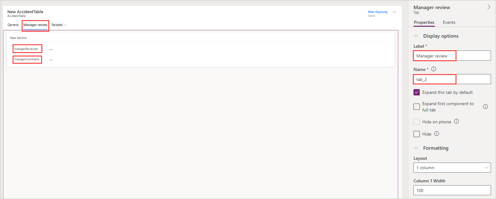
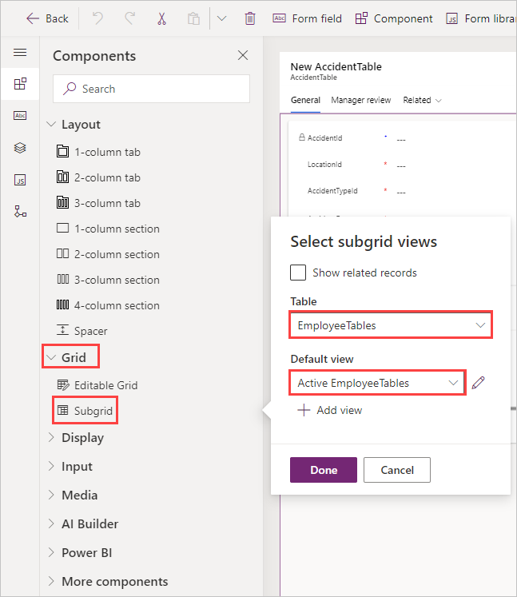
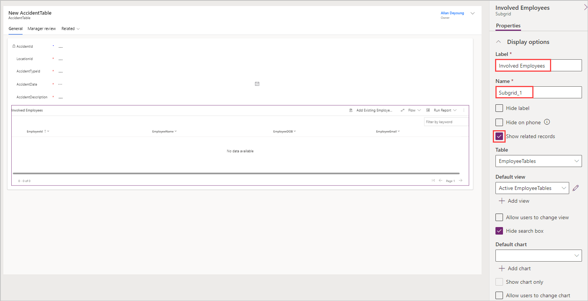
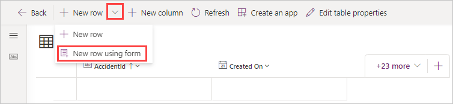
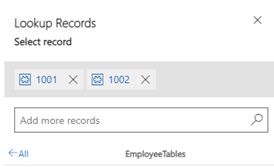
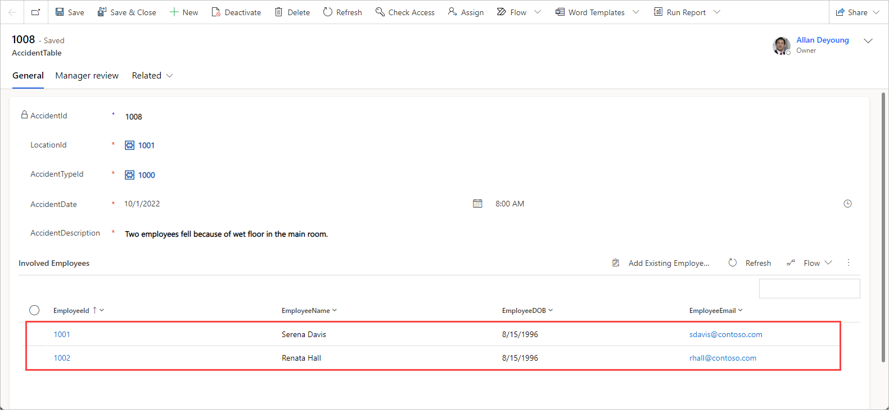

In this exercise, you'll modify the main form for **LocationTable**. To begin, sign in to Power Apps and then follow these steps:

1. From Power Apps, on the main menu, expand **Dataverse** and then select **Tables**.

1. Search for **LocationTable** that you created in the previous module. You can search for it by typing *location* in the search field in the upper right of the screen.

1. Select **LocationTable** and then select **Forms** (from the **Data Experiences** pane). Find and select the **Main** information form to navigate to the forms design experience.

1. Add the **Owner** (a Dataverse standard field that identifies the user who created the record in the table) to the **Header** section of the table by dragging the **Owner** field and then dropping it to the upper right of the header. (If you downloaded the solution at the beginning of this module, these steps have already been done, but you can follow along.)

1. Add the fields that a user will enter for locations in the **General** section of the form. As in the previous unit, the **Table columns** pane on the left show the different columns available in **LocationsTable** that can become form fields. Drag the fields and then drop them into the **General** section. Put the fields in the following order:

    1. **LocationId**

    1. **LocationName**

    1. **LocationCountry**

1. Let's set the **LocationId** field to be **Read-only**. Select the **LocationId** field, and on the right side pane under **Properties**, select the **Read-only** checkbox.

1. To complete the changes, select **Publish** in the upper right.

    Now, let's test our form by adding a location record to our table with it.

1. Return to the table's menu (Dataverse > Tables > **LocationTable**).

1. In the pane at the bottom of the screen called **LocationTable columns and data**, select the **Edit** button. This opens up the data view in edit mode.

1. Select the down chevron just to the right of **+ New row** and then select **New row using form** to open up the form you just made in a separate browser tab.

    > [!div class="mx-imgBorder"]
    > 

1. Enter the following information into the form. Then select **Save & Close** in the command bar. (The **LocationId** field will auto-populate.)

    - **LocationName** - Contoso Main Factory

    - **LocationCountry** - Choose **USA** from the dropdown menu

    > [!div class="mx-imgBorder"]
    > 

### Modify the main form for TypeofAccidentTable

Sign in to Power Apps and then follow these steps to modify the main form for **TypeofAccidentTable**:

1. From Power Apps, on the main menu, expand **Dataverse** and then select **Tables** (or select **Tables** from your current Tables viewer or from the navigation menu in the left pane).

1. Search for **TypeofAccidentTable** that you created in the previous module. Remember, you can search for it by typing **typeofaccident** in the search bar.

1. Select the table and then select **Forms** (from the **Data experiences** pane). Then select the **Main** information form to navigate to the forms design experience.

1. Add the **Owner** (a Dataverse standard field that identifies the user who created the record in the table) to the **Header** section of the table by dragging the **Owner** field and dropping it to the upper right of the header. (Again, please follow along if you already downloaded the solution at the beginning of the module. Most of these steps will have already been done.)

1. Add the fields that a user will use for the type of accidents in the **General** section of the form. Drag the fields and then drop them in the **General** section. Put them in the following order:

    1. **TypeofAccidentId**

    1. **AccidentName**

    1. **AccidentSeverity**

1. Set the **TypeofAccidentId** field to be read-only. Select the **TypeofAccidentId** field, and on the right under **Properties**, select the **Read-only** checkbox (make sure it's checked).

1. To complete the changes, select **Publish** in the upper right.

    Now, let's use your new form to add some data to the **TypeofAccidentTable** table.

1. Select **Back** in the upper left and select **Tables**, then search for the **TypeofAccidentTable** and select it to go to the Tables editor.

1. In the **columns and data** pane, select the **Edit** button. This action navigates you to the data view for your table. In the command bar, select the down chevron just to the right of **+ New row**, then select **New row using form** from the dropdown.

1. In a new browser tab, your form opens. Enter the information below into the form:

     - **AccidentName** - Slip and Fall

     - **AccidentSeverity** - Select **2** from the dropdown menu

    Your form should look like this:

    > [!div class="mx-imgBorder"]
    > 

1. Select **Save & Close** from the command bar.

### Modify the Main form for the AccidentTable

The process for modifying the **AccidentTable** form is the same as the previous processes. The difference with this one is that you'll create a **one-column tab** in the **General** area to group the general accident information fields. Then, you'll create another **one-column tab** in the **General** area to group the manager fields. Also, you'll add a subgrid so that users can add employees that were involved in a particular accident.

1. From Power Apps, on the main menu, expand **Dataverse** and then select **Tables**.

1. Find your **AccidentTable** that you created in the previous module. It should be close to the top of your list of tables, but you can also search for it by entering **accident** in the search bar at the top right.

1. Select the table and then select **Forms** (from the **Data experiences** pane). Find and select the **Main** information form to navigate to the Form design experience.

1. Add the **Owner** to the **Header** section of the table by dragging the **Owner** field and then dropping it to the upper right of the header (again, if you downloaded the solution at the beginning of the module, the form is already complete, so you can follow along for understanding).

1. Add the fields that a user will enter for new accident records in the **General** section of the form. Though the view should open with the **Table columns** tab already displayed, you can also get there by selecting the **Table columns** navigation button from the left side navigation pane.  The **Table columns** will appear underneath the header showing the different fields (or columns) from the **AccidentTable**. Drag the fields and then drop them into the **General** section of your form. Put them in the following order:

    1. **AccidentId**

    1. **LocationId**

    1. **AccidentTypeId**

    1. **AccidentDate**

    1. **AccidentDescription**

1. Set the **AccidentId** field to be **Read-only** by selecting the **AccidentId** field, and on the right under **Properties**, select the checkbox next to **Read-only**.

1. Select the **LocationId** field, and on the right under **Properties**, change the **Default view** (you may need to scroll down the properties to find it) from **LocationTable Lookup View** to **Active LocationTables**.

1. Still in the **LocationId** properties, under the **Default view** dropdown menu, select the checkbox next to **Allow users to change view**. Doing this causes the **Show all views** option to appear, go ahead and check this one, too. For this exercise we want both checkboxes selected so that our users can see the different form views and select the one they want.

1. Repeat the previous steps for the **AccidentTypeId** field and then set the **Default view** to **Active TypeofAccidentTables**. Again select the options underneath to **Allow users to change view** and to **Show all views**.

1. Select the **Components** section from the side navigation panel and then select the **1-column tab** option to add a new tab in the **General** section.

    > [!div class="mx-imgBorder"]
    > 

1. In the **Properties** pane, for the **Label**, enter **Manager Review**. For the **Name**, enter **tab_2**. 

1. Add the following fields to the new tab:

    - **ManagerReviewed**

    - **ManagerComments**

    > [!div class="mx-imgBorder"]
    > 

1. On the form canvas, select the **General** tab.

1. From the left navigation menu, select the **Components** section, select **Grid** to expand it, and then select **Subgrid**. 

1. In the popup window, find **EmployeesTable** under **Table** and then select **Active EmployeesTables** as the **Default view**.

    > [!div class="mx-imgBorder"]
    > 

1. Select **Done** to add the subgrid. 

1. Give the subgrid a more meaningful name. In the **Label** field under **Properties**, enter **Involved Employees**, and **Subgrid_1** as the **Name**. Look for the **Show related records** checkbox and make sure that it's selected.

    > [!div class="mx-imgBorder"]
    > 

1. Select **Publish** to complete the form.

    Next, let's use our new form to add some data to our **AccidentTable**.

1. Select **Back** in the upper left, then find the **AccidentTable** from your **Tables**.

1. Select **Edit** from the **AccidentTable columns and data** to show the grid view of the table.

1. Now select the down chevron just to the right of the **+ New row** button in the command bar and then **New row using form** to navigate to a new main form. 

    > [!div class="mx-imgBorder"]
    > 

1. The new form opens in a separate browser tab and should resemble the one that you customized in the previous steps. Now, enter a new accident record and with the following details:

    - **LocationId** - From the dropdown menu, enter **10** and your locations should appear, select **Contoso Main Factory**

        > [!NOTE]
        > If you press the **Enter** key while you're on the dropdown menu, it will reveal the location names instead of their IDs.

    - **AccidentTypeId** - From the dropdown menu, select **Slip and Fall**. (Again, press **Enter** to reveal the entries you've already made.)

    - **AccidentDate** - 10/1/2022

    - **AccidentDescription** - Enter **Two employees fell because of wet floor in the main room.**

1. Select **Save**.

1. After the record is saved, the **Involved Employees** subgrid should appear, where you can add the involved employees.

1. Select **Add Existing Employee**, then press **Enter** in the **Look for records** box to reveal the employee IDs. If you select each one, you'll see the record form for Oscar Ward and Serena Davis, respectively. Select both of these employee IDs.

    > [!div class="mx-imgBorder"]
    > 

1. Select **Add** to add the employee names.

1. You might need to select **Refresh** for the names to show in the list.

1. Select **Save & Close** from the command bar to complete the process.

    > [!div class="mx-imgBorder"]
    > 
