In this exercise, you explore Microsoft Dataverse standard tables. Tables in Microsoft Dataverse are similar to tables in a database or worksheets in Microsoft Excel. You can connect tables together with relationships that model real-world interactions between the data. Each table contains multiple rows (records), each having data columns. For example, a Project table might have columns such as Name, Due Date, and Status. And it might be related to a Project Owner table, which might have columns such as Name and Email.

Microsoft Dataverse abstracts much of the typical low-level database management work to help make it easier for you to set up a custom data model that fits your application.

In addition to allowing for the creation of custom tables, Microsoft Dataverse contains a Common Data Model that consists of hundreds of standard table definitions. You can find the current Common Data Model schema at [GitHub Microsoft CDM](https://github.com/Microsoft/CDM/?azure-portal=true). You can also browse the Common Data Model by using the CDM Visual Table Navigator by going to [GitHub CDM](https://microsoft.github.io/CDM/?azure-portal=true). For more information, see [Common Data Model Overview](/powerapps/common-data-model/overview/?azure-portal=true).

> [!NOTE]
> This module is designed for use with the App in a Day instructor-led course. For more information on attending this free, instructor-led course, see [Microsoft Power Platform instructor-led training](https://powerplatform.microsoft.com/instructor-led-training/). On that page, you can [Register for an event](https://events.microsoft.com/allevents/?search=App%20in%20a%20Day&view=list&language=English&clientTimeZone=1&startTime=06:00&endTime=11:00).

> [!NOTE]
> To complete the exercises, you'll need to use a few
> files. Download the [App in a Day files](https://github.com/MicrosoftDocs/mslearn-developer-tools-power-platform/raw/master/in-a-day/AIAD/AppinADayStudentFiles.zip)
> for use in this module. The file folders that are in
> this download include:
>
> - **Completed modules with instructions** - Package files to import the completed exercise steps.
> - **Machine-Order-Data.xlsx** - File used in the exercises.

## Task - Explore standard tables

In this task, you explore Microsoft Dataverse standard tables.

Before beginning the exercises, go to [Make Microsoft Power Apps](https://make.powerapps.com/?azure-portal=true) and confirm that you're in your training environment for the labs.

> [!div class="mx-imgBorder"]
> 

1. In the navigation pane to the left of the screen, select **Tables**.

   > [!div class="mx-imgBorder"]
   > 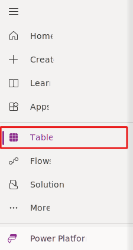

1. A list of tables in this environment displays. Select a few of the standard tables (such as **Account**) to get familiar with some features of a table.

   > [!div class="mx-imgBorder"]
   > 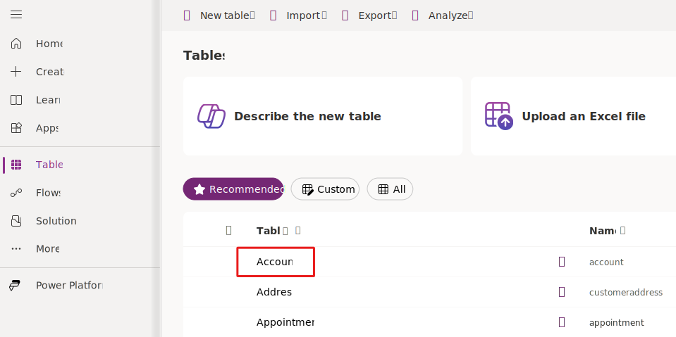

### Table properties

In the **Table properties** section, you'll find the table name, table type, the table's primary column, and table description. You can also copy the table's set name, schema name, or logical name from the **Tools** dropdown menu.

> [!div class="mx-imgBorder"]
> [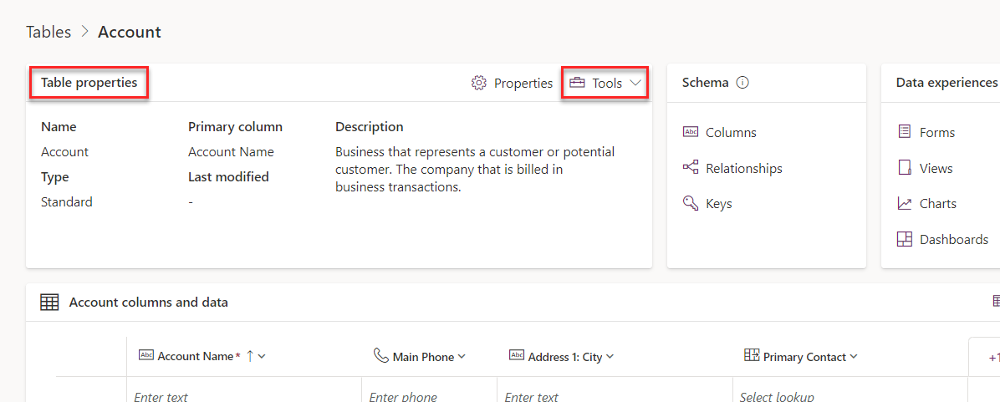](../media/table-properties.png#lightbox)

### Table schema

In the **Schema** section, you can navigate to the table columns, relationships, and keys. For this exercise, select **Columns**.

> [!div class="mx-imgBorder"]
> [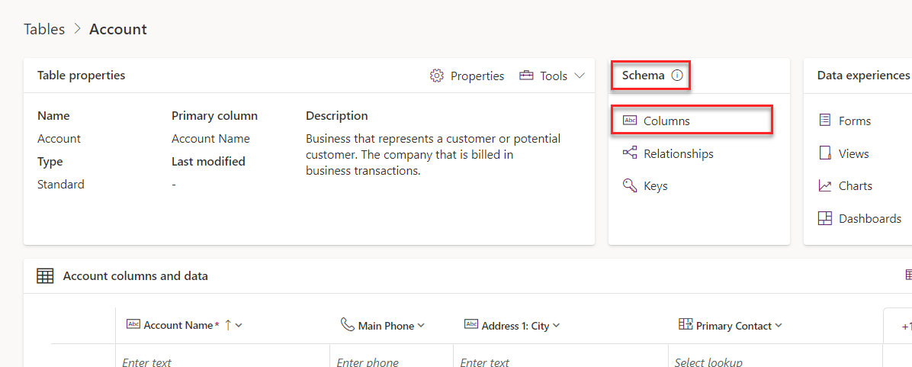](../media/table-columns.png#lightbox)

### Columns

A table has a list of columns. In the following example, the Account table has columns such as **Account Name** and **Account Number**. Each column has a data type, such as **Text** and **Number**. The system chooses the data type when you create a column, and this value isn't changeable. The data type also defines many characteristics and behaviors of the column when your application runs. For example, a **Choice** column allows you to have a predefined list of values for use in your application. When this column is used on a form in a model-driven application, the visual presentation is a dropdown control. The column helps to ensure data consistency and allows for built-in support for multi-language applications.

> [!div class="mx-imgBorder"]
> [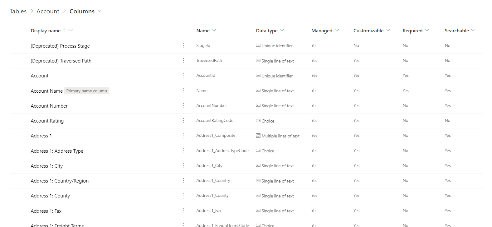](../media/data-type-column.png#lightbox)

For more information, see [Microsoft Dataverse Supported Data Types](/powerapps/maker/common-data-service/types-of-fields/?azure-portal=true).

Return to the table by selecting the browser's back button.

Select **Relationships**.

> [!div class="mx-imgBorder"]
> [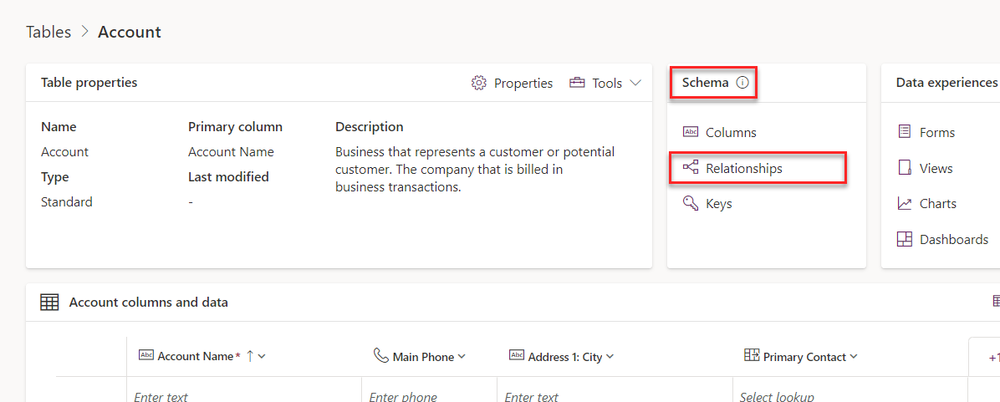](../media/relationships.png#lightbox)

### Relationships

Relationships allow you to manage relationships between tables. Supported relationships include one to many (1:N), many to one (N:1), and many to many (N:N). Relationships also define the behavior that happens when actions occur on the primary row in a 1:N relationship. For example, if the parent row is deleted, you can set up the relationship behavior so that all child rows are also deleted, or you can remove the reference.

> [!div class="mx-imgBorder"]
> [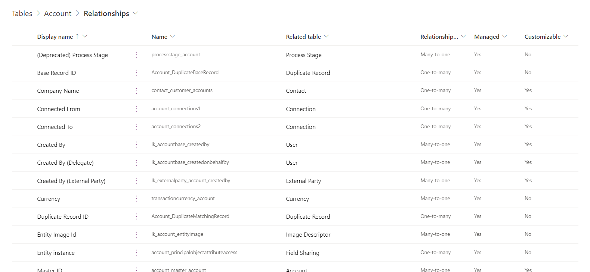](../media/relationship-type.png#lightbox)

Return to the table by selecting the browser's back button.

Select **Keys**.

> [!div class="mx-imgBorder"]
> 

### Keys

By selecting the **Keys** menu, you can view the lookup keys for the table. Keys can contain multiple columns to define a composite key. Keys enforce uniqueness, so you shouldn't use them when you need to store duplicate values of used columns.

> [!div class="mx-imgBorder"]
> [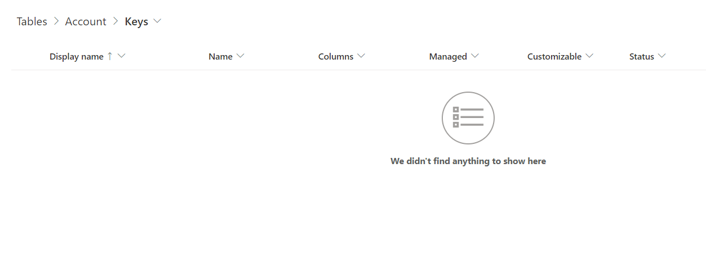](../media/keys-menu.png#lightbox)

Return to the table by selecting the browser's back button.

### Data experiences

With the **Data experiences** menu, you can navigate to the table forms, views, charts, and dashboards. Select **Forms**.

> [!div class="mx-imgBorder"]
> [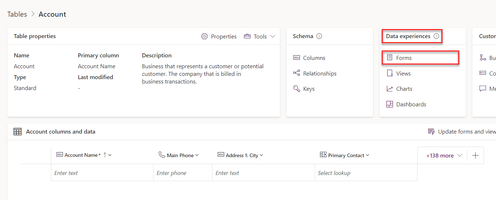](../media/data-experience.png#lightbox)

### Forms

You can use forms to interact with the data that you need to do your work. Make sure that the forms that you use are designed to help you efficiently find or enter the information that you need. From the **New form** dropdown menu, you can create different types of forms, such as **Quick Create**, **Quick View**, **Card**, and a **Main** form. Some forms have more than one version to accommodate different user roles within your organization.

> [!div class="mx-imgBorder"]
> 

Return to the table by selecting the browser's back button.

Select **Views**.

> [!div class="mx-imgBorder"]
> [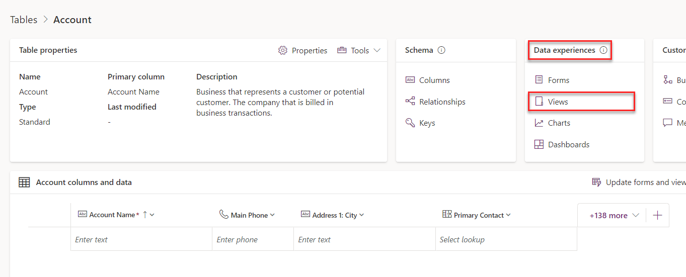](../media/table-views.png#lightbox)

### Views

Views let you define how a list of rows are shown in the app. You can create multiple custom views, each having its own filtering and sorting criteria. For example, you could create a view so that only the rows that were created in the last week are visible. You could create another view for rows that haven't been updated in a year. Create views to make the application users more productive in filtering their data.

> [!div class="mx-imgBorder"]
> [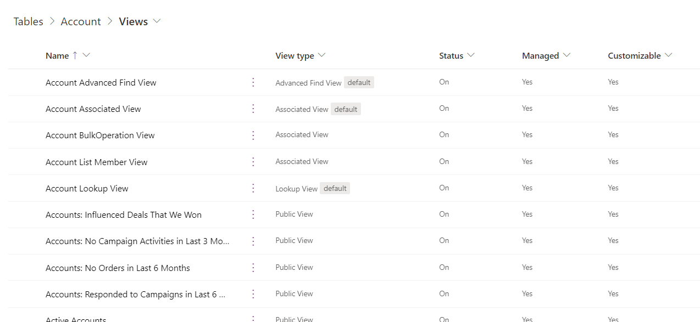](../media/view-type.png#lightbox)

Return to the table by selecting the browser's back button.

Select **Charts**.

> [!div class="mx-imgBorder"]
> [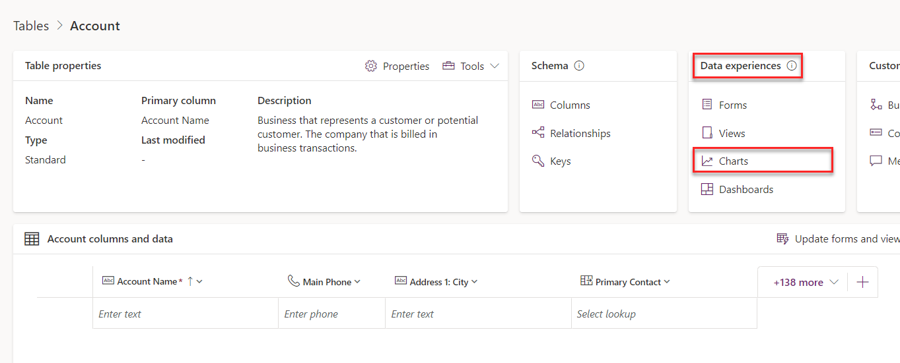](../media/table-charts.png#lightbox)

### Charts

Use charts to display a high-level view of your data in insightful and graphical ways.

> [!div class="mx-imgBorder"]
> [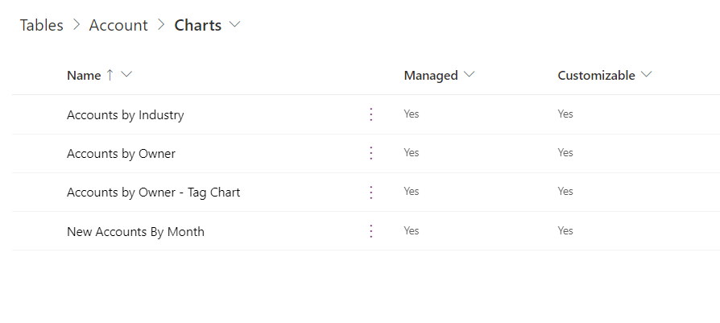](../media/table-chart.png#lightbox)

Return to the table by selecting the browser's back button.

Select **Dashboards**.

> [!div class="mx-imgBorder"]
> [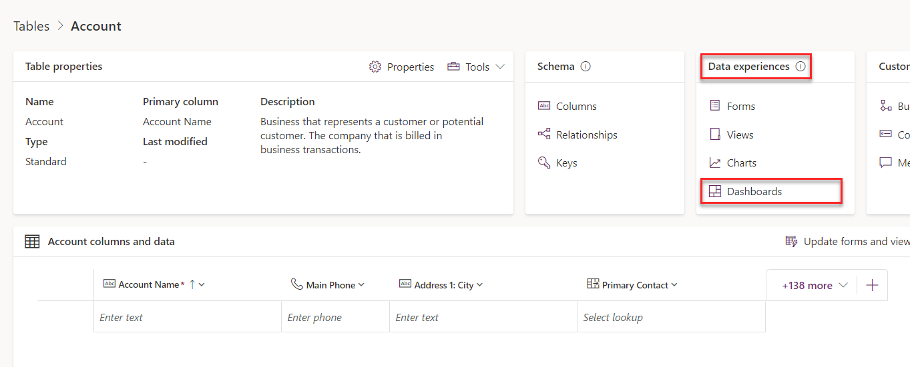](../media/dashboards.png#lightbox)

### Dashboards

Dashboards help you bring your views, charts, and web resources together in one place.

> [!div class="mx-imgBorder"]
> [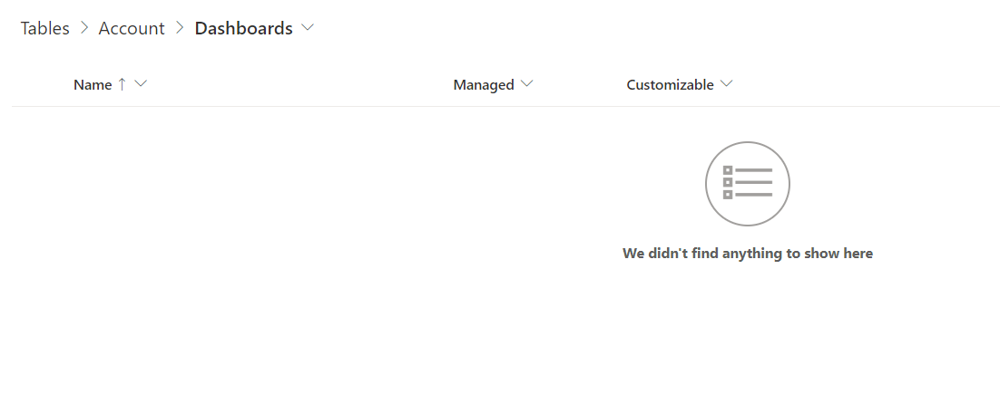](../media/table-dashboards.png#lightbox)

Return to the table by selecting the browser's back button.

### Customizations

In the **Customizations** section, you can navigate to the table business rules and commands. Select **Business rules**.

> [!div class="mx-imgBorder"]
> [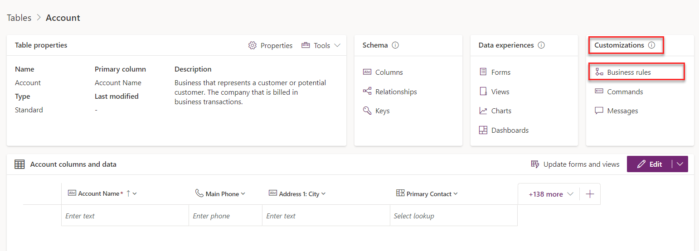](../media/business-rules.png#lightbox)

### Business rules

Building a business rule is similar to building a flowchart where you can define conditions and actions.

For more information, see [Business Rules Recommendations](/dynamics365/customer-engagement/customize/create-business-rules-recommendations-apply-logic-form/?azure-portal=true).

> [!div class="mx-imgBorder"]
> [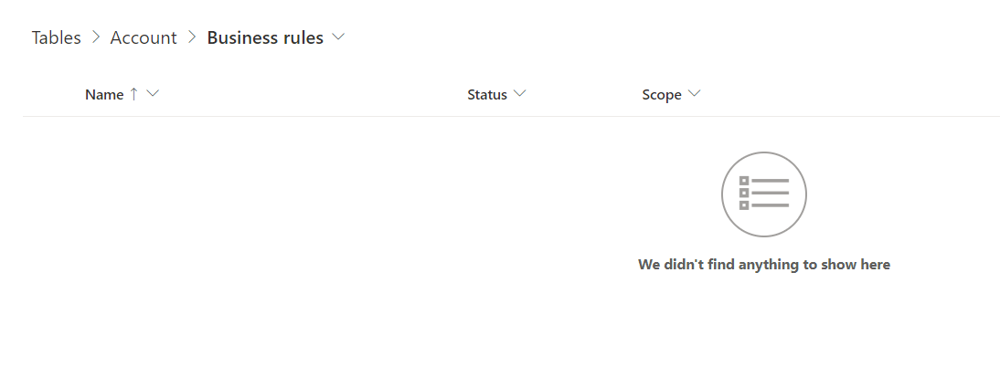](../media/table-business.png#lightbox)

Return to the table by selecting the browser's back button.

Select **Commands**.

> [!div class="mx-imgBorder"]
> [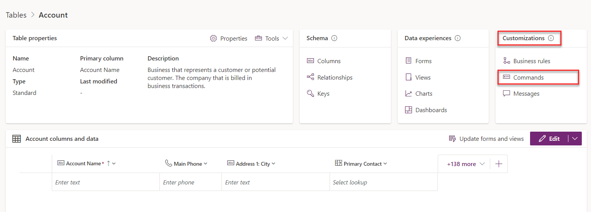](../media/commands.png#lightbox)

### Commands

Microsoft Dataverse allows you to create your own command bar buttons. The commands that you add to the table are listed in the **Commands** section.

> [!div class="mx-imgBorder"]
> [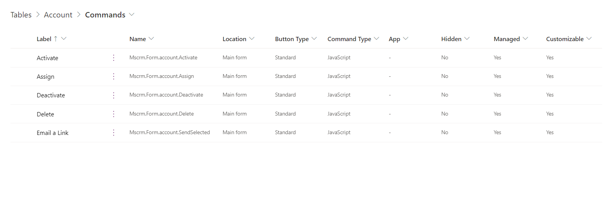](../media/table-commands.png#lightbox)

Return to the table by selecting the browser's back button.

### Columns and data

The **columns and data** section shows the first 10 rows of the table data. You can also view more columns by selecting the **Show existing columns** button, add a new column by selecting the **+ new column** button, edit table data with the **Edit** button, and order columns to your liking by dragging and dropping columns.

> [!div class="mx-imgBorder"]
> [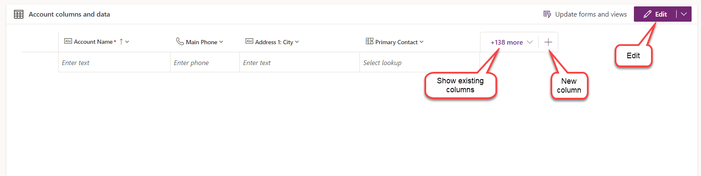](../media/data-view.png#lightbox)

Select the **Edit** button.

### Edit

By selecting the **Edit** button, you can create a new row, create a new column, refresh the data to view the latest rows, create an app from the data, and edit the table properties.

> [!div class="mx-imgBorder"]
> [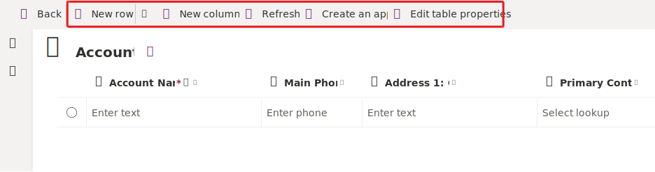](../media/table-edit.svg#lightbox)

You can delete one or more rows by selecting the rows that you want to delete. For this exercise, **don't delete rows**.

> [!div class="mx-imgBorder"]
> 

Select the **Back** button.

## Task - Explore standard choices

Similar to standard tables, Microsoft Dataverse includes a set of standard choices. You can also create custom choices. Later in this lab, you create a custom choice called **ApprovalStatus** to set the approval status of a machine order.

1. Select **Choices** from the navigation pane to the left of the screen. If you don't see **Choices** within the navigation pane, you might need to select **More**.

   > [!div class="mx-imgBorder"]
   > 

1. Examine the standard choices.

   > [!div class="mx-imgBorder"]
   > [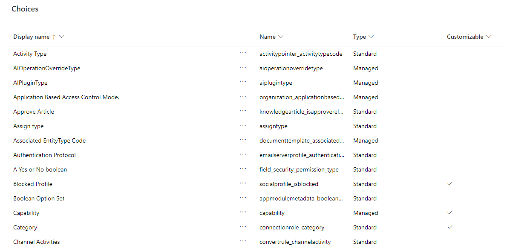](../media/standard-choices.png#lightbox)
