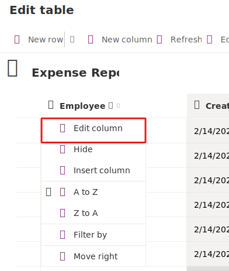

Let's explore using AI to generate a table of data and create a new app within Power Apps using the Copilot tool.

> [!NOTE]
> To complete the exercises, you'll need to use a few
> files. Download the [App in a Day files](https://github.com/MicrosoftDocs/mslearn-developer-tools-power-platform/raw/master/in-a-day/AIAD/AppinADayStudentFiles.zip)
> for use in this module. The file folders that are in
> this download include:
>
> - **Completed modules with instructions** - Package files to import the completed exercise steps.
> - **Machine-Order-Data.xlsx** - File used in the exercises.

## Task - Explore AI Copilot within Power Apps

Before beginning the exercise, go to [Make Microsoft Power Apps](https://make.powerapps.com/), sign in and confirm that you're in your training environment for the labs.

   > [!div class="mx-imgBorder"]
   > 

> [!NOTE]
> Within this lab, notice that your results for data may vary from those within the screenshots and images throughout the lab. This is because Power Apps is using OpenAI to generate data for the lab that changes daily.

1. In the center of the **Home** page within Power Apps, there's a text field in which you can enter a prompt to search for an AI generated table.

   Within the **text field** type the following prompt:

   `build an app to collect expense reports for employees that purchase microsoft laptops and tablets`

   Then, select the **Send** button.

   > [!div class="mx-imgBorder"]
   > 

1. After the AI Copilot generates a table based on your prompt, look through the table to see what columns were created for the start of your table.

   > [!NOTE]
   > Within this lab, notice that your results for data may vary from those within the screenshots and images throughout the lab. This is because Power Apps is using OpenAI to generate data for the lab that changes daily.

   > [!div class="mx-imgBorder"]
   > 

   > [!NOTE]
   > If you'd like, you can add or modify the existing columns generated within the table by Copilot. But note that there is a pre-built Suggestions section to the left of the screen.

Let's explore further within modifying and adding to the already generated table.

1. In the text box, at the bottom of the **Copilot** pane to the right of the screen, you can type a request to add a column. For this example we're going type:

   `add a column to track the employee's email address`

   Then, select the **Send** button.

   > [!NOTE]
   > You may find that the column added above already exists within your table that was generated by the Copilot. If so, try requesting a different column to be added.

   > [!div class="mx-imgBorder"]
   > 

   Notice how a new column that we requested and the corresponding data is added to the table.

   > [!NOTE]
   > Remember that the data that is generated in your table may vary from the data shown within the table in the screenshots and images for the lab.

   > [!NOTE]
   > In the bottom left corner of the screen, notice that there is a section titled **Suggestions**. This section provides you with different suggestions on how you can add to and modify your table.

   > [!div class="mx-imgBorder"]
   > 

   Notice that to the right of the screen, it appears to look as if you're having a conversation with a Copilot AI bot while adding to and modifying your table. Here's where you can scroll through and view the changes or additions you made to your table.

   > [!div class="mx-imgBorder"]
   > 

1. Select a column name **drop down** from within the table, and select **View column**. Here, you can view the columns’ properties and the current status details and data.  For the example shown within the following image, the drop-down for the column **Category** was selected. Every column within the table displays different column properties.

   > [!div class="mx-imgBorder"]
   > 

   Select the **X** in the top right corner of the pane to close out.

Let's try adding more data to our table and the existing columns.

1. Within the **Copilot** pane text box, type and send:

   `add 5 more rows of data`

   Notice that five more rows of data are added for each of the existing columns within the table.

   > [!div class="mx-imgBorder"]
   > 

   > [!NOTE]
   > Remember that the data that is generated in your table may vary from the data shown within the table in the screenshots and images for the lab.

Now, let's try changing the name of a column within our generated table.

1. Within your generated table, choose a column in which you want to change the name of. For the following example, we're going to choose the column that we added previously; the Employee Email column.

1. Within the textbox in the Copilot pane, **type** and **send** your request to change the column name in which you desire. For this example we type and send:

   `change the Employee Email column name to Employee Email Address`

You should then see the column name update within the table to the new column name you requested.

> [!div class="mx-imgBorder"]
> 

> [!NOTE]
> Remember that the data that is generated in your table may vary from the data shown within the table in the screenshots and images for the lab.

Now, let's try removing columns within our generated table.

Choose a column that you wish to **remove** from your table. For this example, we're going to remove the column in which we added and updated previously.

1. Within the text box of the **Copilot** pane, type a request to **remove** a column and select **send**. For the following example, we remove the column in which we added and updated the name of previously; the Employee Email Address column:

   `remove Employee Email Address column`

   Notice that the column within the table is removed.
   You might also notice that Copilot also made other changes. As shown here, you can see that Copilot also removed the five rows of data we added previously. In this scenario, I'm okay with that and I'll keep the table as is.

   > [!div class="mx-imgBorder"]
   > 

   > [!NOTE]
   > Remember that the data that is generated in your table may vary from the data shown within the table in the screenshots and images for the lab.

You can add and make more changes to your table as you wish, but for this lab and example, we keep the table as is.

Let's create the app now.

1. In the bottom right corner of the screen, select the **Create app** button.

   > [!div class="mx-imgBorder"]
   > 

   When the app first loads, a dialog might appear saying: **Welcome to Power Apps Studio**. If so, select the **Skip** button.

   You should now be viewing the app that was built for you in **Edit** mode. If the **Copilot** pane appears to the right of the screen, select the **X** in the top right corner to close it. That pane is available to you in Edit mode in case there are other changes you wish to make to the app.

   > [!NOTE]
   > Remember that the data that is generated in your table may vary from the data shown within the table in the screenshots and images for the lab.

   > [!div class="mx-imgBorder"]
   > 

1. To the left of the screen, select the **Data** icon from the navigation bar. Notice that a **Dataverse** table is created by the Copilot and is now in the **Environments** section.

   > [!div class="mx-imgBorder"]
   > 

   > [!NOTE]
   > Copilot is currently only supported for Dataverse. You cannot use any other data access point at this time.

Let's try editing the table now that the app was made.

1. Within the **Data** pane, hover over the table. To the right of the table, select the **ellipsis** (...).

1. From the menu, select **Edit data**.

   > [!div class="mx-imgBorder"]
   > 

   The Edit Table dialog appears. Here's where you can come and add your own columns to the table, or modify existing columns.

   > [!div class="mx-imgBorder"]
   > 

   > [!NOTE]
   > Remember that the data that is generated in your table may vary from the data shown within the table in the screenshots and images for the lab.

1. Locate the **Employee ID** column within the table. *(If you don't have an ID column within your table, navigate back to Copilot and request that the ID column is added to your table.)* Select the **Employee ID** column header from the table.

1. From the drop-down, select the **Edit column** option.

   > [!div class="mx-imgBorder"]
   > 

In this example, we don't want the *Data Type* of the column to be a *Single line of text*. Let's change that.

1. Within the Edit column pane, from the **Date type** drop-down select **# Autonumber**

1. Select **Save**.

   > [!div class="mx-imgBorder"]
   > 

1. Select the **Close** button in the bottom right corner of the **Edit table** dialog.

   Notice that the table now says **Refreshed** within the Data pane.

   > [!div class="mx-imgBorder"]
   > 

Based on what you learned in all of your other labs, let's add a few of those practices in.

1. Within the **Edit view** for the app, select the **Form** within the app canvas.

   > [!div class="mx-imgBorder"]
   > 

   > [!NOTE]
   > Remember that the data that is generated in your app may vary from the data shown within the app in the screenshots and images for the lab.

1. From the **Form** edit pane to the right of the screen, select the **Edit fields** button.

1. Within the **Fields** pane, expand the **ID** field.

1. From the **Control type** drop-down, change the type to **View text**.

   > [!div class="mx-imgBorder"]
   > 

   > [!NOTE]
   > Remember that the data that is generated for you may be different than the data shown in the images. In this case, the order in which the fields are listed may be different for you.

   Because we previously changed the ID field to Autonumber, we don’t want the users putting in their own number; Dataverse is going to autonumber it for us.

1. Within the **Fields** pane, use the **X** in the top right corner to **close** out the pane.

   Now, let's make and add a new request to the table within the app.

1. From the top of the screen, select the **Play** button.

   > [!div class="mx-imgBorder"]
   > 

1. Within the pane to the left of the app, select the **+New** button.

   > [!div class="mx-imgBorder"]
   > 

   > [!NOTE]
   > Remember that the data that is generated for you may be different than the data shown in the images. In this case, the data displayed in the fields of the app may be different for you.

1. Although you could modify the form to autofill the fields for you, we're going to do so ourselves to show that the app works.

   Fill in the following fields with this information:

   Employee Name: `< Your name >`

   Then, select the **checkmark**.

   > [!div class="mx-imgBorder"]
   > 

   > [!NOTE]
   > Remember that the fields within the app may be in different locations than what you see in your app.

1. Notice that the new request is added to the list of requests to the left of the app.

   Now, select the **X** in the top right corner to **close** out of the app.

   If a dialog appears saying: **Did you know?**, select **OK**.

   > [!div class="mx-imgBorder"]
   > 

1. From the top of your screen, select the Save button to save the new app you created.

   > [!div class="mx-imgBorder"]
   > 

Congratulations! You can now use your skills to modify your galleries and modify the form.
