In this exercise, you create a new custom table named Machine Order, and you add columns that are necessary for tracking the machine requests. You also create a server-side business rule that defaults the estimated ship date.

> [!NOTE]
> To complete the exercises, you'll need to use a few
> files. Download the [App in a Day files](https://github.com/MicrosoftDocs/mslearn-developer-tools-power-platform/raw/master/in-a-day/AIAD/AppinADayStudentFiles.zip)
> for use in this module. The file folders that are in
> this download include:
>
> - **Completed modules with instructions** - Package files to import the completed exercise steps.
> - **Machine-Order-Data.xlsx** - File used in the exercises.

## Task - Create a custom table

In this task, you create a custom table to store machine order requests.

1. Select **Solutions** and then open the **Contoso Coffee** solution.

1. Select the **+ New** drop down from the tool bar at the top of the page, hover over the **Table** option and then choose **Table**.

   > [!div class="mx-imgBorder"]
   > [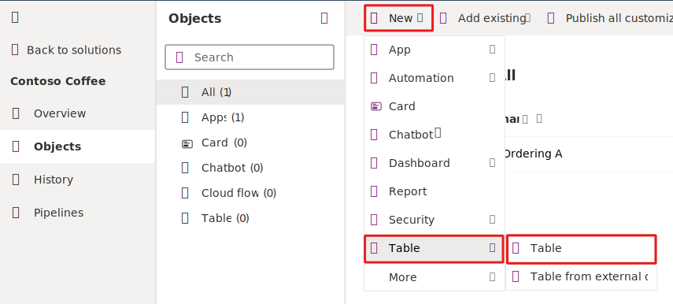](../media/new-table.svg#lightbox)

1. Enter `Machine Order` in the **Display name** field. The **Plural name** field automatically populates based on your entry in the **Display name** field. These fields are editable if you need to make changes. The system uses the plural name by default whenever a set of rows are shown.

   Select the **Enable attachments** option because it allows you to create notes on the machine order.

   > [!div class="mx-imgBorder"]
   > 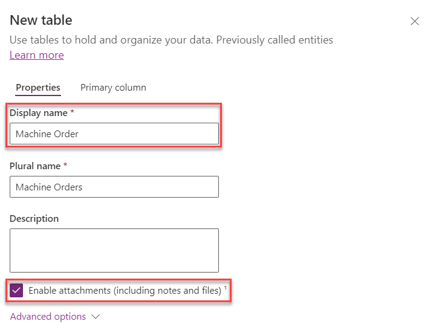

1. Select the **Primary column** tab.

1. Change the **Display name** field to `Machine Name`. The **Primary** column defaults to being named **Name**. For some scenarios, that label might not be the best one, so you can customize it if needed. However, the **Primary** column is always a text column that isn't changeable.

1. Select **Save**.

   > [!div class="mx-imgBorder"]
   > 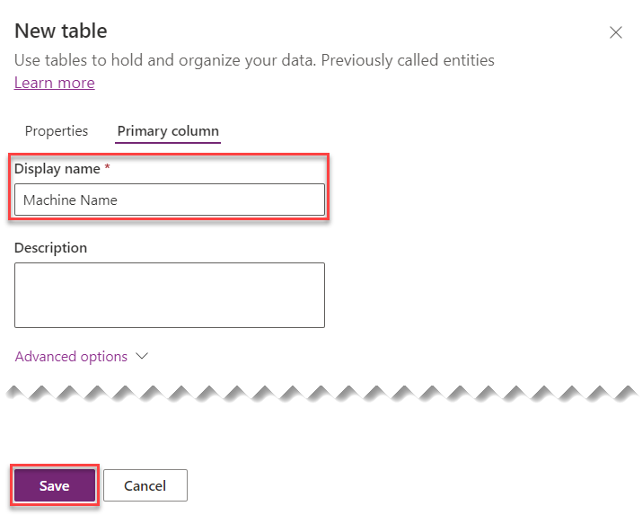

## Task - Create custom columns

In this task, you create custom columns for the Machine Order table. It might take a few minutes for your new Machine Order table to provision. Begin these steps after it finishes.

1. Within the **Objects** pane to the left of the screen, select to open the **Machine Order** table that you created.

1. Select the **+ New** drop down and then choose **Column**.

   > [!div class="mx-imgBorder"]
   > 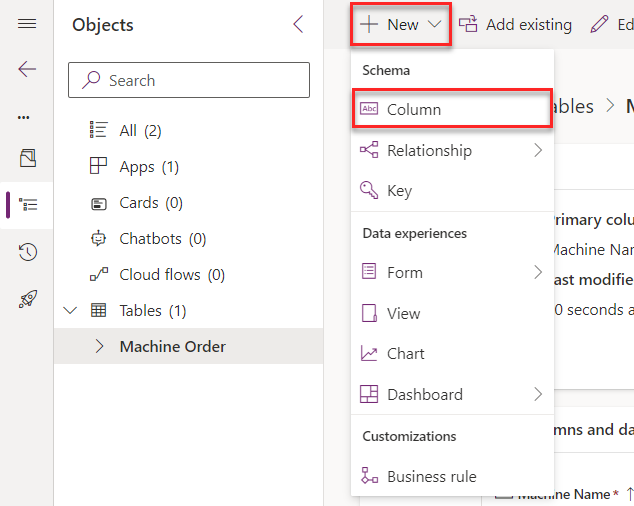

1. Enter `Price` in the **Display name** field, enter `Machine Price` in the **Description** box, and then select **Currency** from the **Data type** dropdown menu. From the **Required** dropdown menu, make the column **Business Required**. Select the **Searchable** option and then select **Advanced options**.

   > [!NOTE]
   > Currency is a special data type that allows you to build multi-currency solutions. For each currency column that you add, another currency column will be added with the prefix **_Base** on the name. This column stores the calculation of the value of the currency column that you added and the base currency. For more information, see [Using currency fields](/dynamics365/customer-engagement/customize/types-of-fields?azure-portal=true#BKMK_UsingCurrencyFields).

   > [!div class="mx-imgBorder"]
   > 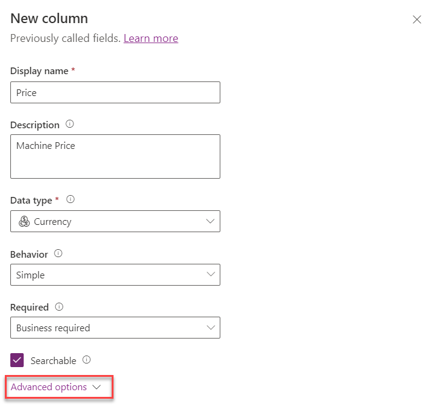

1. Enter `0` in the **Minimum value** field, enter `50000` in the **Maximum value** field, and then select **Save**.

   > [!div class="mx-imgBorder"]
   > 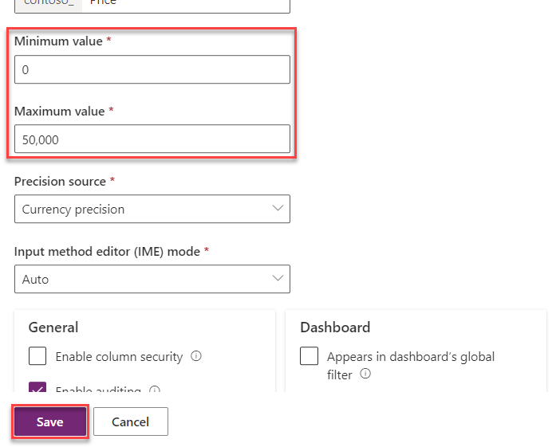

1. Select the **+ New** drop down, and then choose **Column** again.

1. Enter `Requested By` in the **Display name** field, select **Single line of text** from the **Data type** dropdown menu, choose **Email** from the **Format** dropdown menu, ensure that the column is **Searchable**, and then select **Save**.

   > [!div class="mx-imgBorder"]
   > 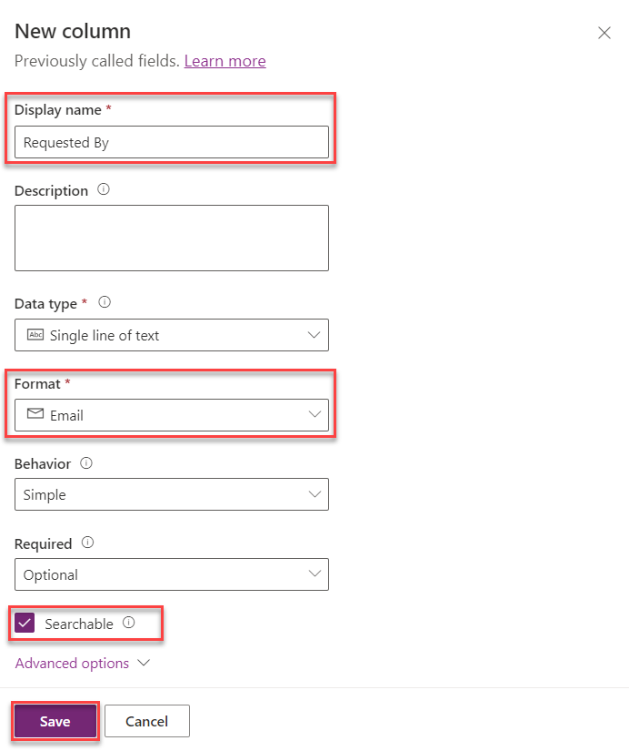

1. Repeat the **Add column** process and add the following columns:

   | Display name | Data type | Format |
   |--------------|-----------|--------|
   | Request Date | Date and time | Date only |
   | Approver | Single line of text | Email |
   | Comments | Multiple lines of text | Text |
   | Estimated Ship Date | Date and time | Date only |
   | Approved Date | Date and time | Date only |

1. Now, you create the **Approval Choice**. You're adding it as a choice (as opposed to a two-option) because users likely have more than **Yes/No** options to choose from. Select the **+ New** drop down and then choose **Column**.

1. Enter `Approval Status` in the **Display name** field, select **Choice** from the **Data type** dropdown menu, choose **No** beneath the **Sync with global choice** section, enter `Approve` in the **Label** field, and then select **+ New choice**.

   > [!div class="mx-imgBorder"]
   > 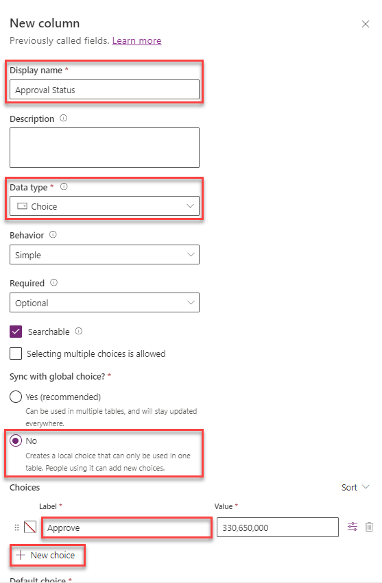

1. Enter `Reject` in the **Label** field and then select **Save**.

   > [!div class="mx-imgBorder"]
   > 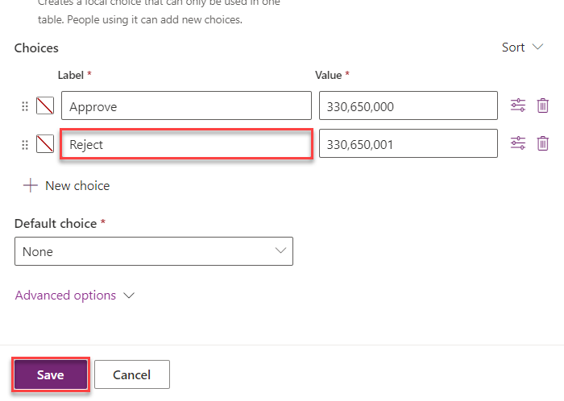

## Task - Create a formula column

In this task, you add a **Department Contribution** column using the formula data type and set its value to 10 percent of the price. In this scenario, this amount comes from the department manager's budget. In Dataverse, the "Formula" column refers to a column where the values are calculated based on a formula defined by the user. This formula can be created using a syntax specific to Dataverse, often similar to Excel formulas. 

1. Select the **+ New** drop down from the top of the page and then choose **Column**.

1. Enter `Department Contribution` in the **Display name** field, select **Formula** from the **Data type** dropdown menu.

1. In the formula box, enter the formula `Decimal(price)*.1`

   > [!div class="mx-imgBorder"]
   > 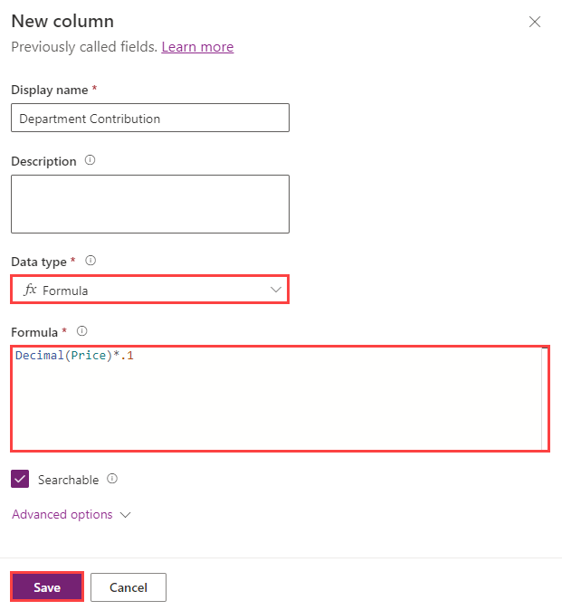

## Task - Create a business rule

In this task, you'll create a business rule that sets the Estimated Delivery Date to 14 days after the order is approved.

1. Select the **+ New** drop down located at the top of the page and then choose **Business rule**.

   > [!div class="mx-imgBorder"]
   > 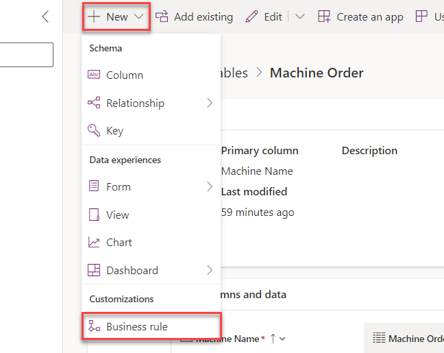

1. Select the drop-down arrow to **Show Details**.

   > [!div class="mx-imgBorder"]
   > 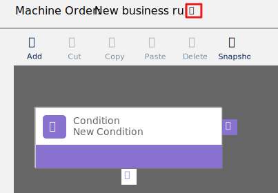

1. Change the **Business rule name** to `Calculate Ship Date`.  You can add a description as well like `Set the ship date to 14 days`. Then select the arrow to **Hide Details**.

   > [!div class="mx-imgBorder"]
   > 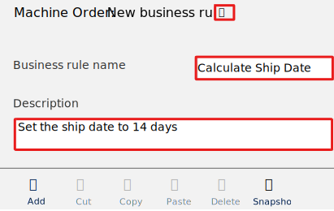

1. Select the **Condition**, and then change the **Display name** to `Check Approved Date`.

   > [!div class="mx-imgBorder"]
   > [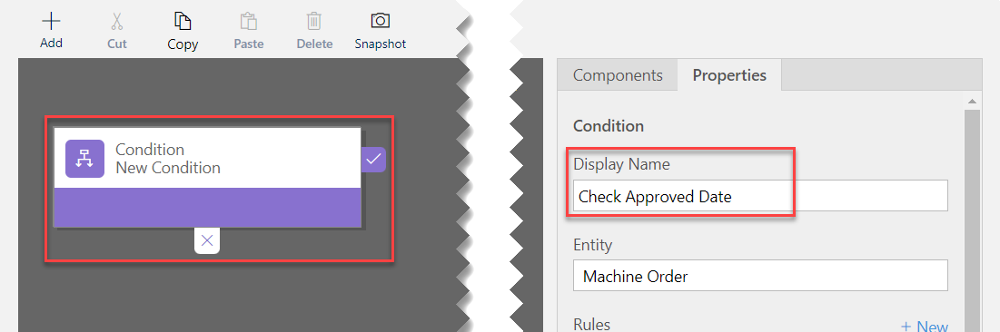](../media/condition.png#lightbox)

1. In the **Rules** section, select **Entity** from the **Source** dropdown menu, choose **Approved Date** from the **Field** dropdown menu, select **Contains data** from the **Operator** dropdown menu, and then choose **Apply**.

   > [!NOTE]
   > You might need to scroll down to the bottom of all scroll bars for the **Apply** button. Make sure that you select **Apply** after any change to the properties; otherwise, they will revert to the prior value. The **Business Rule (Text View)** will automatically update after you select **Apply** when you're done modifying the rule.

   > [!div class="mx-imgBorder"]
   > 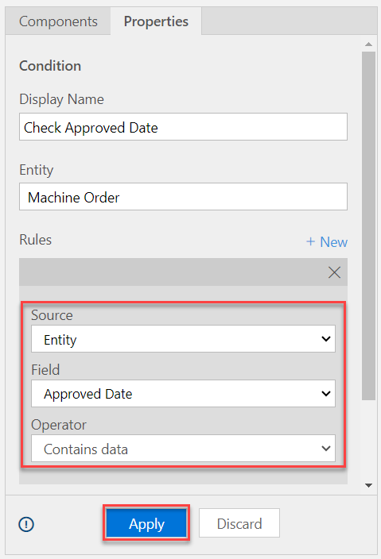

1. Select **+ Add** from the tool bar at the top of the page and then choose **Add Set Field Value**.

   > [!div class="mx-imgBorder"]
   > 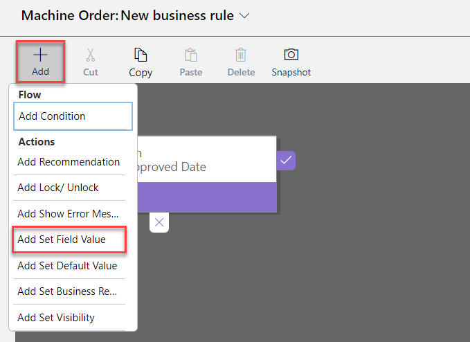

1. Select the **true** side of the condition.

   > [!div class="mx-imgBorder"]
   > 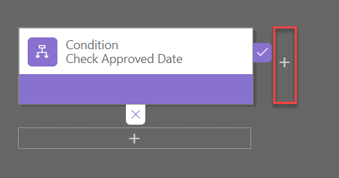

1. Enter the following information in the Set Field Value **Properties** pane:

   - **Display name**: Set Estimated Ship Date
   - **Field**: Estimated Ship Date
   - **Type**: Formula
   - Second **Field**: Approved Date
   - **Operator**: plus (**+**) sign
   - Second **Type**: Value
   - **Days**: 14

   Select **Apply** when you're finished.

   > [!div class="mx-imgBorder"]
   > 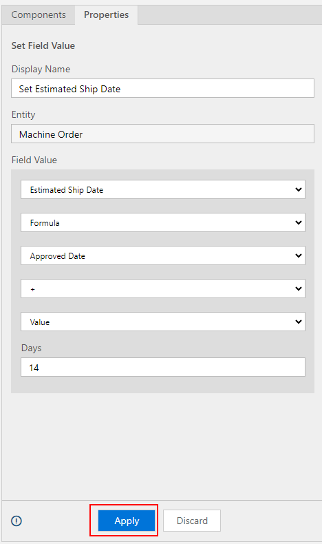

1. From the top right hand corner of the page, select **Validate**.

   > [!div class="mx-imgBorder"]
   > 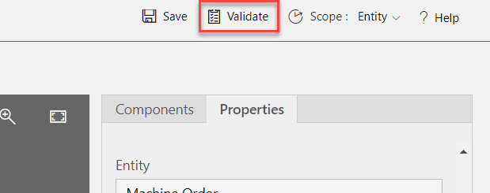

1. Make sure that the validation succeeds.

   > [!div class="mx-imgBorder"]
   > 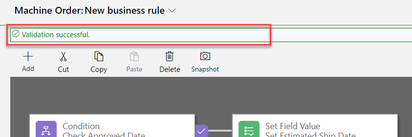

1. Select **Save**.

   > [!div class="mx-imgBorder"]
   > 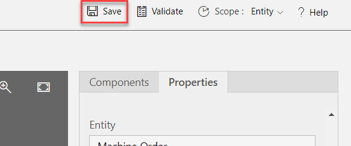

1. Select **Activate**.

   > [!div class="mx-imgBorder"]
   > 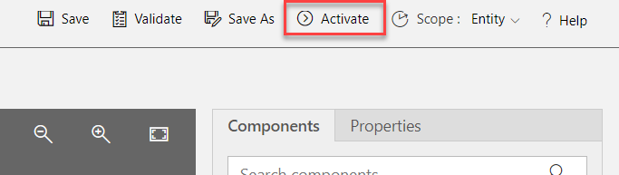

1. Confirm activation. Business rules only run when they're activated. In the future, to make changes to rules, you need to deactivate them, make the change, and then reactivate the rule.

   > [!div class="mx-imgBorder"]
   > 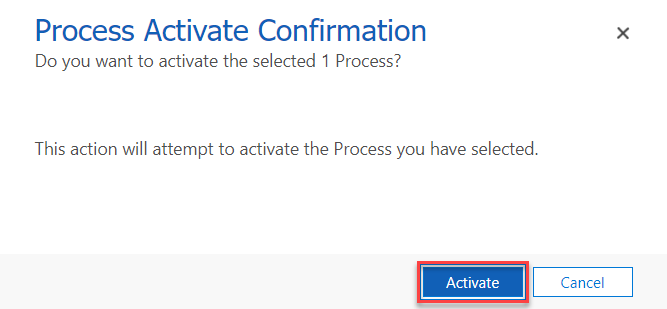

1. Close the process editor browser window or tab.

1. Select **Done**. The list should refresh and show the business rule that you created.

   > [!div class="mx-imgBorder"]
   > 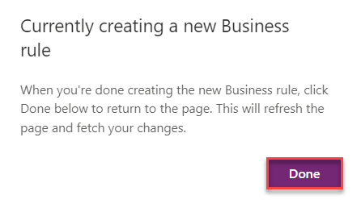

> [!IMPORTANT]
> Don't navigate away from this page.
