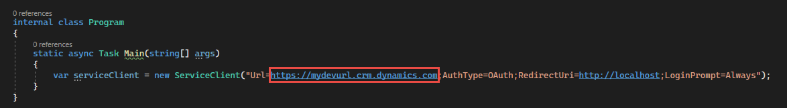

## Dataverse organization service

In the following steps, you can build an application that uses the Dataverse SDK for .NET.

### Authenticate and create new record

1. Start **Visual Studio 2022**.

1. Select **Create a new project**.

1. Search for console, select **Console App**, and then select **Next**.

   > [!div class="mx-imgBorder"]
   > [](../media/create-console-app.png#lightbox)

1. Provide a name for the project, select a **Location**,  and then select **Next**.

1. Select **.NET 7.0 (LTS)** for Framework, check the **Do not use top-level statements** checkbox, and select **Create**.

   > [!div class="mx-imgBorder"]
   > [](../media/net-framework.png#lightbox)

1. Right-click on the project and select **Manage NuGet Packages**.

1. Select the **Browse** tab, search for dataverse.client, select **Microsoft.PowerPlatform.Dataverse.Client**, and then select **Install**.

   > [!div class="mx-imgBorder"]
   > [](../media/nuget-package.png#lightbox)

1. Close the NuGet manager.

1. Add these using statements to **Program.cs**.

   ```csharp
   using Microsoft.PowerPlatform.Dataverse.Client;
   using Microsoft.Xrm.Sdk;
   ```

1. Replace the code inside the **Main** method with this code. This code creates a service client.

   ```csharp
     var serviceClient = new ServiceClient("Url=[instance url];AuthType=OAuth;RedirectUri=http://localhost;LoginPrompt=Always");
   ```

1. Make the Main method **async** and return **Task** instead of void.

   > [!div class="mx-imgBorder"]
   > [](../media/main-method.png#lightbox)

1. Go to the [Maker portal](https://make.powerapps.com/?azure-portal=true), and make sure you have the correct environment selected.

1. Select the **Settings** button and then select **Session details**.

   > [!div class="mx-imgBorder"]
   > [](../media/session-details.png#lightbox)

1. Copy the **Instance url**.

   > [!div class="mx-imgBorder"]
   > [](../media/instance-url.png#lightbox)

1. Go back to Visual Studio and replace **[instance url]** with the URL you copied.

   > [!div class="mx-imgBorder"]
   > [](../media/uniform-resource-locator.png#lightbox)

1. Add this method to the **Program** class.

   ```csharp
     private async static Task CreateNewAccount(ServiceClient serviceClient)
     {

     }
   ```

1. The **CreateNewAccount** method.

   > [!div class="mx-imgBorder"]
   > [](../media/create-account-method.png#lightbox)

1. Add this code to the **CreateNewAccount** method. This code creates a new account and displays the ID of the created account.

   ```csharp
    Entity newAccount = new Entity("account");
    newAccount["name"] = "Fourth Coffee (Learn Labs)";
    newAccount["creditlimit"] = new Money(12000);
    var accountId = await serviceClient.CreateAsync(newAccount);
    Console.WriteLine("Created Account Id: " + accountId);
   ```

1. The **CreateNewAccount** should now look like this method.

   > [!div class="mx-imgBorder"]
   > [](../media/create-new-account-code.png#lightbox)

1. Add this code to the **Main** method. This code calls the create new account method.

   > [!div class="mx-imgBorder"]
   > [](../media/call-create-account.png#lightbox)

1. Save your changes and run the console application.

1. You should be prompted to sign in. Provide your credentials and sign in.

1. You can close the browser window.

1. The console application should display the ID of the created account row.

   > [!div class="mx-imgBorder"]
   > [](../media/account-id.png#lightbox)

1. Press any key to close the console application.

1. Go back to the [Maker portal](https://make.powerapps.com/?azure-portal=true), and make sure you have the correct environment selected.

1. Select **Tables** and open the **Account** table.

   > [!div class="mx-imgBorder"]
   > [](../media/account-table.png#lightbox)

1. Go to the **Account columns and data** section, select the **More** button, add the **Credit limit** column, and then select **Save**.

   > [!div class="mx-imgBorder"]
   > [](../media/credit-limit.png#lightbox)

1. You should see the created account row.

   > [!div class="mx-imgBorder"]
   > [](../media/created-account.png#lightbox)

### Create related records

1. Go back to **Visual Studio 2022**.

1. Add this method to the **Program** class.

   ```csharp
    private async static Task CreateRelatedRecords(ServiceClient serviceClient)
    {

    }
   ```

1. Add this code to the **CreateRelatedRecords** method. This code creates a new account.

   ```csharp
    Entity newAccount = new Entity("account");
    newAccount["name"] = "Fourth Coffee (With Contact)";
    newAccount["creditlimit"] = new Money(12000);
    newAccount.Id = await serviceClient.CreateAsync(newAccount);
   ```

1. Add this code to the **CreateRelatedRecords** method. This code creates a new contact and sets its parent customer to the new account.

   ```csharp
    Entity newContact = new Entity("contact");
    newContact["firstname"] = "Nancy";
    newContact["lastname"] = "Anderson (Learn Lab)";
    newContact["parentcustomerid"] = newAccount.ToEntityReference();
    var contactId = await serviceClient.CreateAsync(newContact);
   ```

1. Add this code to the **CreateRelatedRecords** method. This code displays the IDs of the created contact and account records.

   ```csharp
    Console.WriteLine($"Created Acount Id: {newAccount.Id} -  Created  Contact Id: {contactId}.");
   ```

1. The **CreateRelatedRecords** method should now look like this image.

   > [!div class="mx-imgBorder"]
   > [](../media/create-related-records-method.png#lightbox)

1. Go to the **Main** method, comment out the call to the **CreateNewAccount** method and call the **CreateRelatedRecordsMethod** method.

1. The **Main** method should now look like this image. Run the program.

   > [!div class="mx-imgBorder"]
   > [](../media/main-method-call-related.png#lightbox)

1. Provide your credentials and sign in.

1. The console application should display the IDs of the created records.

   > [!div class="mx-imgBorder"]
   > [](../media/created-records.png#lightbox)

1. Close the console application.

   ```csharp
    QueryExpression contactQuery = new QueryExpression("contact");
    contactQuery.ColumnSet = new ColumnSet("fullname");
   ```

### Query Contacts

1. Go back to **Visual Studio 2022**.

1. Add this method to the **Program** class.

   ```csharp
    private async static Task QueryContacts(ServiceClient serviceClient)
    {

    }
   ```

1. Add this code to the **QueryContacts** method. This code creates a query expression for the contact table and selects the fullname column.

   ```csharp
    QueryExpression contactQuery = new QueryExpression("contact");
    contactQuery.ColumnSet = new ColumnSet("fullname");
   ```

1. Add this code to the **QueryContacts** method. This code snippet creates LinkEntity for the account and contact table, select the name and creditlimit columns, and give the **LinkEntity** an alias name. A LinkEntity allows you to query across the relationship between the two tables where they intersect.

   ```csharp
    LinkEntity accountLink = new LinkEntity("contact", "account", "parentcustomerid", "accountid", JoinOperator.Inner);
        accountLink.Columns = new ColumnSet("name", "creditlimit");
    accountLink.EntityAlias = "parentAccount";
   ```

1. Add this code to the **QueryContacts** method. This code adds a condition for accounts with credit limit greater than 12001. This adds criteria to the LinkEntity so you only get contact rows that are associated with an account that has a credit limit > 12000.

   ```csharp
    accountLink.LinkCriteria.AddCondition("creditlimit", ConditionOperator.GreaterThan, 12000);
    contactQuery.LinkEntities.Add(accountLink);
   ```

1. Call retrieve multiple. Add this code to the **QueryContacts** method. This returns all the contact table rows matching the query criteria.

   ```csharp
    EntityCollection results = serviceClient.RetrieveMultiple(contactQuery);
   ```

1. Add this code to the **QueryContacts** method. This code goes through the result entities and displays the last name of the contact and the credit limit of the account. Notice this casts the entity column as AliasedValue, this is necessary when accessing data from a LinkedEntity in retrieve multiple results.

   ```csharp
    foreach (Entity entity in results.Entities)
    {
        var creditLimit = ((Money)((AliasedValue)entity["parentAccount.creditlimit"]).Value).Value;

        Console.WriteLine($"Contact name: {entity["fullname"]} Credit limit: {creditLimit}.");
    }
   ```

1. The **QueryContacts** method should now look like this image.

   > [!div class="mx-imgBorder"]
   > [](../media/query-contacts-method.png#lightbox)

1. Go to the **Main** method, comment out the call to the **CreateRelatedRecordsMethod** method and call the **QueryContacts** method.

1. The **Main** method should now look like this image. Run the program.

   > [!div class="mx-imgBorder"]
   > [](../media/main-method-query-contacts.png#lightbox)

1. Provide your credentials and sign in.

1. The application should display the last name of the contact and the credit limit of the account.

   > [!div class="mx-imgBorder"]
   > [](../media/contact-account.png#lightbox)

1. Close the application.

### Create alternate key

1. Go back to **Visual Studio 2022**.

1. Add this method to the **Program** class.

   ```csharp
    private async static Task CreateAlternateKey(ServiceClient serviceClient)
    {

    }
   ```

1. Add this code to the **CreateAlternateKey** method. This code creates an alternate key for the account table based on the account number. This is an example of using the API to modify the Dataverse metadata. You can also create tables and columns and other metadata in a Dataverse environment.

   ```csharp
   CreateEntityKeyRequest createKeyRequest = new CreateEntityKeyRequest
   {
     EntityName = "account",
     EntityKey = new EntityKeyMetadata
     {
        KeyAttributes = new[] { "accountnumber" },
        SchemaName = "contoso_AccountNumberKey",
        DisplayName = new Label("Account Number Key", 1033)
     }
   };
   ```

1. Add this code to the **CreateAlternateKey** method. This code calls execute and displays the Key ID.

   ```csharp
    var excuteResults = await serviceClient.ExecuteAsync(createKeyRequest);
    Console.WriteLine($"Key Id: {excuteResults.Results.First().Value}");
   ```

1. The **CreateAlternateKey** method should now look like this image.

   > [!div class="mx-imgBorder"]
   > [](../media/create-key.png#lightbox)

1. Go to the **Main** method, comment out the call to the **QueryContacts** method and call the **CreateAlternateKey** method.

1. The **Main** method should now look like this image. Run the program.

   > [!div class="mx-imgBorder"]
   > [](../media/main-method-call-create-alt.png#lightbox)

1. Provide your credentials and sign in.

1. The console app should display the created alternate **Key Id**.

   > [!div class="mx-imgBorder"]
   > [](../media/new-key-id.png#lightbox)

1. Close the application.

1. Go to [Maker portal](https://make.powerapps.com/?azure-portal=true), and make sure you have the correct environment selected.

1. Select **Tables** and open the **Account** table.

1. Select the **Keys** button under the **Schema** section.

   > [!div class="mx-imgBorder"]
   > [](../media/schema.png#lightbox)

1. You should see the alternate key you created.

   > [!div class="mx-imgBorder"]
   > [](../media/alternate-key.png#lightbox)

### Update record using alternate key

1. Go to the [Maker portal](https://make.powerapps.com/?azure-portal=true), and make sure you have the correct environment selected.

1. Select **Tables** and open the **Account** table.

1. Go to the **Account columns and data** section, select the **More** columns button, add the **Account Number** and **Credit Limit** columns, and then select **Save**.

   > [!div class="mx-imgBorder"]
   > [](../media/add-column.png#lightbox)

1. Copy the **Account Number** value of one of the accounts and make a note of the current **Credit Limit** value.

   > [!div class="mx-imgBorder"]
   > [](../media/copy-key.png#lightbox)

1. Go back to **Visual Studio 2022**.

1. Add this method to the **Program** class.

   ```csharp
    private async static Task UpdateWithAlternateKey(ServiceClient serviceClient)
    {

    }
   ```

1. Add this code to the **UpdateWithAlternateKey** method. This updates the account's credit limit using the alternate key.

   ```csharp
    Entity account = new Entity("account", "accountnumber", "ABC28UU7");
    account["creditlimit"] = new Money(500);

    await serviceClient.UpdateAsync(account);
   ```

1. The Main **UpdateWithAlternateKey** should now look like this image.

   > [!div class="mx-imgBorder"]
   > [](../media/update-key.png#lightbox)

1. Go to the **Main** method, comment out the call to the **CreateAlternateKey** method and call the **UpdateWithAlternateKey** method.

1. The **Main** method should now look like this image. Run the program.

   > [!div class="mx-imgBorder"]
   > [](../media/main-method-call-update-key.png#lightbox)

1. Provide your credentials and sign in.

1. The application should run successfully. Close the application.

1. Go to the maker and make sure the account credit limit was updated.

   > [!div class="mx-imgBorder"]
   > [](../media/updated-limit.png#lightbox)

### Query change tracking

1. Go back to **Visual Studio 2022**.

1. Go to the Main **UpdateWithAlternateKey** and change the credit limit value to 25000.

   > [!div class="mx-imgBorder"]
   > [](../media/change-credit.png#lightbox)

1. Add this method to the **Program** class.

   ```csharp
    private async static Task QueryChangeTracking(ServiceClient serviceClient)
    {

    }
   ```

1. Add this code to the **QueryChangeTracking** method. This creates a request to retrieve entity change for the account table and set the number of records to 5000.

   ```csharp
    string token = null;
    RetrieveEntityChangesRequest request = new RetrieveEntityChangesRequest
    {
        EntityName = "account",
        Columns = new ColumnSet(true),
        PageInfo = new PagingInfo
        {
            Count = 5000, // Set the number of records per page here.
            PageNumber = 1
        },
        DataVersion = token
    };
   ```

1. Add this code to the **QueryChangeTracking** method. This executes the request.

   ```csharp
    var response = await serviceClient.ExecuteAsync(request) as RetrieveEntityChangesResponse;
   ```

1. Add this code after to the **QueryChangeTracking** method. This displays the IDs of the new or updated entity ID.

   ```csharp
    foreach (var entity in response.EntityChanges.Changes)
    {
        if (entity.Type == ChangeType.NewOrUpdated)
        {
            var updatedEntity = ((NewOrUpdatedItem)entity).NewOrUpdatedEntity;

            Console.WriteLine($"Entity ID: {updatedEntity.Id}");
        }
    }
    request.DataVersion = response.EntityChanges.DataToken;
   ```

1. The **QueryChangeTracking** method should now look like this image.

   > [!div class="mx-imgBorder"]
   > [](../media/change-ids.png#lightbox)

1. Call the **UpdateWithAlternateKey** method. Add this code to the **QueryChangeTracking** method.

1. You'll now retrieve entity changes again after you update the account credit limit. Add this code after the call to the  **UpdateWithAlternateKey** method.

   ```csharp
    response = await serviceClient.ExecuteAsync(request) as RetrieveEntityChangesResponse;

    foreach (var entity in response.EntityChanges.Changes)
    {
        if (entity.Type == ChangeType.NewOrUpdated)
        {
            var updatedEntity = ((NewOrUpdatedItem)entity).NewOrUpdatedEntity;

            Console.WriteLine($"Updated ID: {updatedEntity.Id}");
        }
    }
   ```

1. The bottom part of the **QueryChangeTracking** method should look like this image.

   > [!div class="mx-imgBorder"]
   > [](../media/method-bottom.png#lightbox)

1. Go to the **Main** method, comment out the call to the **UpdateWithAlternateKey** method and call the **QueryChangeTracking** method.

1. The **Main** method should now look like this image. Run the program.

   > [!div class="mx-imgBorder"]
   > [](../media/call-query-change-tracking.png#lightbox)

1. Provide your credentials and sign in.

1. The application should run successfully, and it should display a list of IDs including the ID of the account you updated.

   > [!div class="mx-imgBorder"]
   > [](../media/list-ids.png#lightbox)

1. Close the application.
