Power BI reports are designed so that people can view and interact with them to gain insights and make better decisions. The Power BI for Teams app allows you to collaborate with your team members on data and take action.

In this unit, you will learn how to:

- **Add the Power BI for Teams app** so that you can access your Power BI data without leaving Teams.

- **Grant permissions to reports** to allow your coworkers and team members access.

- Use the Power BI tab for Microsoft Teams to **embed interactive reports in channel and chat tabs**.

- **Start a chat in Teams** to start a conversation while you are viewing the report.

- **Reference a report in the Teams message box** when you are collaborating with coworkers.

- **Add a comment to a report** to start a conversation with colleagues.

## Add the Power BI for Teams app
To add the Power BI for Teams app, follow these steps:

1. Launch Teams or use your browser to open [https://teams.microsoft.com](https://teams.microsoft.com/?azure-portal=true).

1. In Teams, select **Apps** in the lower-left corner of the screen.

1. In the search box, enter **Power BI** and then select it from the search results.

    > [!div class="mx-imgBorder"]
    > [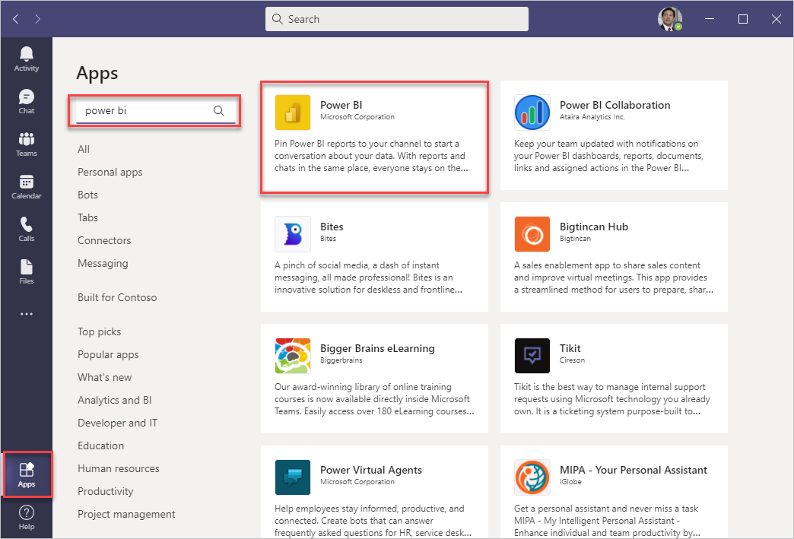](../media/image-39.png#lightbox)

1. Select **Add** to install Power BI.

If you've never signed in to Power BI before, sign in and then go through the new user setup prompts.

> [!NOTE]
> Pin the Power BI app to the app launcher to quickly access it at any time. Right-click the Power BI icon and select **Pin**. You can also run the app as a separate window from Teams by selecting **Pop out app**.
>
> [!div class="mx-imgBorder"]
> 

The Power BI app for Teams launch page gives you quick access to your favorite reports, dashboards, and workspaces. Also, you can explore Power BI training and recommended apps.

> [!div class="mx-imgBorder"]
> [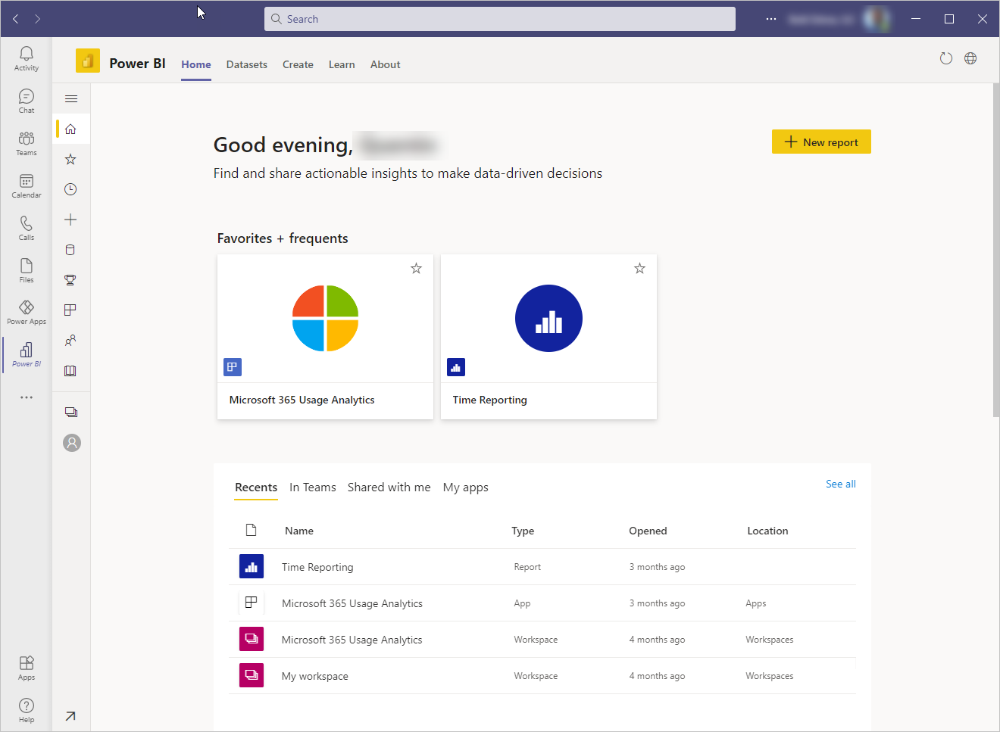](../media/image-41.png#lightbox)

## Share a report

Reports that are published to Power BI workspaces automatically grant access to everyone who is a member of the workspace. If you published the report to **My workspace**, only you have access to the report by default.

> [!NOTE]
> When a user tries to access a Power BI report that they don't have access to, they are prompted through a request access dialog box to provide a note that explains their reason for access. The owner of the report will receive an email to review the request and approve if appropriate.

To create a share link, follow these steps:

1. Open the report in the Power BI for Teams app.

1. Set any filters or slicers that you want the recipients to see. The share link will contain this information and users will see the filtered report when using the shared link.

1. Select **Share** from the menu bar.

    > [!div class="mx-imgBorder"]
    > 

1. Expand the dialog box to define who can use the link. Choose the appropriate settings and then select **Apply**.

    - **People in your organization** - This link grants access to people in your organization. It doesn't work for external users.
    - **People with existing access** - Use this option when you want to generate a link and not change the existing permissions.
    - **Specific people** - This link prompts you to provide the name of specific people, groups, or external guests in your organization's Microsoft Entra ID. You can't grant access to external users that aren't guests of your organization.

    > [!NOTE]
    > Use the **Specific people** option to ensure everyone has access when sharing as a tab in a channel, chat, or meeting.

    > [!div class="mx-imgBorder"]
    > [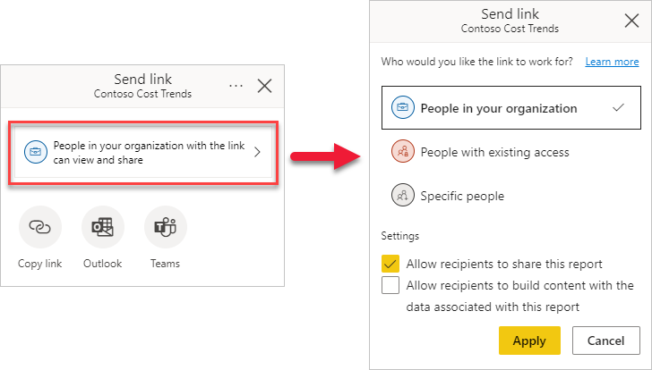](../media/image-43.png#lightbox)

1. Select whether you want to **Copy link** to the clipboard, open an **Outlook** email with the link, or post the link to a **Teams** channel. If you share with **Specific people**, you can enter a message and **Send** an email immediately.

    > [!div class="mx-imgBorder"]
    > [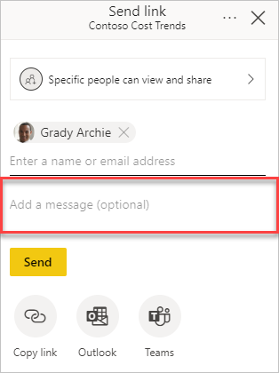](../media/image-44.png#lightbox)

To manage report permissions, follow these steps:

1. Open the report in Power BI for Teams.

1. Select **Share** from the menu bar.

1. Select the **More options** ellipsis (**…**) in the **Send link** windows title and then select **Manage permissions**.

    > [!div class="mx-imgBorder"]
    > [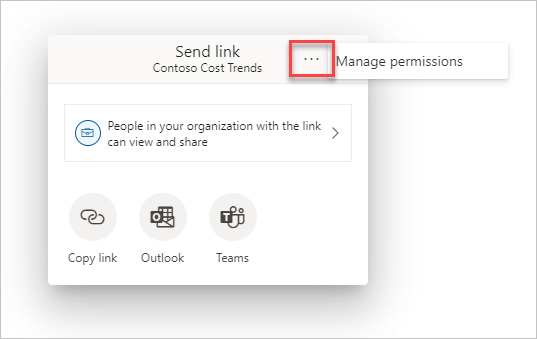](../media/image-45.png#lightbox)

1. From the **Managed permissions** panel, you can review **Links giving access** and who has **Direct access** permissions to the report.

    > [!div class="mx-imgBorder"]
    > [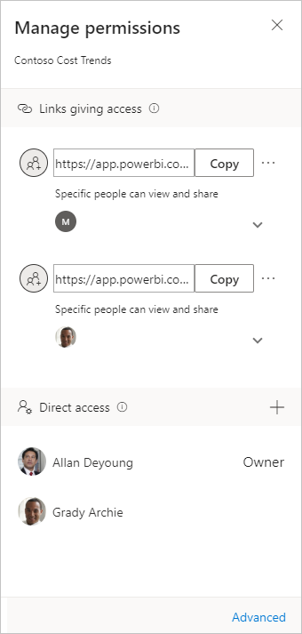](../media/image-46.png#lightbox)

## Embed interactive reports in channel and chat tabs

Adding a Power BI tab in Teams helps make it easier for your team members to find the report. They can view and interact with the report without leaving the channel or chat.

1. Open the Teams app or use your browser to open [https://teams.microsoft.com](https://teams.microsoft.com/?azure-portal=true).

1. Open a chat or channel to add the Power BI report.

1. Select the **Add a tab** icon (**+**).

    > [!div class="mx-imgBorder"]
    > [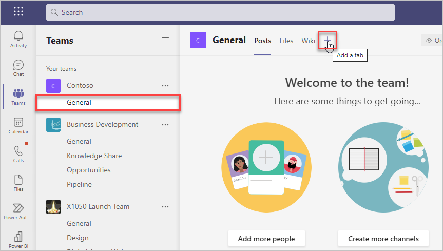](../media/image-47.png#lightbox)

1. Select the **Power BI** app.

1. Enter a **Tab name** and then select the report from the workspace section. Select **Save** to continue.

    > [!div class="mx-imgBorder"]
    > [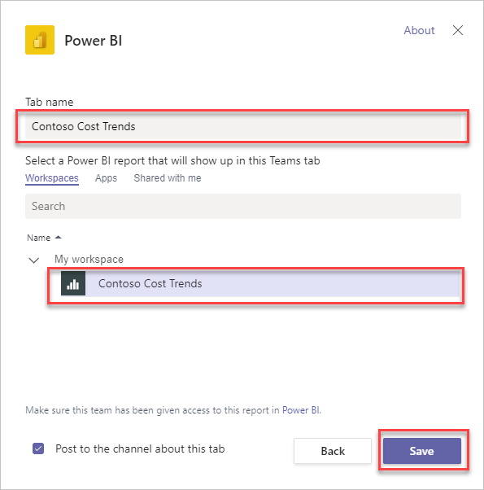](../media/image-48.png#lightbox)

The report will appear as a tab in the channel or chat.

> [!div class="mx-imgBorder"]
> [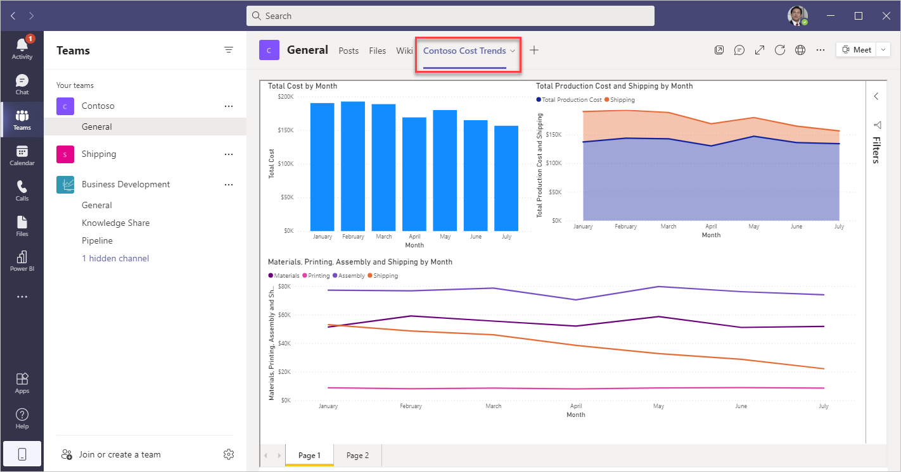](../media/image-49.png#lightbox)

> [!NOTE]
> Adding a Power BI tab does not change permissions, and only users that have access can view the report. Users who don't have access will be prompted to request access when they select the tab.

## Start a chat in Teams

You can start a conversation in a Teams channel when you are viewing reports in the Power BI for Teams app. The conversation can be about the report or you can direct it to an individual visual.

To start a chat in Teams about the report, follow these steps:

1. Open the report in the Power BI for Teams app.

1. Select **Chat in Teams**.

    > [!div class="mx-imgBorder"]
    > [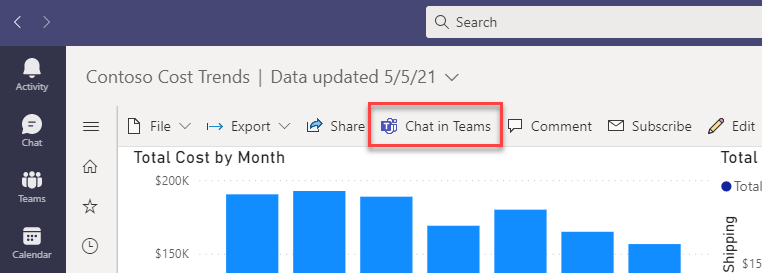](../media/image-50.png#lightbox)

1. If prompted, fill out the authentication prompts for Teams.

1. Enter the name of a team or channel in the **Share to** field. Enter a message without overwriting or changing the URL.

    > [!div class="mx-imgBorder"]
    > 

1. Select **Share** when you are finished.

    In the channel, a new conversation will be started with a link to the report.

    > [!div class="mx-imgBorder"]
    > [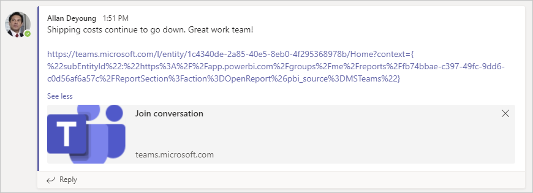](../media/image-52.png#lightbox)

To start a chat in Teams about an individual visual, follow these steps:

1. Open the report in the Power BI for Teams app.

1. On the report visual, select the **More options** ellipsis (**…**) and then select **Add a comment**.

    > [!div class="mx-imgBorder"]
    > [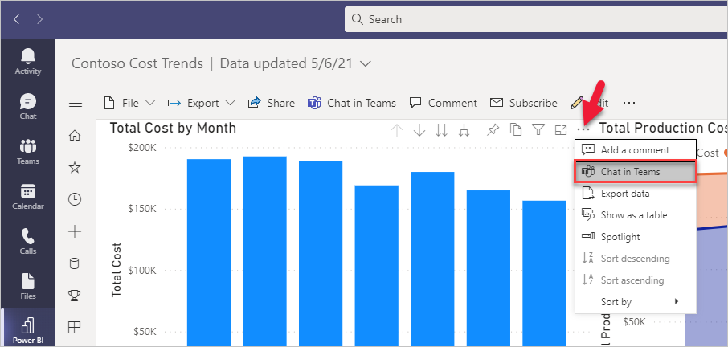](../media/image-53.png#lightbox)

1. If prompted, fill out the authentication prompts for Teams.

1. Enter the name of a team or channel in the **Share to** field. Enter a message without overwriting or changing the URL. Select **Share** when you are finished.

    > [!div class="mx-imgBorder"]
    > [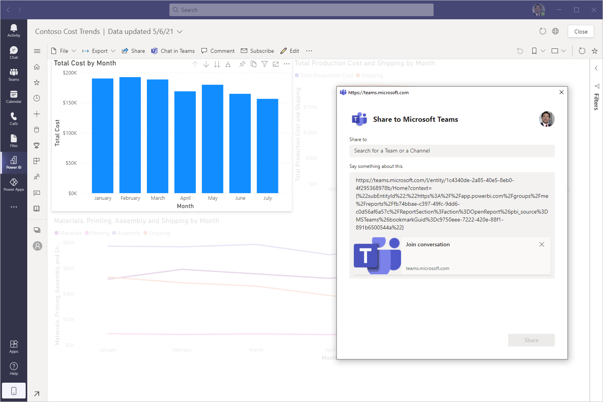](../media/image-54.png#lightbox)

    When users select the link in Teams, the selected visual will be highlighted.

> [!NOTE]
> **Chat in Teams** starts a Microsoft Team conversation with a link to the report. It does not update the permissions, and only users with permissions to the report can access it. Users who don't have access will be prompted to request access when they select the link.

## Reference a report in the Teams message box

To reference a Power BI report from a channel or chat, follow these steps:

1. From a Teams message box, select the **Power BI** icon.

    > [!div class="mx-imgBorder"]
    > 

1. Search for and select the report to include in the chat.

    > [!div class="mx-imgBorder"]
    > [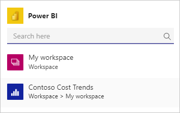](../media/image-56.png#lightbox)

1. **Send** the message when you are done.

    > [!div class="mx-imgBorder"]
    > [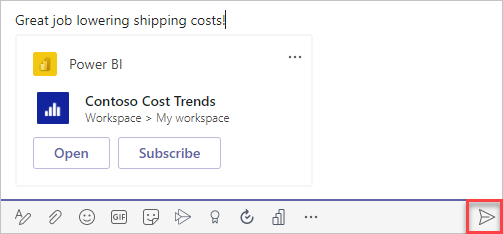](../media/image-57.png#lightbox)

Users can select to **Open** the Power BI report, or they can select **Subscribe** to set up a schedule to receive email updates. For more information about subscribing to a Power BI report, see the links in the Summary unit at the end of the module.

## Share Power BI during a meeting

Data-driven decision-making allows you and your team to spot trends, drive actions, and improve outcomes. Review data each week with your team to enable better data-driven decisions. Add Power BI reports to meetings by adding a link to the invite, adding the tab in a channel, sharing the link in the meeting chat, or sharing your screen.

## Add comments to a report

You can add comments to a report or even on individual visuals on the report. To target comments to individuals, use the **@mention** function to grab their attention. Report filters or slicer settings will be captured with the comment so that you can view the report as it was when you first commented.

To create a general comment on the report, follow these steps:

1. Open the report in the Power BI for Teams app.

1. Select **Comment** to open the **Comments** pane.

    > [!div class="mx-imgBorder"]
    > [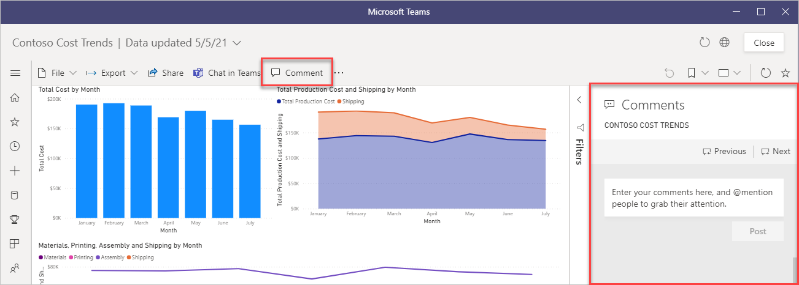](../media/image-58.png#lightbox)

1. Use **@mention** to alert others to your comment so that they can respond. Select **Post** when you are finished.

    > [!div class="mx-imgBorder"]
    > 

   An email will be sent to the person who is tagged in the **@mention** function.

    > [!div class="mx-imgBorder"]
    > 

When the person selects **Open Comments**, a browser window will open to the report on the Power BI website, where they can reply to the comment.

To comment on an individual visual, follow these steps:

1. Open the report in the Power BI for Teams app.

1. On the report visual, select the **More options** ellipsis (**…**) and then select **Add a comment**.

    > [!div class="mx-imgBorder"]
    > [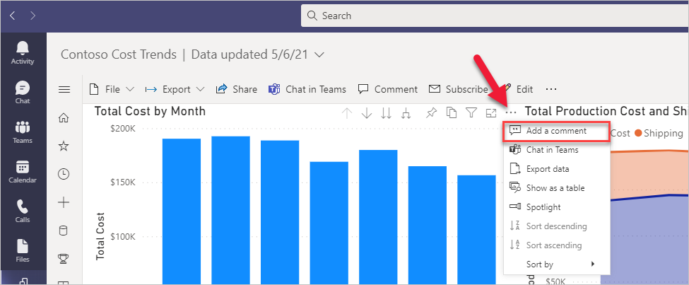](../media/image-61.png#lightbox)

1. The selected report visuals will be highlighted when you enter a comment. Use **@mention** functions in the same way that you would for general comments.

    > [!div class="mx-imgBorder"]
    > [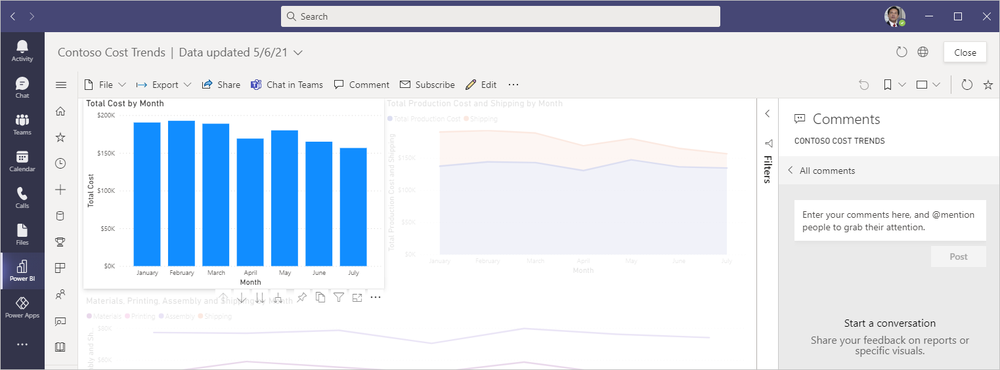](../media/image-62.png#lightbox)
