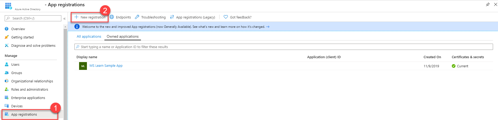
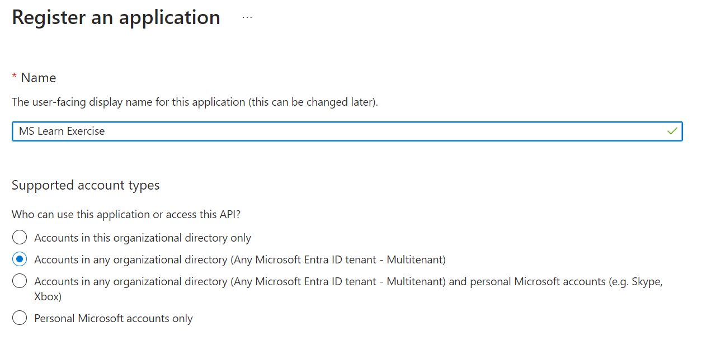
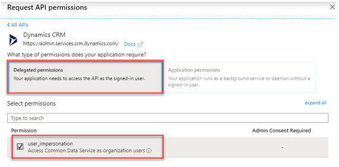
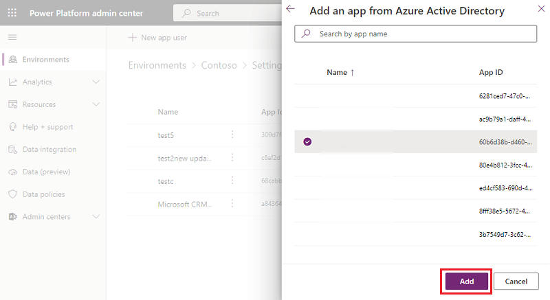

Microsoft Dataverse uses OAuth 2.0 as its authentication standard. OAuth 2.0 provides an industry standard for authenticating client applications and granting them access to a resource.

## Authentication vs. authorization

**Authentication** is the process or action of verifying the identity of a user or process. Microsoft's solution to this verification process is Microsoft Entra ID. Entra ID supports many options to verify the identity of a user or process. Abstracting your identity provider allows for a good separation of concerns because managing usernames and passwords can be a difficult (and risky) process.

> [!NOTE]
> Microsoft Entra ID is the new name for Azure Active Directory. All licensing and functionality remain the same.

**Authorization** is the process or action of verifying whether an authenticated user is *authorized* to access the resource. Presently, Dataverse authorization is at the Entra ID tenant level, while management of the detailed permissions is delegated to the application based on the current signed-in user. Therefore, you don't use OAuth 2.0 to govern app-level security, which you would handle with Dataverse security roles and assignment to users with the [Power Apps Admin Center](https://aka.ms/ppac?azure-portal=true).

If you want to learn more about the concepts of authentication and authorization, see [Authentication basics](/azure/active-directory/develop/authentication-scenarios/?azure-portal=true).

## Register Dataverse apps with Entra ID

To successfully connect to your Dataverse, you must first register an app with Entra ID, which you can complete in the [Azure portal](https://portal.azure.com/?azure-portal=true). Depending on the type of app that you want to make, a few different settings are available for you to configure (web apps versus native apps that are installed natively on a device). For more information on settings required for each type, see [Types of app registration](/power-apps/developer/common-data-service/authenticate-oauth?azure-portal=true).

To register an app with Entra ID, go to the **App Registrations** section of the Entra ID (Azure Active Directory) menu and then select **New Registration**.

> [!div class="mx-imgBorder"]
> [](../media/app-registrations.png#lightbox)

Specify the name of your app and what type of account access you need. If you're registering a web app, specify a Redirect URI by going to the **Authentication** section, setting the type to **Web**, and then entering a redirect URI.

> [!div class="mx-imgBorder"]
> [](../media/register.png#lightbox)

The following list summarizes when to use the different account types:

- **Accounts in this organizational directory only (Single tenant)**

  All user and guest accounts in your directory can use your application or API.

  *Use this option if your target audience is internal to your organization.*

- **Accounts in any organizational directory (Any Entra ID directory - Multitenant)**

  All users with a work or school account from Microsoft can use your application or API, including schools and businesses that use Microsoft 365.

  *Use this option if your target audience is business or educational customers and to enable multitenancy.*

- **Accounts in any organizational directory (Any Entra ID directory - Multitenant) and personal Microsoft accounts (for example, Skype and Xbox)**

  All users with a work, school, or personal Microsoft account can use your application or API. It includes schools and businesses that use Microsoft 365 and personal accounts that are used to sign in to services like Xbox and Skype.

Depending on the complexity of your application setup, you might want to configure other authentication settings. Refer to the Entra ID documentation for steps on how to complete this task.

## Access Dataverse using the Web API

All access to Dataverse is done in the context of a signed-in user. This can be a normal interactive user or a non-interactive user using Server-to-Server (S2S) authentication.

When an application accesses Dataverse on behalf of an interactive user, the registered application must be configured with API permissions to access Dataverse with delegated permission. When an application directly accesses Dataverse, an Application User associated with the Entra ID application registration must be created in Dataverse. When you use S2S authentication, Dataverse API delegated permissions aren't required.

In all cases, the authenticated users must have Dataverse security roles associated with the user, permitting the operations you perform using the Web API.

### Configure API permissions

If your application accesses Dataverse on behalf of a signed-in user, go to the **API permissions** tab on the application registered and ensure that you grant your application user **impersonation** access to your Dataverse environment.

> [!div class="mx-imgBorder"]
> [](../media/request.png#lightbox)

The label says Dynamics CRM, which is a historical name of the precursor product to Dataverse.

> [!div class="mx-imgBorder"]
> [](../media/permissions.png#lightbox)

### Configure a Dataverse application user

When you use S2S authentication, a Dataverse Application User must be configured in each Dataverse environment you access with the Web API.

Configuration of Dataverse Application Users is done from the [Power Platform admin center](https://admin.powerplatform.microsoft.com/?azure-portal=true) as a System Administrator.

> [!div class="mx-imgBorder"]
> [](../media/add-application.png#lightbox)

From the admin center, you can perform the following steps:

- Create a new application user

- Associate the application user with the Entra ID app or managed identity

- Configure which Dataverse security roles apply

For more detailed step-by-step review [Manage application users in the Power Platform admin center](/power-platform/admin/manage-application-users/?azure-portal=true).

## Use authentication libraries to connect

Once your application is registered, use one of the [Microsoft identity platform authentication libraries](/azure/active-directory/develop/reference-v2-libraries/?azure-portal=true) to perform authentication and acquire an access token for use with the Web API.

The following code is an excerpt from the [Enhanced QuickStart](/power-apps/developer/data-platform/webapi/enhanced-quick-start/?azure-portal=true) sample that uses the Microsoft Authentication Library (MSAL). The following OAuthMessageHandler class implements a class derived from [DelegatingHandler](/dotnet/api/system.net.http.delegatinghandler/?azure-portal=true), which you pass to the constructor of the HttpClient. This handler allows you to override the `HttpClient.SendAsync` method so that the access token is refreshed by the AcquireToken* method calls with each request sent by the Http client.

```csharp
class OAuthMessageHandler : DelegatingHandler
{
  private AuthenticationHeaderValue authHeader;
  public OAuthMessageHandler(string serviceUrl, string clientId, string redirectUrl, string username, string password, HttpMessageHandler innerHandler)
  : base(innerHandler)
  {
    //Build Microsoft.Identity.Client (MSAL) OAuth Token Request
    var authBuilder = PublicClientApplicationBuilder.Create(clientId)
    .WithAuthority(AadAuthorityAudience.AzureAdMultipleOrgs)
    .WithRedirectUri(redirectUrl)
    .Build();
    var scope = serviceUrl + "//.default";
    string[] scopes = { scope };
    AuthenticationResult authBuilderResult;
    if (username != string.Empty && password != string.Empty)
    {
      //Make silent Microsoft.Identity.Client (MSAL) OAuth Token Request
      var securePassword = new SecureString();
      foreach (char ch in password) securePassword.AppendChar(ch);
      authBuilderResult = authBuilder.AcquireTokenByUsernamePassword(scopes, username, securePassword).ExecuteAsync().Result;
    }
    else
    {
      //Popup authentication dialog box to get token
      authBuilderResult = authBuilder.AcquireTokenInteractive(scopes).ExecuteAsync().Result;
    }
      //Note that an Entra ID access token has a finite lifetime, default expiration is 60 minutes.
      authHeader = new AuthenticationHeaderValue("Bearer", authBuilderResult.AccessToken);
    }
  protected override Task<HttpResponseMessage> SendAsync(HttpRequestMessage request, System.Threading.CancellationToken cancellationToken)
  {
    request.Headers.Authorization = authHeader;
    return base.SendAsync(request, cancellationToken);
  }
}
```

You could then have a helper method to get the HttpClient instance using the handler:

```csharp
static HttpClient GetHttpClient(string url, string clientId, string redirectUrl, string version = "v9.2")
{
  try
  {
    HttpMessageHandler messageHandler = new OAuthMessageHandler(url, clientId, redirectUrl, "", "",
    new HttpClientHandler());
    HttpClient httpClient = new HttpClient(messageHandler)
    {
      BaseAddress = new Uri(string.Format("{0}/api/data/{1}/", url, version)),
      Timeout = new TimeSpan(0, 2, 0) //2 minutes
    };
  return httpClient;
  }
  catch (Exception)
  {
    throw;
  }
}
```

And finally, use the client instance to make a Web API call:

```csharp
using (HttpClient client = GetHttpClient("https://yourenvname.api.crm.dynamics.com", "51f81489-12ee-4a9e-aaae-a2591f45987d", "http://localhost:8080"))
{
  // Use the WhoAmI function
  var response = client.GetAsync("WhoAmI").Result;
  if (response.IsSuccessStatusCode)
  {
    //Get the response content and parse it.
    JObject body = JObject.Parse(response.Content.ReadAsStringAsync().Result);
    Guid userId = (Guid)body["UserId"];
    Console.WriteLine("Your UserId is {0}", userId);
  }
  else
  {
    Console.WriteLine("The request failed with a status of '{0}'", response.ReasonPhrase);
  }
  Console.WriteLine("Press any key to exit.");
  Console.ReadLine();
}
```

You should now have an app registered that can successfully connect to your Dataverse environment. You also have a simple example of connecting and using the registered app to access a Web API operation.
