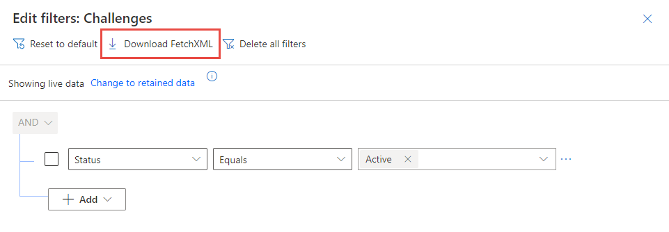

FetchXML is a query language that Microsoft developed to enable you to perform complex query operations against Microsoft Dataverse data. It provides considerably more filtering options than the OData connectors and allows you to see the labels for reference data, such as option set labels or lookup fields.

You can run FetchXML queries by using the following methods:

- Dataverse Web API

- Organization service

You can also apply a custom FetchXML filter to a lookup field within a model-driven app. This approach allows for more complex lookup scenarios that you can't easily accomplish out of the box. For more information on how to complete this process, see the [addCustomFilter Client API Reference](/power-apps/developer/model-driven-apps/clientapi/reference/controls/addcustomfilter/?azure-portal=true).

### Example FetchXML query

The following sample query retrieves the **accountid** and **name** fields from the account table:

```xml
<fetch mapping='logical'>
   <entity name='account'>
      <attribute name='accountid'/>
      <attribute name='name'/>
   </entity>
</fetch>
```

If you need to filter this data, for example by state, you could do something like the following sample query:

```xml
<fetch mapping='logical'>
   <entity name='account'>
      <attribute name='accountid'/>
      <attribute name='name'/>
      <filter type='and'>
        <condition attribute='address1_stateorprovince' operator='eq' value='WA' />
      </filter>
   </entity>
</fetch>
```

### Tools to help build your queries

If you're querying data and have a model-driven app that includes the tables you wish to query, the simplest method for composing FetchXML queries is to use Advanced Find, which contains a **Download FetchXML** function. You're limited to the UI on what filters and related data you can pull, but it's frequently an excellent first start, so you don't have to compose the XML yourself.

> [!div class="mx-imgBorder"]
> [](../media/download.png#lightbox)

Another notable tool created by the community is called **FetchXML Builder**. With this tool, you can construct FetchXML in ways that Advanced Find can't (aggregates, outer joins, "has no" queries, and attributes from multi-level linked entities). It also provides a wealth of other features, which you can find on their website: [FetchXML Builder](https://fetchxmlbuilder.com/?azure-portal=true).

### More resources

For more in-depth details on the FetchXML Query Language, review the [Use FetchXML to query data](/power-apps/developer/common-data-service/use-fetchxml-construct-query/?azure-portal=true) section, which covers several advanced topics such as handling paging, querying hierarchical data, and much more.
