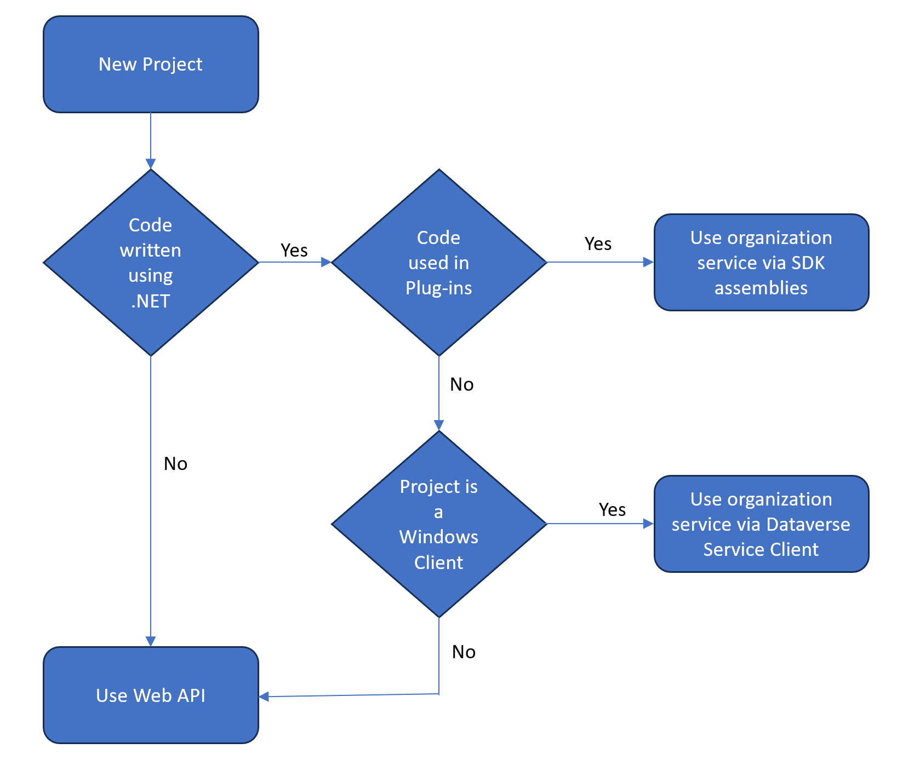

## Web API vs. the organization service

The Web API and the organization service are the two main ways to interact with data and metadata in Microsoft Dataverse. You can use the organization service when writing plug-ins or workflow extensions using the SDK for .NET that Microsoft provides.

Regardless of your approach, all data operations go through the underlying organization service. As such, the Web API allows you to perform the same operations as the organization service but in a RESTful style.

The following graphic is a decision tree that can help you determine when to use the Web API versus the organization service (through the SDK assemblies available in the [Microsoft.CrmSdk.CoreAssemblies NuGet package](https://www.nuget.org/packages/Microsoft.CrmSdk.CoreAssemblies/?azure-portal=true)). It also shows when to use the Dataverse Service Client Assemblies (available in the [Microsoft.PowerPlatform.Dataverse.Client](https://www.nuget.org/packages/Microsoft.PowerPlatform.Dataverse.Client?azure-portal=true) NuGet package) for Windows applications.

> [!div class="mx-imgBorder"]
> 

This module focuses on the Web API. For more information on the organization service, see [Use the Dataverse Organization service](/power-apps/developer/common-data-service/org-service/overview/?azure-portal=true) in the Dataverse Developer Guide.

## OData (Open Data Protocol) 4.0

Dataverse Web API is implemented as an OData (OASIS Open Data Protocol) service. Using an industry-standard such as this provides all the benefits of open standard development, such as cross-platform compatibility and simple implementation against a common, predefined protocol.

Dataverse doesn't provide specific .NET tooling for the Web API. Instead, we recommend that you use community libraries that conform to the OData protocol. If you want more information about which libraries exist, see [https://www.odata.org/libraries/](https://www.odata.org/libraries/?azure-portal=true).

OData lets you interact with Dataverse data with CRUD (Create, Read, Update, Delete) operations that are available through standard GET, POST, PATCH, and DELETE HTTP methods. (You can find more information about these methods later in this module.) You can also perform almost any other operation exposed through the Dataverse [Event Framework](/power-apps/developer/common-data-service/event-framework/?azure-portal=true) by invoking an OData *function* or *action* with the same name as its corresponding organization service message.  CRUD-related messages are the only ones that aren't available because those messages use the previously described standard HTTP methods.

## REST

Fundamentally, OData protocol is a set of RESTful (**RE**presentational **S**tate **T**ransfer) APIs, an industry standard for providing interoperability between systems. REST consists of six guiding principles that restrict how a service can process and respond to requests to ensure that non-functional properties of that service are met (such as performance, scalability, simplicity, reliability, and so on).

For this lesson, you should keep in mind that OData conforms to these constraints and that the Dataverse Web API that implements the OData protocol also conforms to the constraints.

## FetchXML

FetchXML is a robust query language that allows for complex querying of Dataverse data. You can use FetchXML to compose your query criteria when you run queries with the Dataverse Web API. This approach can be valuable if you encounter a scenario where FetchXML better fits your particular query than OData query syntax. You can find more information about FetchXML later unit in this module.
