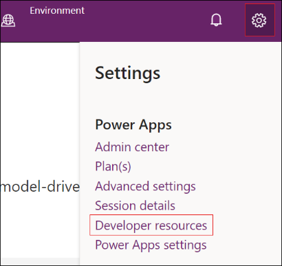
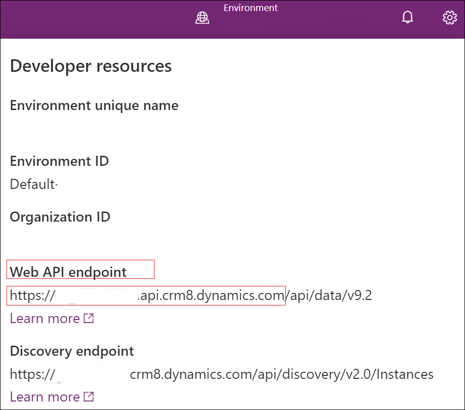
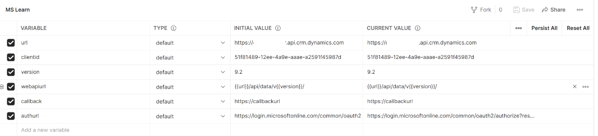
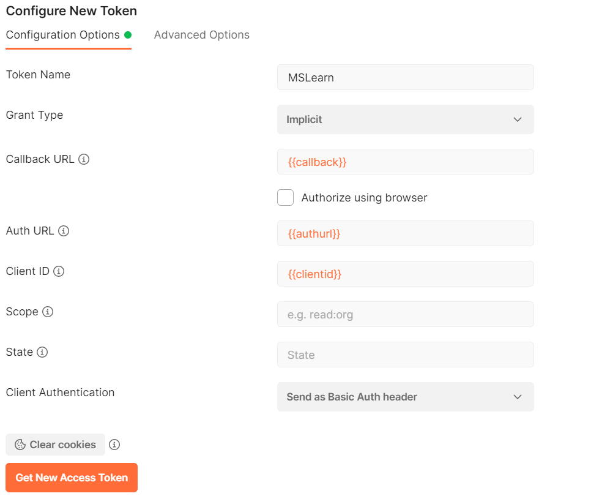
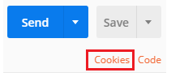
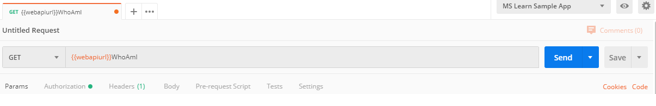
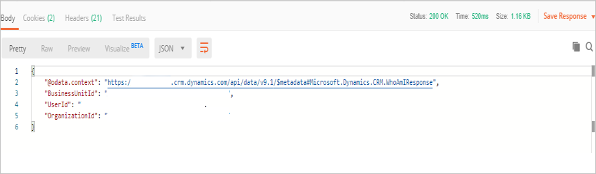

Postman is a valuable tool for composing ad hoc Web API queries and verifying the behavior of Web API Operations without having to write a program to do so. If you're new to Postman, see the [First five things to try if you're new to Postman](https://blog.getpostman.com/2018/04/11/first-5-things-to-try-if-youre-new-to-postman/?azure-portal=true) article for an introduction to the concept.

## Register an app in Microsoft Entra ID

To connect Postman to Microsoft Dataverse, you must first ensure that you have an application registered in your Entra ID environment.

## Get the current version of your Web API endpoint

You can find the version number of your Web API endpoint by going to your environment's **Developer resources** in the maker portal.

> [!div class="mx-imgBorder"]
> 

From the **Developer Resources** page. Your version number is indicated under the Web API endpoint, as shown in the following image. Make note of the endpoint and the version.

> [!div class="mx-imgBorder"]
> 

## Set up Postman

To start the setup process, install [Postman](https://www.getpostman.com/?azure-portal=true).

After Postman has been installed, you use a feature that Postman has to manage environment variables so that you can cleanly manage entities such as your endpoint URLs and client IDs.

To create a Postman environment that you can use to connect with your Dataverse instance, follow these steps:

1. Launch the Postman desktop application.

1. Select the **Environment** tab from the left side.

1. Select **New Environment**.

1. Select **HTTP**.

1. Enter a name for the environment and then add the following key/value pairs into the editing space.

   | Variable | Initial value |
   |----------|---------------|
   | url | `https://[ORGANIZATION].api.crm.dynamics.com` |
   | clientid | 51f81489-12ee-4a9e-aaae-a2591f45987d |
   | version | 9.2 |
   | webapiurl | `{{url}}/api/data/v{{version}}/` |
   | callback | `https://callbackurl` |
   | authurl | `https://login.microsoftonline.com/common/oauth2/authorize?resource={{url}}` |

   > [!div class="mx-imgBorder"]
   > 

1. Replace the instance URL placeholder value with the URL of your Dataverse environment and then select **Save** to save the environment.

1. Close the **Manage environments** dialog box.

## Generate an access token to use with your environment

To connect by using OAuth 2.0, you must have an access token. To get a new access token, follow these steps:

1. Make sure that the new environment you created is selected.

1. Select the **Authorization** tab.

1. Set the **Type** to **OAuth 2.0**.

1. Verify that you've selected the environment that you created.

1. Scroll down to the **Configure New Token** area.

1. Set **Callback URL** to `{{callback}}`, **Auth URL** to `{{auth}}`, and **Client ID** to `{{clientid}}`. Select **Implicit** from the **Grant Type** drop-down menu. You can set the **Token Name** to whatever you like and then leave other keys set to default values.

   > [!div class="mx-imgBorder"]
   > 

   > [!NOTE]
   > If you are configuring environments in Postman for multiple Dataverse instances by using different user credentials, you might need to delete the cookies that are cached by Postman. Select the **Cookies** link, which can be found under the **Send** button, and remove the saved cookies from the **Manage Cookies** dialog box.

   > [!div class="mx-imgBorder"]
   > 

   Some of these cookies are persistent. You can delete some cookies in groups, but you might have to delete others individually. You might need to complete this process twice to ensure that no cookies remain.

1. Select **Get New Access Token**. When you make this selection, an Entra ID sign-in page appears. Enter your username and password.

1. After the token is generated, scroll to the bottom and select **Use Token**. This selection closes the **Manage Access Tokens** dialog box.

## Test your connection

Create a new Web API request to test the connection with your Dataverse instance. Use the WhoAmI function by following these steps:

1. Select GET as the HTTP method and add `{{webapiurl}}WhoAmI` in the editing space.

   > [!div class="mx-imgBorder"]
   > 

1. Select **Send** to send this request.

If your request is successful, you see the data from the WhoAmIResponse ComplexType that is returned by the WhoAmI Function.

> [!div class="mx-imgBorder"]
> 
