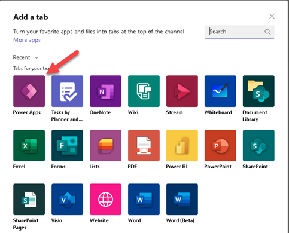

> [!VIDEO https://www.microsoft.com/en-us/videoplayer/embed/RE50tTy]

For more information, see [Guidelines and troubleshooting for embedded canvas apps](/power-apps/maker/model-driven-apps/embedded-canvas-app-guidelines/?azure-portal=true).

## Add an app to Microsoft Teams

For this exercise, you'll add your app as a tab to a team's channel.

1. In Microsoft Teams, select a team and a channel under that team. In this example, it's the **General** channel under your organization's team.

1. Select the plus (**+**) symbol to add a tab.

1. In the **Add a tab** dialog, select **Power Apps**.

    > [!div class="mx-imgBorder"]
    > 

1. Select the app that you want to add to Microsoft Teams. Now, the app will be available to use in the channel

## Known issues

In the desktop app for Microsoft Teams:

- Apps must load content, such as images and .pdf files, over a secure (https) connection.

- Not all sensors, such as **Acceleration**, **Compass**, and **Location**, are supported.

- Only these audio formats are supported: AAC, H264, OGG Vorbis, and WAV.

## Clean up resources

To remove the app from the channel, select **Product Showcase > Remove**.
