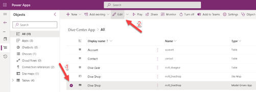
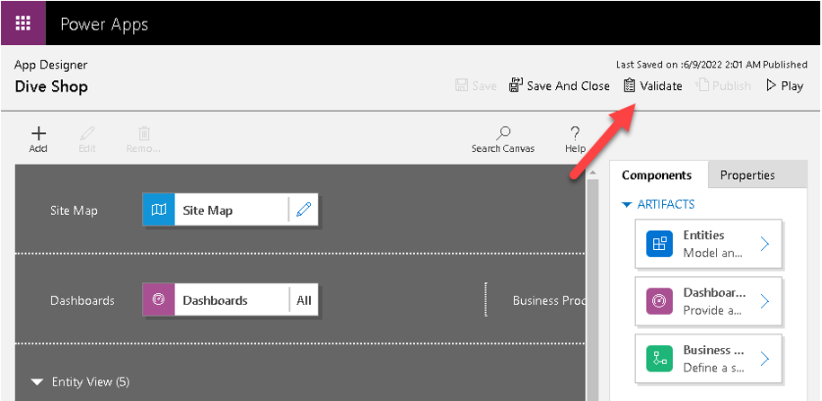
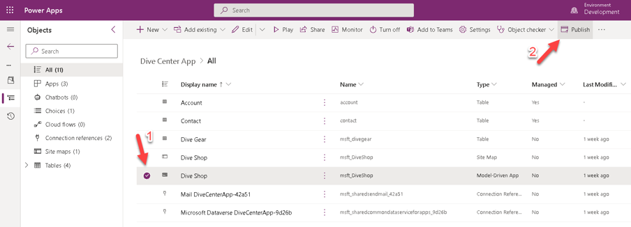
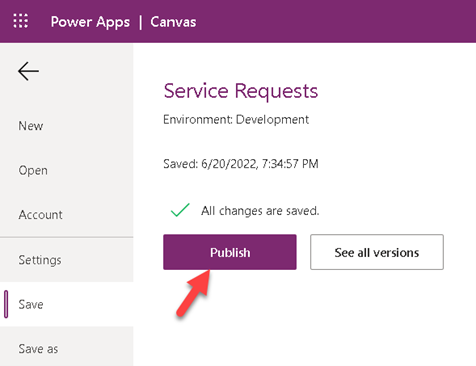
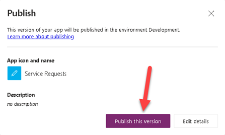
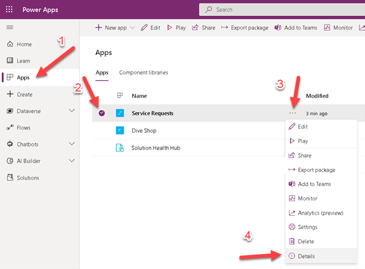
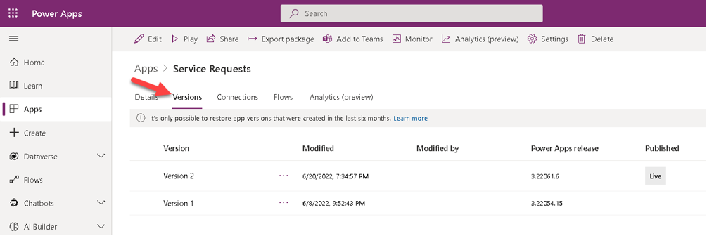
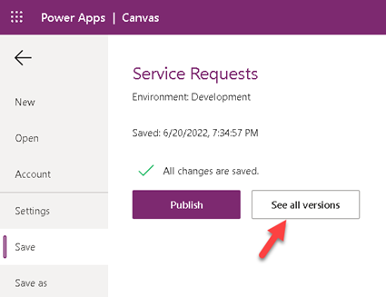

Congratulations, you've made your first app, and now it's been tested and is ready to go.

When your app is ready to use, you'll need to publish and share it.

## Option 1: Publish a model-driven app

Model-driven apps can't be published if they don't include all required components. Some components rely on others, and this relationship between components is known as a dependency.

For example, you can't display a table on the site map if the table isn't included within the app.

The process of checking for dependencies within a model-driven app is known as **validation**.

When the app has been validated, the app designer canvas will show details about the assets that are missing.

### Validate an app and add dependencies

To validate an app and add dependencies, follow these steps:

1. Sign in to [Power Apps](https://make.powerapps.com/?azure-portal=true).

1. On the left pane, select **Solutions** and then open the **Dive Center App** solution.

    > [!div class="mx-imgBorder"]
    > 

1. Select the model-driven app, and then on the command bar, select **Edit**.

    > [!div class="mx-imgBorder"]
    > 

1. Select **Switch to classic** on the header.

    > [!div class="mx-imgBorder"]
    > 

1. In the app designer, select **Validate**.

    > [!div class="mx-imgBorder"]
    > 

    A notification bar will appear and show whether the app has errors or warnings. The notification bar shows warnings in cases where, for example, a table has no forms or views or when the app doesn't contain components. An error might appear if a site map isn't set up for the app. You can save the app without addressing warnings, but you'll need to fix errors before you can publish.

    > [!div class="mx-imgBorder"]
    > 

1. Add the assets that are missing. For every required asset that's added, the error count will decrease.

### Publish an app inside a solution

To publish an app inside a solution, follow these steps:

1. Sign in to [Power Apps](https://make.powerapps.com/?azure-portal=true).

1. On the left pane, select **Solutions** and then open the **Dive Center App** solution.

    > [!div class="mx-imgBorder"]
    > 

1. Select the model-driven app, and then on the command bar, select **Publish**.

    > [!div class="mx-imgBorder"]
    > 

## Option 2: Publish a canvas app

Whenever you save changes to a canvas app, you'll automatically publish them only for you and anyone else who has permissions to edit the app. When you finish making changes, you'll need to explicitly publish them to make them available to everyone with whom the app is shared.

1. In Power Apps Studio, select **Save** on the **File** menu (on the left edge), and then select **Publish**.

    > [!div class="mx-imgBorder"]
    > 

1. In the **Publish** dialog, select **Publish this version** to publish the app to all users with whom the app is shared.

    > [!div class="mx-imgBorder"]
    > 

### Identify the live version

To identify the live version of the app, follow these steps

1. To view all versions of an app, go to [Power Apps](https://make.powerapps.com/?azure-portal=true). Select **Apps** and then find and select your app. Select **More Commands > Details**.

    > [!div class="mx-imgBorder"]
    > 

1. Select the **Versions** tab.

    > [!div class="mx-imgBorder"]
    > 

The **Live** version is published for everyone with whom the app is shared. The most recent version of any app is available only to those users who have edit permissions for it.

> [!div class="mx-imgBorder"]
> 
