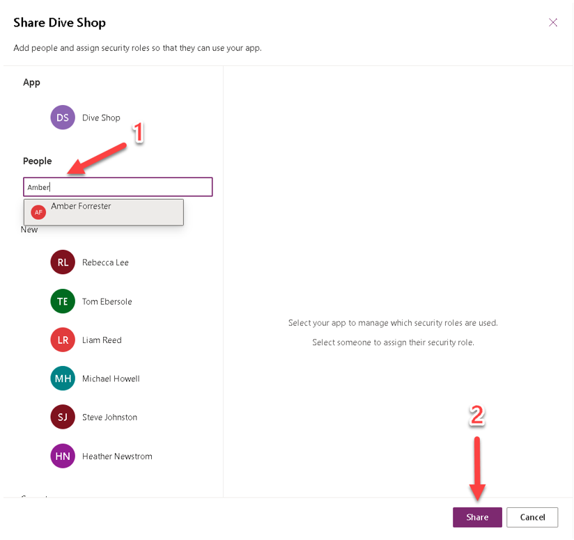
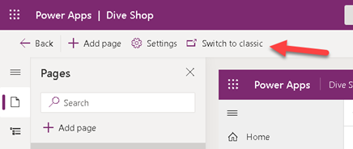
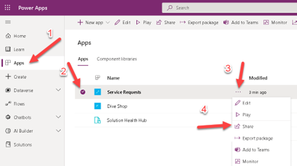
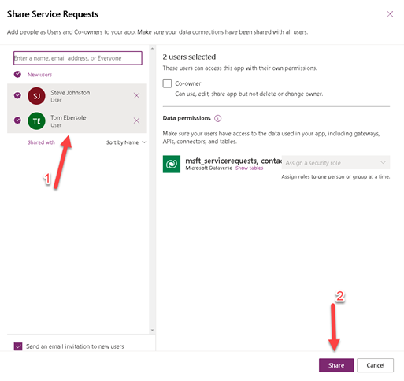
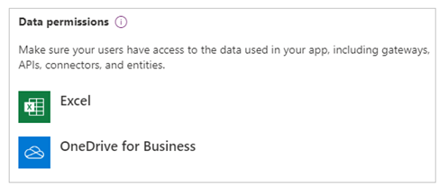
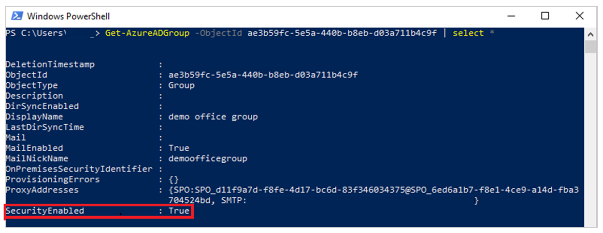

Now that your apps have been published, it's time to share them.

## Option 1: Share a model-driven app

Model-driven apps use role-based security for sharing. The fundamental concept in role-based security is that a security role contains privileges that define a set of actions that users can perform on tables within the app. This approach means that, while two people can use the app, only one user might be able to read records or only records that they've created. The other user might be able to view all records and have the rights to delete those records.

You'll need to make sure that all app users are assigned one or more predefined or custom security roles. Alternatively, you can assign security roles to teams. When a user or team has been assigned to one of these roles, the person or team members will be granted the set of privileges that are associated with that role.

### App sharing privilege and licensing requirements

A few key environment and licensing prerequisites are required when sharing a model-driven app with a user:

- A Microsoft 365 user with Microsoft Power Platform administrator rights or global admin rights must exist within the organization. This parameter provides the user with administrator rights over all environments.

- The app sharer must have admin privileges to the specific environment (or be a Microsoft Power Platform administrator). The app sharer must have a [security role](/power-platform/admin/security-roles-privileges/?azure-portal=true) with equal or greater privileges than the security role that they're assigning to the app and to other users. Usually, the app sharer will have the Microsoft Dataverse **System Administrator** or **System Customizer** security role. Microsoft Power Platform administrators (who have rights over all Dataverse environments) can assign these roles. The system administrator and system customizer security roles are standard roles that exist within all Dataverse environments.

- The user must exist as a user within the environment; it's not enough to only be a Microsoft 365 user. The reason is because all users in an environment are accounted for and described within tables in the environment. For more information, see [Learn how to add a user to an environment](/power-platform/admin/add-users-to-environment/?azure-portal=true).

- The user must have the correct [license](/power-platform/admin/pricing-billing-skus/?azure-portal=true) to be able to use the app. This license might be assigned through a per app plan pass, a per user license, or a pay-as-you-go license. Also, the app sharer will need to assign the license in the tenant that's hosting the app. The exception to this prerequisite is when an app is hosted in a Microsoft Dataverse for Teams environment.

### Model-driven app sharing basics

Before you share an app, it's helpful to understand the following model-driven app sharing basics:

- The app must have at least one security role associated with it, such as **Basic User**. However, if your app has one or more custom tables, for users to be able to work with your custom table's records, you'll need to set up privileges to the custom tables in a security role. For more information, see [Create or edit a security role for your app](/power-apps/maker/model-driven-apps/share-model-driven-app#create-or-edit-a-security-role-for-your-app/?azure-portal=true).

- App users must be assigned a security role from the available roles. Alternatively, you can assign a team to a security role, and you can make users members of the team. A team can be an Owner, Access, Microsoft Entra ID security group, or Microsoft 365 group. For more information, see [Learn to manage a Dataverse team](/power-platform/admin/database-security/?azure-portal=true).

### Assign security roles or people to a model-driven app

When you share a model-driven app, you can share it with all members of one or more security roles or a user or team.

1. Sign in to [Power Apps](https://make.powerapps.com/?azure-portal=true).

1. On the left pane, select **Solutions** and then open the **Dive Center App** solution.

    > [!div class="mx-imgBorder"]
    > 

1. Select the model-driven app, and then on the command bar, select **Share**.

    > [!div class="mx-imgBorder"]
    > 

1. Add the users whom you want to share this app with and then select **Share**.

    > [!div class="mx-imgBorder"]
    > 

> [!IMPORTANT]
> If your app has one or more custom tables, for users to be able to work with your custom table's records, you'll need to set up privileges to the custom tables in a security role.
>
> For more information, see [Create or edit a security role for your app](/power-apps/maker/model-driven-apps/share-model-driven-app?azure-portal=true#create-or-edit-a-security-role-for-your-app).

### Share the link to your app

Unlike sharing canvas apps, sharing model-driven apps doesn't send an email with a link to the app.

1. Sign in to [Power Apps](https://make.powerapps.com/?azure-portal=true).

1. On the left pane, select **Solutions** and then open the **Dive Center App** solution.

    > [!div class="mx-imgBorder"]
    > 

1. Select the model-driven app, and then on the command bar, select **Edit**.

    > [!div class="mx-imgBorder"]
    > 

1. Select **Switch to classic** on the header.

    > [!div class="mx-imgBorder"]
    > 

1. In the classic designer, select the **Properties** tab and then copy the **Unified Interface URL**.

    > [!div class="mx-imgBorder"]
    > 

**Best practice:** Paste the app URL in a location where your users can access it, such as posting it on a SharePoint site or sending it by email.

## Option 2: Share a canvas app

Now, you can specify which users in your organization can run the app and who can modify and reshare it. You can specify a username or a security group in Microsoft Entra ID. Additionally, you can select the entire organization if this app will be used by all users.

### Prerequisites

Before you share an app, make sure that you [save it to the cloud](/power-apps/maker/canvas-apps/save-publish-app?azure-portal=true#save-changes-to-an-app) (not locally) and then [publish](/power-apps/maker/canvas-apps/save-publish-app?azure-portal=true#publish-an-app) it. Whenever you make changes, make sure that you save and publish the app again if you want others to view those changes.

### Share an app

To share an app, follow these steps:

1. Sign in to [Power Apps](https://make.powerapps.com/?azure-portal=true).

1. On the left pane, select **Apps**.

1. Select the app that you want to share by selecting its icon.

1. Select the **More Commands** (**...**) dropdown menu and then select **Share**.

    > [!div class="mx-imgBorder"]
    > 

1. Specify, by name or alias, the users or security groups in Microsoft Entra ID with whom you want to share the app and then select **Share**.

    > [!div class="mx-imgBorder"]
    > 

    > [!NOTE]
    > You can't share an app with a distribution group in your organization or with a group outside your organization.

    > [!TIP]
    > If you want to allow users to edit and share the app, select the **Co-owner** checkbox. However, keep in mind that no two people can edit an app at the same time. If one person opens the app for editing, other people can run but not edit it.

    > [!div class="mx-imgBorder"]
    > 

1. If your app connects to data for which users need access permissions, specify security roles as appropriate.

    For more information, see [Manage table permissions](/power-apps/maker/canvas-apps/share-app?azure-portal=true#manage-table-permissions).

1. If your app uses connections to other data sources, make sure that you share these data sources with the users whom you shared the app with. (For example, the data source could be a Microsoft Excel file that's hosted on OneDrive for Business.)

    > [!div class="mx-imgBorder"]
    > 

    For more information, see [Share canvas app resources](/power-apps/maker/canvas-apps/share-app-resources/?azure-portal=true).

1. If you want to help people find your app, select the **Send an email invitation to new users** checkbox.

Now, users can run the app by using Power Apps for mobile devices or from Microsoft AppSource on [Microsoft 365](https://www.office.com/apps/?azure-portal=true) in a browser. Co-owners can edit and share the app in [Power Apps](https://make.powerapps.com/?azure-portal=true).

If you sent an email invitation, users can also run the app by selecting the link in the invitation email:

- If a user selects the link on a mobile device, the app will open in Power Apps for mobile devices.

- If a user selects the link on a desktop computer, the app will open in a browser.

Co-owners who receive an invitation will receive another link that opens the app for editing in Power Apps Studio.

### Change permissions for a user or security group

Consider the following parameters if you want to change permissions for a user or security group:

- To allow co-owners to run the app but no longer edit or share it, clear the **Co-owner** checkbox.

- To stop sharing the app with that user or group, select the **Remove** (**X**) icon.

#### Security group considerations

Keep in mind the following security group considerations:

- All existing members of the security group will inherit the app permissions. New users who join the security group will inherit the security group permissions on the app. Users who leave the group will no longer have access through that group. However, you can assign permissions to them directly or through membership in another security group to allow those users to have continued access after they’ve left.

- Every member of a security group has the same permissions for an app as the overall group does. However, you can specify greater permissions for one or more members of that group to allow them greater access. For example, you can give Security Group A permission to run an app. Then, you can give User B, who belongs to that group, **Co-owner** permissions. Every member of the security group can run the app, but only User B can edit it. If you give **Co-owner** permissions to Security Group A, and you give User B permission to run the app, that user can still edit the app.

### Share an app with Microsoft 365 groups

You can share an app with [Microsoft 365 groups](/microsoft-365/admin/create-groups/compare-groups/?azure-portal=true). However, the group must have security enabled. Enabling security ensures that the Microsoft 365 group can receive security tokens for authentication to access apps or resources.

#### Check whether a Microsoft 365 group has security enabled

To check whether a Microsoft 365 group has security enabled, follow these steps:

1. Ensure that you have access to the [Microsoft Entra ID cmdlets](/azure/active-directory/users-groups-roles/groups-settings-v2-cmdlets/?azure-portal=true).

2. Go to the [Azure portal](https://portal.azure.com/?azure-portal=true), select **Microsoft Entra ID > Groups**, select the appropriate group, and then copy the **Object ID**.

3. [Connect to Microsoft Entra ID](/powershell/module/azuread/connect-azuread/?azure-portal=true) by using the `Connect-AzureAD` PowerShell cmdlet.

    > [!div class="mx-imgBorder"]
    > 

4. Get the [group details](/powershell/module/AzureAD/Get-AzureADGroup/?azure-portal=true) by using `Get-AzureADGroup -ObjectId <ObjectID> | select *`.

    In the output, ensure that the **SecurityEnabled** property is set to **True**.

    > [!div class="mx-imgBorder"]
    > 

### Enable security for a group

If the group isn't security-enabled, you can use the PowerShell cmdlet [Set-AzureADGroup](/powershell/module/AzureAD/Set-AzureADGroup/?azure-portal=true) to set the **SecurityEnabled** property to **True**:

`Set-AzureADGroup -ObjectId <ObjectID> -SecurityEnabled $True`

> [!div class="mx-imgBorder"]
> 

> [!NOTE]
> You need to be the owner of the Microsoft 365 group to enable security. Setting the **SecurityEnabled** property to **True** doesn't affect how Power Apps and Microsoft 365 features work. This command is required because the **SecurityEnabled** property is set to **False** by default when Microsoft 365 groups are created outside of Microsoft Entra ID.

After a few minutes, you can access this group in the Power Apps sharing panel and then share apps with this group.
