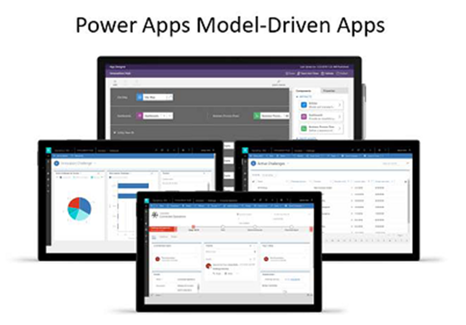

> [!VIDEO https://www.microsoft.com/videoplayer/embed/RE50N9k]

Model-driven apps require a Microsoft Dataverse database. They're built on top of the data that's modeled in that database environment. 

> [!div class="mx-imgBorder"]
> 

Views and detail screens for model-driven apps are based on the data structure. As a result, they offer users a more consistent appearance and behavior from one screen to the next without requiring much effort from the app creator.

Model-driven apps are beneficial for scenarios where the [business logic](/power-apps/guidance/planning/logic/?azure-portal=true) is complex, such as:

-   Sophisticated data models

-   Business process management

-   Tracking activities that are associated with data

> [!div class="mx-imgBorder"]
> 

Conversely, you can build canvas apps with or without a Dataverse database. Canvas apps use connectors to access data and services, and they start with a blank screen, like an artist's canvas, where the creator manually lays out each screen. This feature gives the creator complete control over the placement of each element on the canvas.

If the user expects a customized experience, you should use canvas apps because they offer:

-   A graphical, intuitive interface.

-   The ability to create a tailor-made UI that's based on user requirements.

-   Integration that spans multiple systems through the use of connectors.

Consider creating a model-driven app unless your users have a specific need for a canvas app. Model-driven apps enable you to make your app quickly because they don't require you to build the UI.

Your final end-to-end solution can include multiple apps. Occasionally, the type of app is driven by the personas who are using the app, so your end-to-end solution can apply model-driven apps for some users, canvas apps for others, and even [Power Pages](/training/paths/power-pages-get-started/?azure-portal=true) for your customers to access on the web.

Regardless of the app(s) that you end up with as part of your solution, another significant step during your designing phase is to determine where to place logic, such as data validation, calculations, process automation, and so on. For more information, see [Where to place logic](/power-apps/guidance/planning/logic/?azure-portal=true).
