By using the Figma UI Kit for Power Apps, you can create a canvas app that you can connect to a data source and then make available to users in your organization.

The first steps that are required for this process involve obtaining connectivity information from Figma to the Power Apps studio:

1.  In the Figma studio, select **Back to files**.

	> [!div class="mx-imgBorder"]
	> [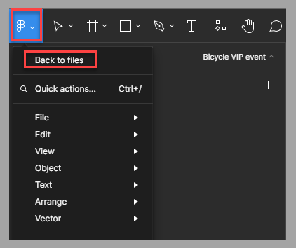](../media/back.png#lightbox)

1.  Select **Settings** in the menu next to your Figma profile name.

	> [!div class="mx-imgBorder"]
	> [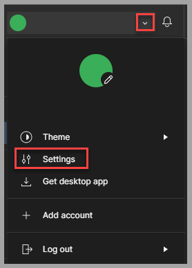](../media/settings.png#lightbox)

1.  In the new window, under **Personal access tokens** in the **Account** section, select **Generate new token**.

	> [!div class="mx-imgBorder"]
	> [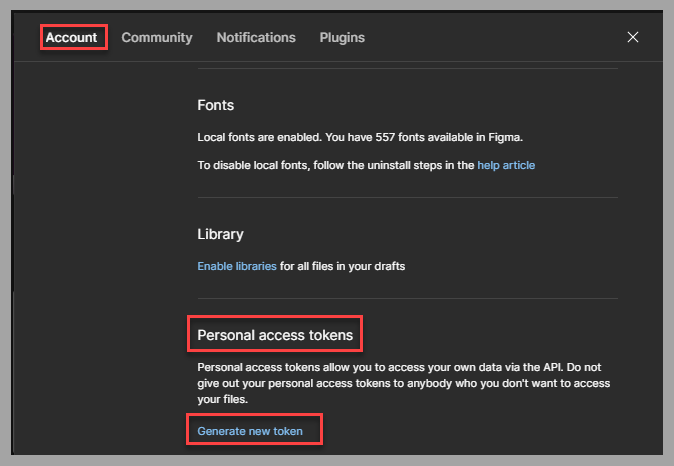](../media/access-tokens.png#lightbox)

1.  In the new window, provide a name for the token, such as **Power Apps**, and then select **Generate token**.

	> [!div class="mx-imgBorder"]
	> [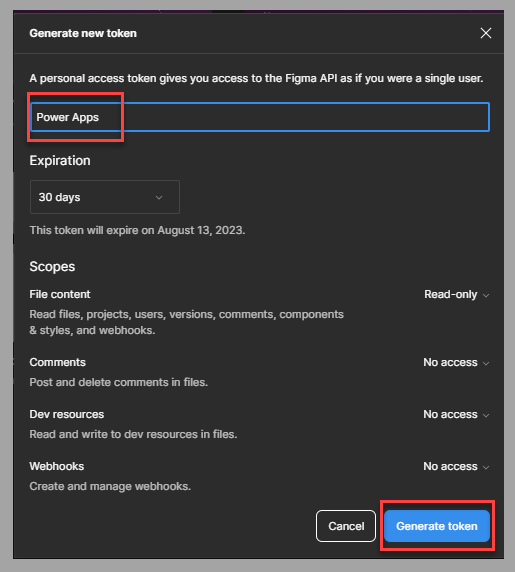](../media/generate.png#lightbox)

1.  A new token generates. Select **Copy this token** to use it later in this process.

	> [!div class="mx-imgBorder"]
	> [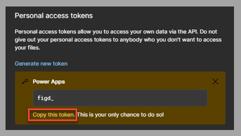](../media/copy.png#lightbox)

1.  In Power Apps studio, in the **Home** section, select the **Start with a page design** tile.

	> [!div class="mx-imgBorder"]
	> [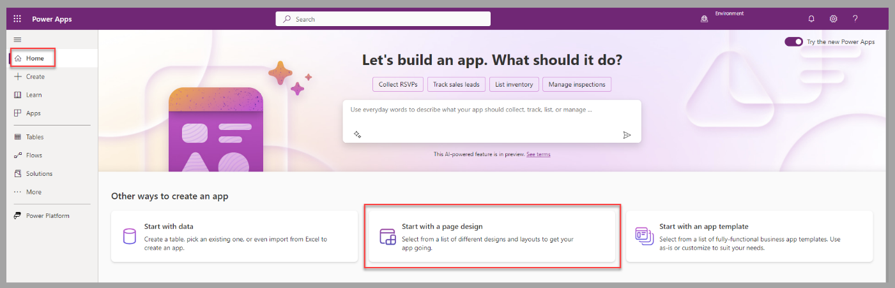](../media/start-page-design.png#lightbox)

1.  Select the **An image or Figma file** tile.

	> [!div class="mx-imgBorder"]
	> [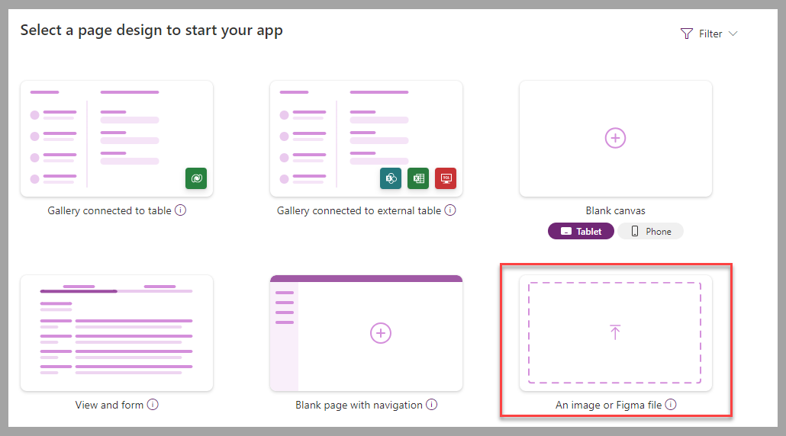](../media/image-file.png#lightbox)

1.  Select the **Start from Figma** tile and then select **Next**.

	> [!div class="mx-imgBorder"]
	> [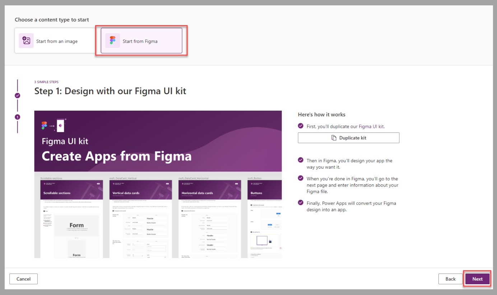](../media/start.png#lightbox)

1.  Enter a name in the **App name** field, and then paste the token that you obtained in step 5 in the **Figma personal access token** field.

	> [!div class="mx-imgBorder"]
	> [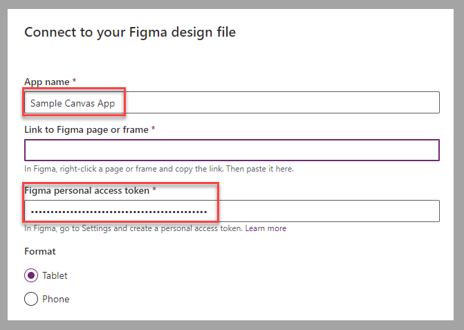](../media/connect.png#lightbox)

1. In Figma studio, return to the app design, and then select **Copy link to page** in the context menu for the page that you want to convert to a canvas app.

	> [!div class="mx-imgBorder"]
	> [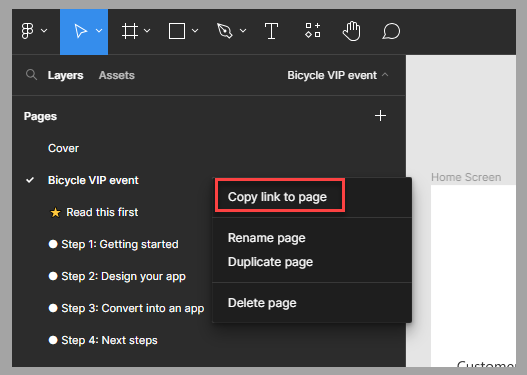](../media/copy-link.png#lightbox)

1. In Power Apps studio, paste the link in the **Link to Figma page or frame** field and then select **Create app**.

	> [!div class="mx-imgBorder"]
	> [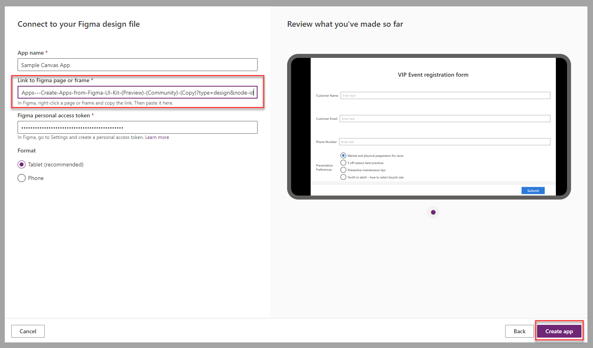](../media/link-page-frame.png#lightbox)

The canvas app is available to modify within Power Apps studio.

> [!div class="mx-imgBorder"]
> [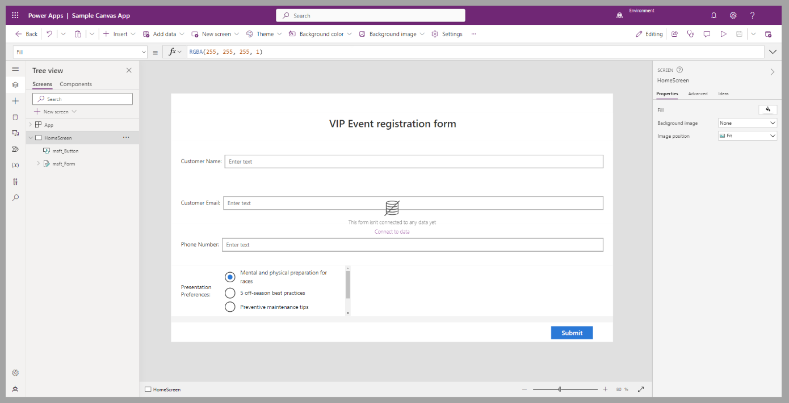](../media/new-canvas-app.png#lightbox)

Now, you can connect the form to a data source. Additionally, you can complement the app by using Microsoft Power Fx and all available controls in Power Apps to provide a rich experience for app users.

## Exercise steps (video)

The following video demonstrates the steps for the exercise in this unit.

> [!VIDEO https://www.microsoft.com/videoplayer/embed/RW17Y1W]

## Next steps

You've now learned how to create a canvas app based on a design by using the Figma UI Kit. Your next step is to learn how to create a canvas app based on the Figma design that you created for the bicycle repair shop.
