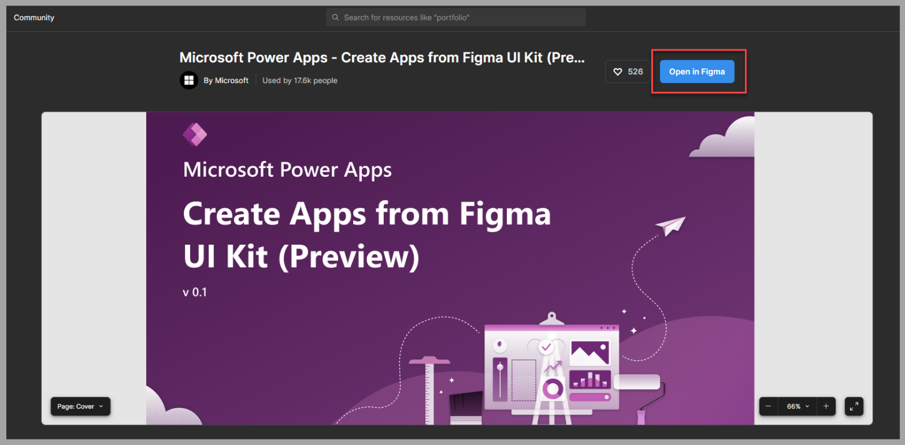
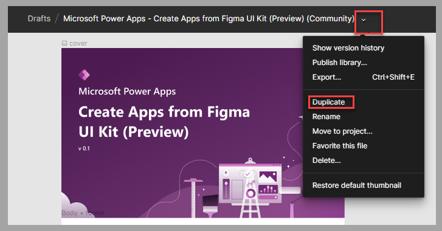
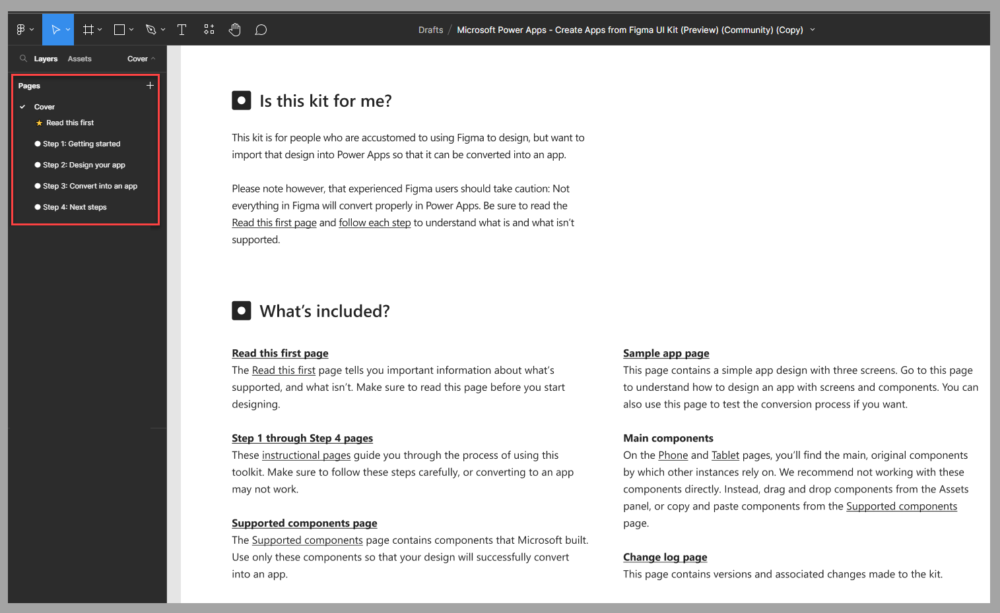

If you want to build a Figma app design to use for creating a canvas app, you need to use components that are part of the Figma UI Kit. This kit contains many graphic representations of the Power Apps components that are expected in an app, such as:

-   Forms, data cards, and sections

-   Text input, dropdown lists, and combo boxes

-   Toggles, checkboxes, and radio buttons

-   Sliders and ratings

-   Date pickers and timers

-   Images and rectangles

## Use Figma UI Kit

Key concepts to know when you're designing an app by using Figma UI Kit include:

-   Use the Segoe UI font to have better rendering results. You can download the [font](https://aka.ms/SegoeFonts) if you don't already have it.

-   Use only the components that are available on the **Supported components** page of the kit.

-   Keep the component names intact. To avoid causing issues, you can only rename pages during the conversion to a canvas app.

-   Make sure that the provided components that are built with specific layers remain unchanged.

-   Use images that convert exactly as it is for the following unsupported components:

    -   Charts

    -   Icons

    -   Shapes

-   Name the screen **msft_Ignore** in situations where you don't want to include a screen in the app conversion.

## Get started with the Figma UI Kit

To design an app by using the Figma UI Kit, follow these steps:

1.  Go to the [Figma UI Kit](https://www.figma.com/community/file/1110934196623232680/Microsoft-Power-Apps---Create-Apps-from-Figma-UI-Kit-(Preview)) webpage.

1.  Select **Open in Figma**.

	> [!div class="mx-imgBorder"]
	> 

1.  Next to the name of the kit, select **Duplicate** in the list of actions.

	> [!div class="mx-imgBorder"]
	> 

If it's your first time using the Figma UI Kit, or if you need a refresher on the instructions, review the **Cover** page that guides you through the kit information and the four steps that describe how to use the kit in Figma.

> [!div class="mx-imgBorder"]
> 

## Next steps

You've now learned about the basic steps for using the Figma UI Kit to create an app design. Your next step is to learn how to design a specific app for a bicycle repair shop by using the Figma UI Kit.
