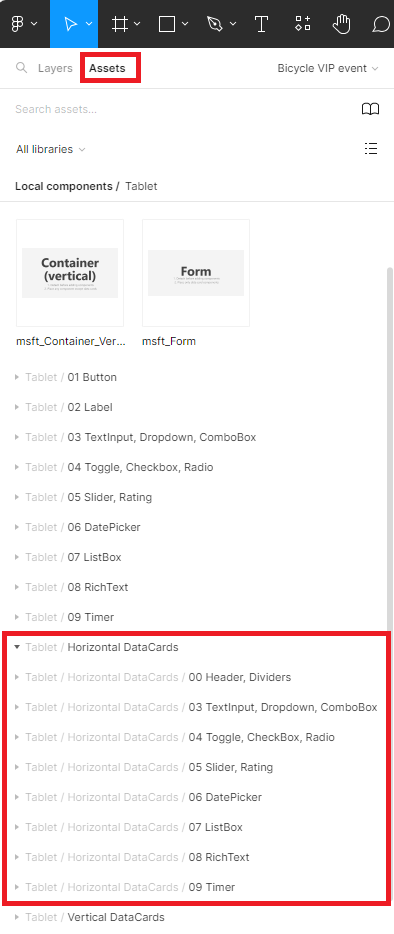

In this exercise, you'll use the Figma UI Kit to explore certain components and to create a bicycle repair shop app.

## Scenario

You work at a bicycle store and are responsible for an upcoming VIP sale. You need to plan the sale based on customer preferences for presentation topics. 
You want to design a canvas app where your colleagues can register potential attendees and collect attendee preferences by using a dedicated tablet.

Your objective is to design the application and allow the store owner and marketing director to review it and provide recommendations.

The application should allow you and your colleagues to gather the following information:

-   Customer name, email, and phone number

-   Choices for a preferred presentation topic:

    -   Mental and physical preparation for races

    -   Five (5) off-season best practices

    -   Preventive maintenance tips

    -   How to select bicycle size for ages youth to adult

## Exercise

Watch the following video for a demonstration of the steps in this unit.

> [!VIDEO https://www.microsoft.com/videoplayer/embed/RW17Vtw]

1.  Go to the [Figma UI Kit](https://www.figma.com/community/file/1110934196623232680/Microsoft-Power-Apps---Create-Apps-from-Figma-UI-Kit-(Preview)) webpage.

1.  Select **Open in Figma**.

	> [!div class="mx-imgBorder"]
	> 

1.  Next to the name of the kit, select **Duplicate** in the list of actions.

	> [!div class="mx-imgBorder"]
	> 

1.  Under **Layers** in the left navigation pane, select the plus (**+**) symbol next to **Pages** to create a canvas for the app design.

	> [!div class="mx-imgBorder"]
	> 

1.  Rename the page to **Bicycle VIP event**.

	> [!div class="mx-imgBorder"]
	> 

1.  In the **Assets** section of the studio, select the **Tablet** form factor and then move a **Screen** component onto the newly created page.

	> [!div class="mx-imgBorder"]
	> 

	Be sure that you drag the component rather than selecting it with a single click. If you accidentally select the component with a single click, the following screen appears. If this scenario occurs, return to the **Bicycle VIP event** page under **Layers** and then repeat this step.

	> [!div class="mx-imgBorder"]
	> 

1.  To allow the addition of components on the screen, you need to detach the screen first. Select **Detach instance** in the context menu by right-clicking the screen component.

	> [!div class="mx-imgBorder"]
	> 

1.  Remove the informational text box by selecting it and then pressing the **Delete** key on your keyboard.

	> [!div class="mx-imgBorder"]
	> 

1.  To rename the screen component, double-click the label located on top of the screen component, and then enter **Home Screen** as its name.

	> [!div class="mx-imgBorder"]
	> 

1. Add the required components from the **Tablet** list. These components allow employees to register customers for the event.

    i. Under the **Tablet** components area, in the **00 Scrollable** section, add a **Form** component.

    ii. Resize and move the form to have the following coordinates and dimensions:

      - **X** = 0

      - **Y** = 60

      - **W**idth = 1366

      - **H**eight = 648

    iii. Follow the instructions in step 7 to detach the form.

	> [!div class="mx-imgBorder"]
	> 

    iv. In the upper-left, select **Layers** and then under Home Screen and msft_Form remove the information text label by selecting it and then pressing the **Delete** key on your keyboard. 

	> [!div class="mx-imgBorder"]
	> 

1. In the form, add the input fields to capture the customer information for the event. In consideration of the tablet form factor and data entry in a form component, select all new components from the **Tablet / Horizontal DataCards** section in the **Assets** left navigation pane.

	> [!div class="mx-imgBorder"]
	> 

1. Add the following components, and by using the right navigation pane, define the component properties with the following information:

    -   **00 Header, Dividers** (a title text box with the following properties):

		Text: VIP Event registration form

    -   **03 TextInput, Dropdown, ComboBox** (an input text box to capture a customer name):

		Text: Customer Name:

    -   **03 TextInput, Dropdown, ComboBox** (an input text box to capture a customer email address):

		Text: Customer Email:

    -   **03 TextInput, Dropdown, ComboBox** (an input text box to capture a customer phone number):

		Text: Phone Number:

    -   **04 Toggle, CheckBox, Radio** (a set of presentation options to select from):

		- Text: Presentation Preferences:

		- Option labels:            

			- Mental and physical preparation for races
	
			- Five (5) off-season best practices
	
			- Preventive maintenance tips
	
			- How to select bicycle size for ages youth to adult

	> [!div class="mx-imgBorder"]
	> 

1. Add a **Submit** button outside of the form and set the X property to **1175** and the Y property to **720**. Change the text of the button to be **Submit**.

	> [!div class="mx-imgBorder"]
	> 

## Next steps

You've now learned how to design an app by using the Figma UI Kit, which you can use to create a canvas app. Your next step is to learn how to create a canvas app based on a Figma design.
