In this exercise, you'll apply your learned knowledge to complete the process of creating a canvas app based on the design that you built in the [Exercise - Design a bicycle repair shop app by using Figma](/training/modules/design-canvas-app-figma/exercise-bicycle-repair-shop-app) unit.

## Scenario

You want to create a canvas app for your colleagues that's based on a Figma design. The app enables your colleagues to register potential attendees for a VIP sale and to collect attendee preferences by using a dedicated tablet.

You'll capture the attendee information in a Microsoft Excel spreadsheet so that the marketing team can contact customers before and after the event.

## Preparation steps

Follow the steps in the [Create a canvas app on a Figma design](/training/modules/design-canvas-app-figma/create-canvas-app) unit to use the bicycle repair shop design that you built. At step 11, you can name the app **Bicycle VIP Event**.

Download the [**Bicycle VIP registration.xlsx**](https://github.com/MicrosoftDocs/mslearn-developer-tools-power-platform/blob/master/power-apps/design-canvas-app-figma/Bicycle%20VIP%20registration.xlsx) Excel spreadsheet file. This file serves as the app data source. Save it into a Microsoft OneDrive for Business location that you have access to.

> [!div class="mx-imgBorder"]
> [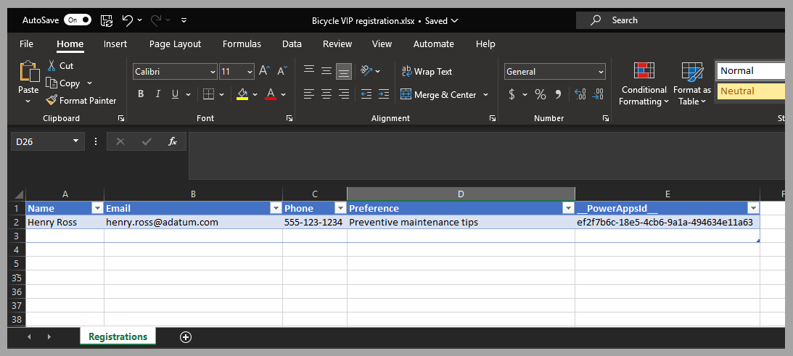](../media/spreadsheet.png#lightbox)

## Exercise

Complete the following steps to create the canvas app that stores the registrations in the Bicycle VIP registration spreadsheet:

1.  Connect to the data source, and then select **Add data** in the **Data** section of the left pane in Power Apps canvas studio.

	> [!div class="mx-imgBorder"]
	> [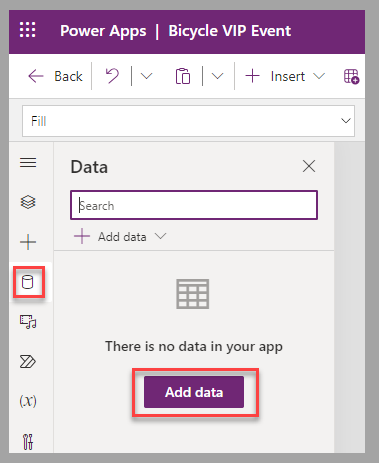](../media/add-data.png#lightbox)

1.  Select **Excel Online (Business)** as the data source.

	> [!div class="mx-imgBorder"]
	> [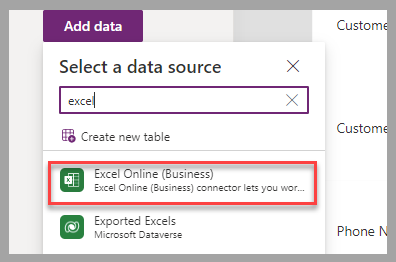](../media/source.png#lightbox)

1.  Select **Connect**.

	> [!div class="mx-imgBorder"]
	> [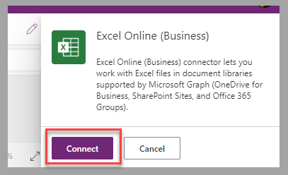](../media/connect-source.png#lightbox)

1.  Go to the location of the **Bicycle VIP registration** spreadsheet that you saved in the **Preparation steps** section and then select the spreadsheet.

	> [!div class="mx-imgBorder"]
	> [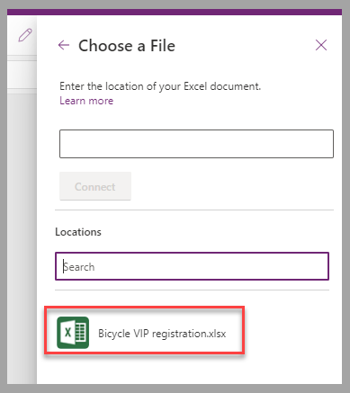](../media/select-spreadsheet.png#lightbox)

1.  Select **Registrations** as the table and then select **Connect**.

	> [!div class="mx-imgBorder"]
	> [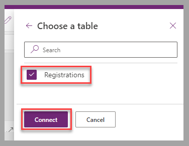](../media/registrations.png#lightbox)

1.  Select the **Use unique column from Excel table** option as an identifier for Registrations, select **\_PowerAppsId\_**, and then select **Connect**.

	> [!div class="mx-imgBorder"]
	> [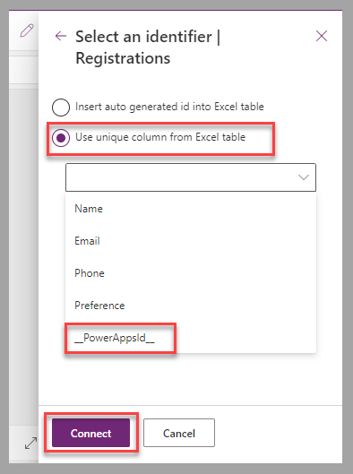](../media/identifier.png#lightbox)

1.  To connect the **msft_Form** control to the data source, update the **DataSource** property to **Registrations**.

	> [!div class="mx-imgBorder"]
	> [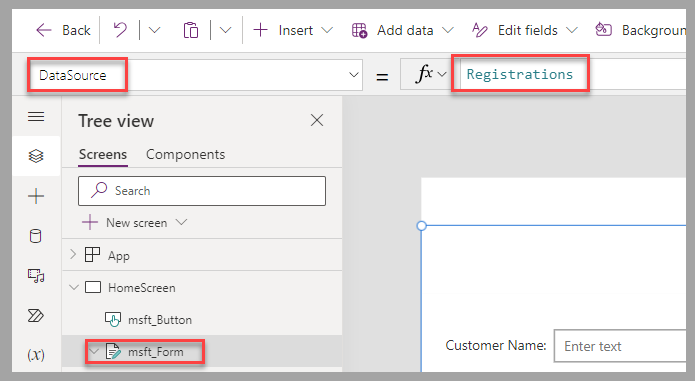](../media/data-source-property.png#lightbox)

1.  To ensure the identification of the controls in the following steps, **Rename** the data card and input components.

	> [!div class="mx-imgBorder"]
	> [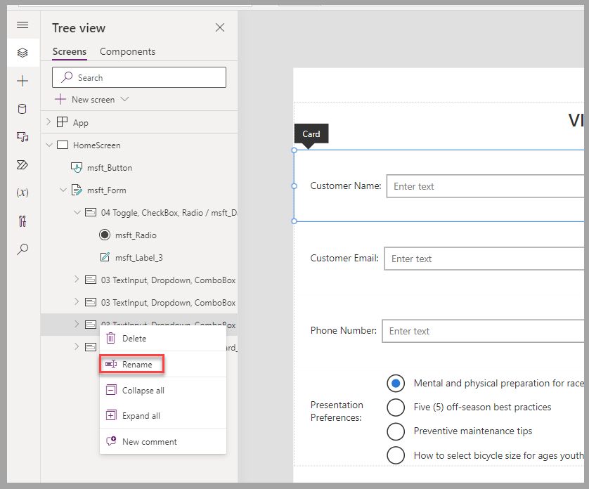](../media/rename-data-card.png#lightbox)

	The result should resemble the following image.

	> [!div class="mx-imgBorder"]
	> [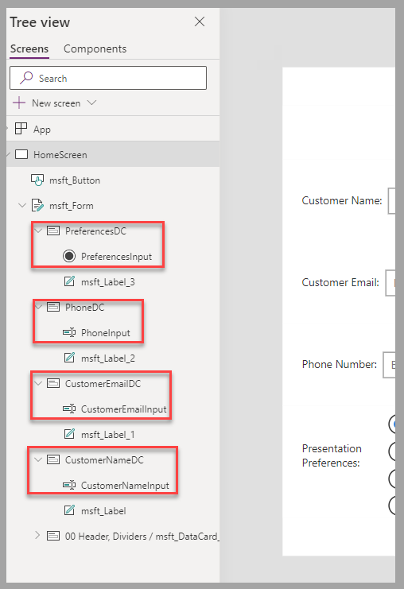](../media/results.png#lightbox)

1.  To connect the data cards to columns in the Excel table, provide the column name for the **DataField** property for each data card control, including the quotation marks.

    -   **PreferencesDC** - "Preference"

    -   **PhoneDC** - "Phone"

    -   **CustomerEmailDC** - "Email"

    -   **CustomerNameDC** - "Name"

	> [!div class="mx-imgBorder"]
	> [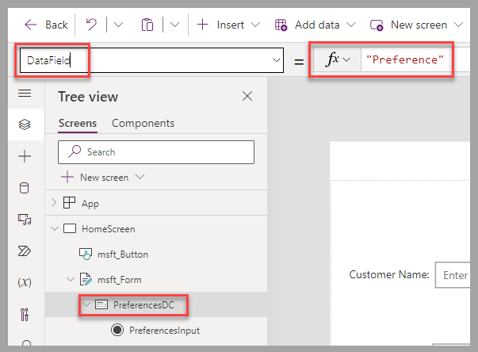](../media/data-field.png#lightbox)

1. To insert the values from the app in the Excel table, provide an input control text property for the **Update** property for each data card control.

    -   **PreferencesDC** - PreferencesInput.SelectedText.Value

    -   **PhoneDC** - PhoneInput.Text

    -   **CustomerEmailDC** - CustomerEmailInput.Text

    -   **CustomerNameDC** - CustomerNameInput.Text

	> [!div class="mx-imgBorder"]
	> [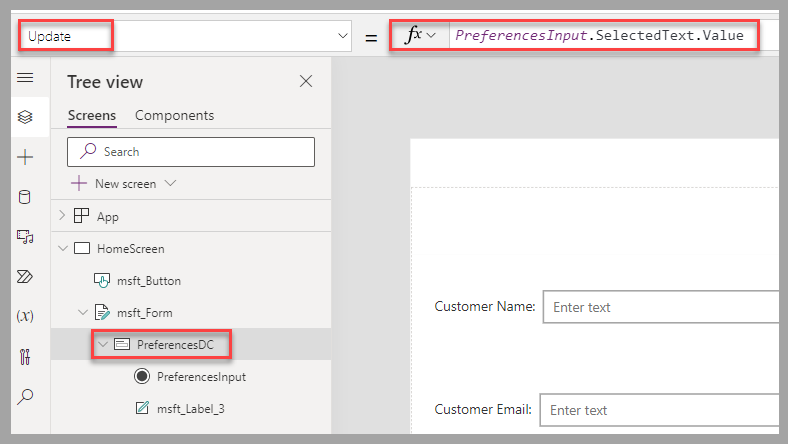](../media/update.png#lightbox)

1. To save the values into the Excel spreadsheet and reset the canvas app form into data entry mode, set the **OnSelect** property of the **Submit** button to **SubmitForm(msft_Form); NewForm(msft_Form);**.

	> [!div class="mx-imgBorder"]
	> [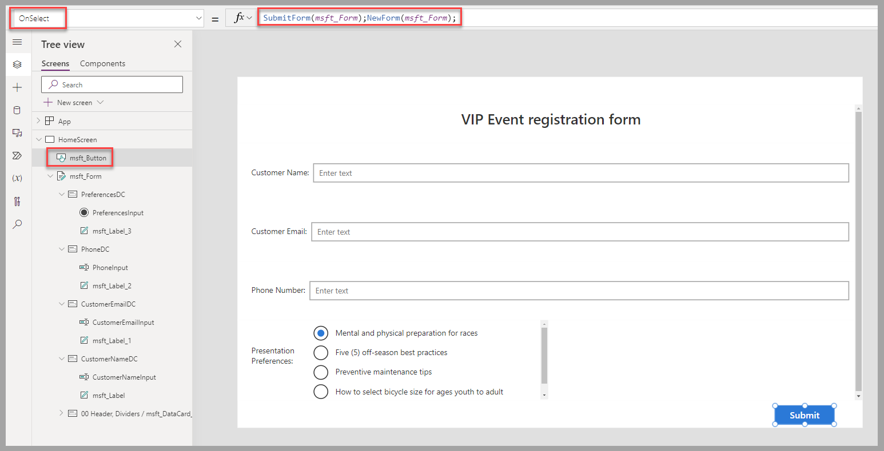](../media/submit-button.png#lightbox)

You now have a complete app that allows the registration of customers for the upcoming VIP sale. To test the app, select the **Save** and **Play** icons. To share the app with your colleagues, select the **Share** icon.

> [!div class="mx-imgBorder"]
> [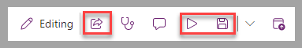](../media/share-play-save.png#lightbox)

The following video demonstrates the steps for this unit.

> [!VIDEO https://www.microsoft.com/videoplayer/embed/RW180wT]

## Next steps

You've now learned how to create a canvas app based on a Figma design. This app is connected to a data source, and you and your colleagues can use it to register customer information and preferences for a VIP sale. Next, you can validate what you've learned from this module.
