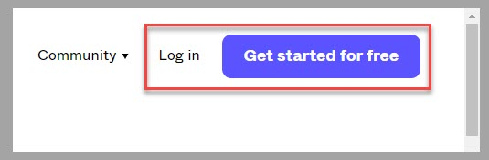

Welcome to the **Design a Power Apps canvas app by using Figma** module. This self-paced module helps you learn how to take advantage of the design functionalities of Figma to drive the creation of canvas apps in Microsoft Power Apps.

## Overview

Figma is a powerful and intuitive design tool that helps you create exceptional user interfaces, collaborate with team members, and create a prototype of your app in one place. A cloud-based design tool, Figma provides a consistent experience where you can design spontaneously or collaborate with team members in real time.

The user-friendly interface provides beginners with a near effortless app design experience. The platform offers a wide range of features and functionalities to help you make your vision a reality. You can create and customize shapes, icons, buttons, and other UI elements by using the robust design tools in Figma. Additionally, Figma provides a vast library of prebuilt components and design resources, saving you time and effort during the design process.

Similar to collaborating with other Microsoft tools, such as Microsoft 365, you can use Figma to enable your team members to collaborate on your projects and to view and edit your designs simultaneously. With Figma, everyone can provide feedback, make changes, and iterate on designs in a seamless manner. Moreover, Figma offers features, such as commenting and version history, that ensure effective communication and tracking of design iterations.

> [!div class="mx-imgBorder"]
> 

## How to use Figma

Figma excels in its integration capabilities, which you can use to connect with other tools in your app development workflow. Whether you're using project management tools, developer handoff platforms, or design system integrations, Figma provides seamless integrations that streamline your app design and development processes.

1.  Go to the [Figma website](https://www.figma.com/).

1.  In the upper-right menu, select **Log in** or **Get started for free** if you don't already have an account set up on Figma.

	> [!div class="mx-imgBorder"]
	> 

1.  When you're connected, you can browse through multiple, ready-to-use **FigJam** templates that can help accelerate your design or learning processes.

	> [!div class="mx-imgBorder"]
	> 

1.  You can also start a new project by selecting a template within Figma Community. To access these templates, select **Explore Community** in the left navigation pane of Figma studio.

	> [!div class="mx-imgBorder"]
	> 

	Figma Community contains thousands of free and paid templates.

	> [!div class="mx-imgBorder"]
	> 

1.  As you work through your app design, you can select UI components from the **Asset** section of the studio. The studio contains items such as forms, buttons, and checkboxes that you can use.

	> [!div class="mx-imgBorder"]
	> 

1.  To browse through the different sections and pages of your app design, go to the **Layers** section of Figma studio.

	> [!div class="mx-imgBorder"]
	> 

At this point, you can explore the different possibilities and capabilities of Figma to design an app and collaborate with team members to enrich or approve this design.

## Next steps

Now that you've learned about the fundamentals of Figma app design, you can learn how to use the Figma UI Kit to design a canvas app.
