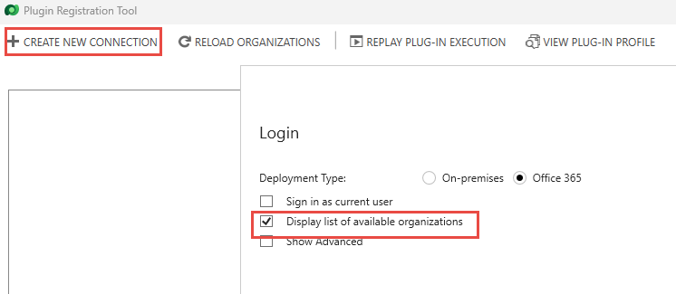
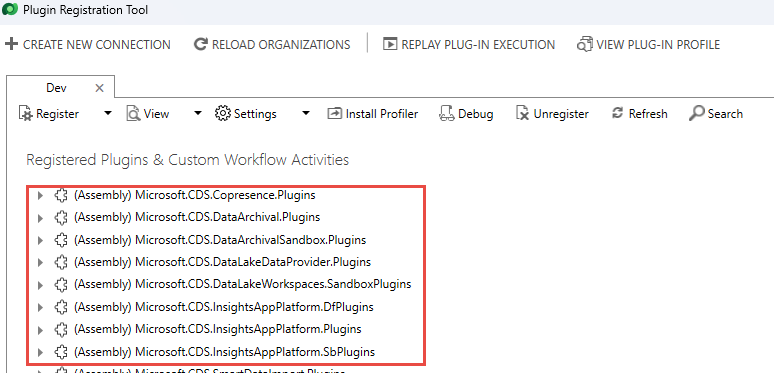
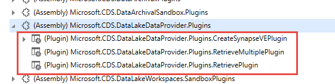
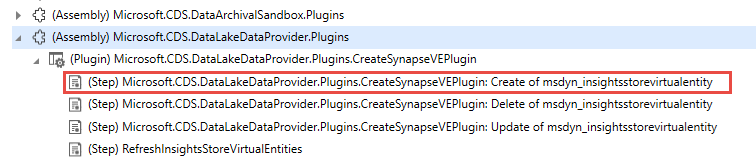
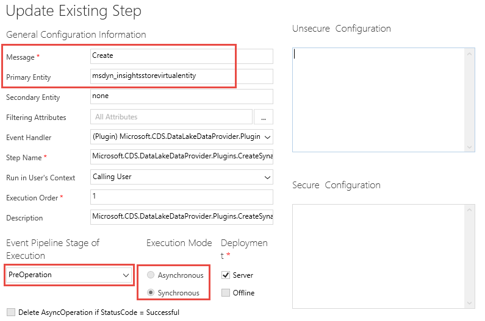

In this exercise, you'll install some of the developer tools from NuGet.

> [!IMPORTANT]
> Use a test environment with Microsoft Dataverse provisioned. If you do not have one you can sign up for the [community plan](https://powerapps.microsoft.com/communityplan/?azure-portal=true).

## Task 1: Install developer tools

In this task, you'll use a Power Platform CLI to install tools.

1. Launch Command Prompt.

1. Run the command below to install the **Configuration Manager Tool**.

	```pac tool cmt```

1. The Configuration Manager Tool should install and launch. Close the Configuration Manager Tool.

1. Run the command below to install the **Package Deployer Tool**.

	```pac tool pd```

1. The Package deployer tool should install and launch. Close the Package Deployer Tool.

1. Run the command below to install the **Plugin Registration Tool**.

	```pac tool prt```

1. The Plugin Registration should install and launch. Don't close the Plugin Registration Tool.
    

## Task 2: Explore a registered plug-in with the plug-in registration tool

1.  Select **Create New Connection**

1.  Check **Display list of available organizations**.

	> [!div class="mx-imgBorder"]
	> [](../media/create.png#lightbox)

1.  Select **Login** and sign in with your Dataverse environment credentials when prompted.

1.  On the list of organizations (environments) pick your environment and select **Login** again.

1.  You'll see a list of system plug-ins, if you do this on an environment with custom plug-ins you would see them in the list as well. The (Assembly) are .NET DLLs that implement the plug-ins.

	> [!div class="mx-imgBorder"]
	> [](../media/list.png#lightbox)

1.  Locate **Microsoft.CDS.DataLakeDataProvider.Plugins** and expand it.

	> [!div class="mx-imgBorder"]
	> [](../media/plugin.png#lightbox)

1.  Each of the child items is implemented in the assembly. Expand one of the items to see the step registrations for that individual plug-in.

	> [!div class="mx-imgBorder"]
	> [](../media/step.png#lightbox)

1. Step registration connects the plug-in as an event handler to the event. In the above example, this is handling a create on the insightsstorevirtualentity table.

1. Double-click on the step to see the step configuration details including what message and entity, it's registered on, the pipeline stage when the plugin will be invoked, whether execution is synchronous or asynchronous, etc.
   
	> [!div class="mx-imgBorder"]
	> [](../media/properties.png#lightbox)

When you create your own custom plug-in, you'll use this tool to load the assembly and register the steps for the events that you want to handle.
