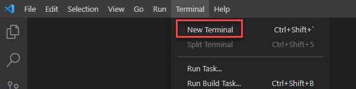
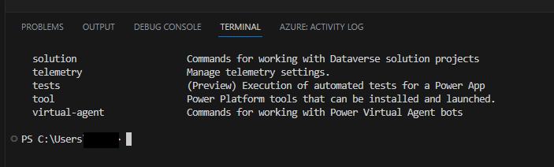
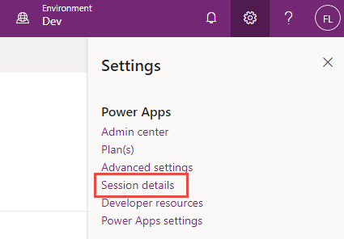
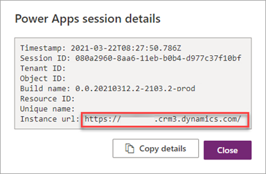
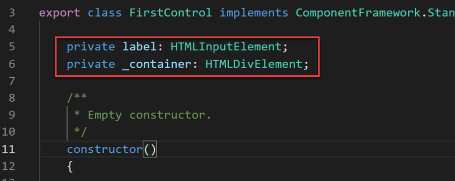
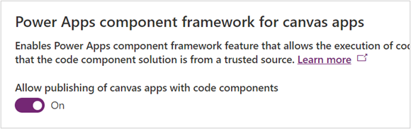
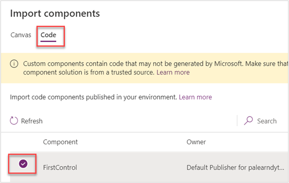
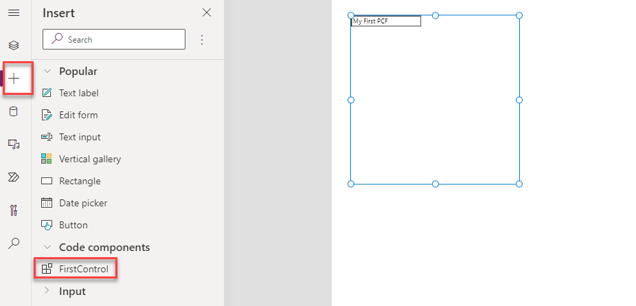

In this exercise, you'll install the Power Platform CLI and create your first Power Apps Component Framework (PCF) component.

## Task 1: Install the CLI

1.  Install Npm (comes with Node.js) or [Node.js](https://nodejs.org/en/?azure-portal=true) (comes with npm). We recommend that you use LTS (Long-Term Support) version 10.15.3 or higher.

1.  Install [Visual Studio Code](https://code.visualstudio.com/Download/?azure-portal=true).

1.  Install [Power Platform Tools extension](https://marketplace.visualstudio.com/items?itemName=microsoft-IsvExpTools.powerplatform-vscode&azure-portal=true).

1.  Start Visual Studio Code.

1.  Select **Terminal** and select **New Terminal**.

	> [!div class="mx-imgBorder"]
	> 

1.  Run the pac command to see what commands are available:

    `pac`

	> [!div class="mx-imgBorder"]	
	> 

1.  You can enter pac and then a command to see what options it has, for example,  try the following:

    `pac admin`

1.  Navigate to [Power Apps maker portal](https://make.powerapps.com/?azure-portal=true) and make sure you have the **Dev** environment selected.

1.  In the upper right corner of the screen, select the **Settings** icon and choose **Session details**.

	> [!div class="mx-imgBorder"]
	> 

1. In the Power Apps session details dialog, select **Instance url** value and copy it for use later in the exercise.

	> [!div class="mx-imgBorder"]
	> 

1. Go back to the Visual Studio Code terminal, type the following command to establish a connection from the CLI and sign into your test environment when prompted.

    `pac auth create --name Lab --url <Your Instance URL>`

1. Type the following `who` command that will display the environment and the user information. This is good to ensure you are in the correct environment.

    `pac org who`

## Task 2: Create a PCF component

1.  Run the command below to create a new folder named **labPCF** inside your user's folder.

    `md labPCF`

1.  Change directory to the folder you created.

    `cd labPCF`

1.  Run the command below to initialize the component project.

    `pac pcf init --namespace lab --name FirstControl --template field`

1.  Type the following command and then press enter. This pulls down any dependencies from the npm repository.

    `npm install`

1.  Open the folder in Visual Studio Code.

    `code -a .`

1.  Explore the files that have been created.

1.  Open **Index.ts** in the **FirstControl** folder.

1.  Paste the following two variables inside the export.

    `private label: HTMLInputElement;`

    `private _container: HTMLDivElement;`

	> [!div class="mx-imgBorder"]
	> 

1.  Paste the following inside the **init()** function to create the HTML controls and set the label value.

    ```
    this.label = document.createElement("input");
    this.label.setAttribute("type", "label");
    this.label.value = "My First PCF";
    this._container = document.createElement("div");
    this._container.appendChild(this.label);
    container.appendChild(this._container);
    ```

1. Save the file.

1. Go to the terminal and input the following command and then enter. This will start the test harness with the latest code.

    `npm start`

1. The test harness is effective to use early in the project to see what your control looks like visually without having to deploy it to an environment. You can set values of property to change the size of the control area. After you're done exploring the test harness, switch back to the terminal and press Ctrl-C to terminate the execution of the test harness.

1. Type **Y** and [ENTER].

1. Run the following command to list solutions in your environment.

    `pac solution list`

1. These are the current solutions that are in your environment. The next step will add one for the component.

1. Type the following push command to push our control to the environment.

    `pac pcf push --publisher-prefix lab`

1. Run pac solution list command again. You should see a PowerAppsTools_lab solution listed. This is how your component is installed in the dev environment for unit testing before being packaged for user testing or production or included as part of another solution.

## Task 3: Use the component in an app (optional)

1.  Navigate to the [Microsoft Power Platform Admin Center](https://aka.ms/ppac/?azure-portal=true).

1.  Select the **environment** you're using for the lab.

1.  Select **Settings**.

1.  Expand **Product** area and select **Features**.

1.  On the right side, enable the **Allow publishing of canvas apps with code components** feature.

	> [!div class="mx-imgBorder"]
	> 

1.  Navigate to [Power Apps maker portal](https://make.powerapps.com/?azure-portal=true) and make sure you are in the correct environment.

1.  Select **Solutions**.

1.  Select to open the **PowerAppsTools_lab** solution.

1.  You should see your component listed.

1. Select **+ New | App | Canvas app**.

1. Select **Phone** for Format, enter **First PCF** for App name, and select **Create**.

1. On the left pane, select **Add (+)**, and then select **Get more components.**

1. Select the **Code** tab.

1. Select your component.

	> [!div class="mx-imgBorder"]
	> 

1. Select **Import**.

1. On the left tool bar, select **+** and expand **Code components**.

1. Select the **FirstControl**. You should now see the control with the text **My First PCF** on the canvas.

	> [!div class="mx-imgBorder"]
	> 

1. Select **Save**  to save the application.

You have now built your first PCF component and used it in a canvas app.
