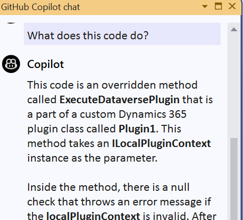

Developers can use many of the traditional development tools when building solutions for Microsoft Power Platform. But there are various distinct tools exclusively targeting Microsoft Power Platform development. Microsoft provides official tooling via [Power Platform CLI ](/power-platform/developer/cli/introduction?azure-portal=true), [NuGet package manager](https://nuget.org/?azure-portal=true), and other published tool installers. There's also a vibrant community of tools and libraries complementing what Microsoft publishes. In this module, we'll explore the tools with which a Microsoft Power Platform developer should be familiar.

## Microsoft Power Platform CLI

The Power Platform CLI is a command-line interface to create code components. The CLI is intended to be the primary CLI for developers to perform various operations. For example, this is how you would initialize and manage the lifecycle of a Power Apps Component Framework component. The tool also can help with developing plug-ins as well. The tool is solution-aware and can help you deploy the supported platform extensions to a development environment for testing. The CLI can be installed [standalone](/power-apps/developer/data-platform/powerapps-cli?azure-portal=true#standalone-power-platform-cli) or as a [Visual Studio Code extension](/power-apps/developer/data-platform/powerapps-cli?azure-portal=true#using-power-platform-tools-for-visual-studio-code). With the extension, commands can be executed from the Visual Studio Code terminal windows.

The following describes some of the common tasks you can perform with the CLI:

|Command Category|Description|
|---| ---|
Admin|   Commands for environment lifecycle features.|
Application|Commands to install AppSource applications that are pre-requisites for the solution work in the target environment.|
Auth|Commands to authenticate to Dataverse.|
Canvas|	Commands for working with canvas app source files.|
Connector|Commands for working with Power Platform Connectors|
Data|Import and export data from Dataverse|
ModelBuilder|Code generator for Dataverse APIs and Tables|
Org|	Commands for working with Dataverse environments.|
Package	|Commands for working with solution packages.|
Paportal|	Commands for working with Power Pages.|
PCF|	Commands for working with Power Apps component framework.|
Pipeline|Commands for working with Pipelines
Plugin|	Command to create a plug-in project.|
Solution|	Commands for working with Dataverse solution projects.|
Telemetry|	Manages the telemetry settings.|
Tool|Manage Power Platform tools that can be installed and launched|
Virtual-Agent|Commands for working with Power Virtual Agent bots

## Microsoft Power Platform connectors CLI

The connector CLI provides a command-line tool to create, download, update, and validate Power Platform custom connectors. The tool allows for advanced editing of the custom connector definition. You also must use the tool if you're preparing a custom connector for open-sourcing or certification. Review the [documentation](/connectors/custom-connectors/paconn-cli?azure-portal=true) on the CLI for more specifics on how to install and use the tool.

## Power Platform tools for Visual Studio
Power Platform Tools for Visual Studio provide support for building Dataverse plug-ins using Visual Studio. Additionally, it includes project templates for other developer tasks like managing solutions and packaging for deployment. This tool can be installed from the Visual Studio Marketplace.

## Application Lifecycle Management (ALM) tools

An important part of implementing an application lifecycle management for your projects is having a repeatable process that allows you to modify the solution components and have these changes recorded in a source control system. While the steps to accomplish these tasks can be performed manually, having an automated process is better to ensure consistency and repeatability. To support building these automations Microsoft provides build tasks for Azure DevOps and Actions for GitHub.

Review the [complete list](/power-platform/alm/devops-build-tool-tasks/?azure-portal=true) of the Azure DevOps build tasks for more specifics on each task.

Review the [complete list](/power-platform/alm/devops-github-available-actions/?azure-portal=true) of GitHub Actions for more specifics on each action.

## Microsoft NuGet tools for Dataverse

The following are Microsoft provided tools that help with various aspects of development when Microsoft Dataverse is used. Each NuGet package contains tools that you download, unpackage and launch to run the tool locally. You can install each of these tools using the Power Platform CLI tool command or by downloading from NuGet and unpackaging the NuGet package.

| NuGet Package                                                | Description                                                  |
| ------------------------------------------------------------ | ------------------------------------------------------------ |
| Code Generation Tool    [Microsoft.CrmSdk.CoreTools](https://www.nuget.org/packages/Microsoft.CrmSdk.CoreTools/?azure-portal=true) | Generates early-bound .NET Framework classes that represent the table data model that is used by model-driven apps. |
| Configuration Migration Tool    [Microsoft.CrmSdk.XrmTooling.ConfigurationMigration.Wpf](https://www.nuget.org/packages/Microsoft.CrmSdk.XrmTooling.ConfigurationMigration.Wpf/?azure-portal=true) | Tool that is used to move configuration data across   Dataverse environments. |
| Package Deployer    [Microsoft.CrmSdk.XrmTooling.PackageDeployment.WPF](https://www.nuget.org/packages/Microsoft.CrmSdk.XrmTooling.PackageDeployment.Wpf/?azure-portal=true) | Tool that enables administrators to deploy packages in a Dataverse environment. Developers combine solution assets and custom code in a package to be deployed by Package Deployer. Independent software vendors (ISVs) must use the same package format when preparing their solutions for publishing on AppSource. |
| PluginRegistrationTool    [Microsoft.CrmSdk.XrmTooling.PluginRegistrationTool](https://www.nuget.org/packages/Microsoft.CrmSdk.XrmTooling.PluginRegistrationTool/?azure-portal=true) | Tool that is used to register custom code plug-in assemblies and steps in a Dataverse environment. |
| Solution Packager Tool    [Microsoft.CrmSdk.CoreTools](https://www.nuget.org/packages/Microsoft.CrmSdk.CoreTools/?azure-portal=true) | Tool that can disassemble Dataverse solutions into multiple XML files to be managed by a source control system.   It can also be used to rebuild a Dataverse solution from the source XML files. |

## Copilots
Each of the Power Platform components are adding copilots makers can use when building components. For example, a maker could add a button to a screen or ask to describe what some Power Fx logic is doing. While the component copilots aren't focused on traditional code, they maybe helpful as you get up to speed testing a code component.

GitHub Copilot chat can also be used as you build your Power Platform extensions. For example, in the following image it shows asking What does this code do? for a selection of Dataverse plugin logic. 

## Community tools

There are many community tools, libraries, and solutions, most of them open source, available to improve Microsoft Power Platform developer experience and fill in the gaps in the official Microsoft development tools and libraries. Some of the tools are listed on [Community tools for Microsoft Dataverse](/power-apps/developer/data-platform/community-tools/?azure-portal=true) page.

Tools created by the community aren't supported by Microsoft. If you have questions or issues with community tools, contact the publisher of the tool.
