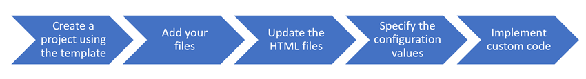
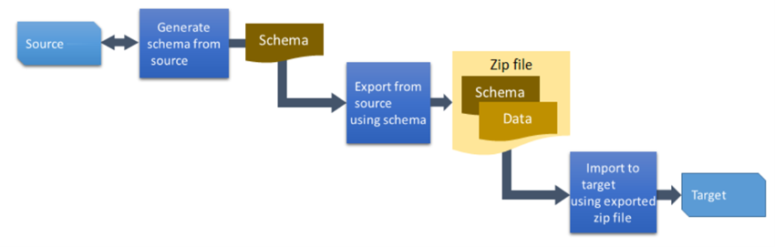

Package Deployer lets administrators deploy packages into Microsoft Dataverse environments. These packages are also used by Independent Software Vendors (ISVs) to deploy certified solutions to customer environments. Developers can help configure the package and build code that runs during the installation phases.

A deployment package is different from a single Dataverse solution in that it can install a complete app including multiple solutions, reference data, and installation of custom logic. A package can consist of any or all of the following:

-   One or more Dataverse solution files

-   Flat files or exported configuration data file from the Configuration Migration tool

-   Custom code that can run before, while, or after the package is deployed to the Dataverse instance

-   HTML content specific to the package that can display at the beginning and end of the deployment process. This can be useful to provide a description of the solutions and files that are deployed in the package.

## Building a package

Microsoft provides a Visual Studio template for creating packages. The level of effort can vary depending on how much custom code is included for execution during installation. Frequently a package only includes one or more solutions and data. The following is the steps to build a deployment package:

> [!div class="mx-imgBorder"]
> [](../media/steps.png#lightbox)

You can initialize a folder with the deployment project template and create your initial package using the Power Platform CLI. The following command is used to populate a folder:

```
pac package init --outputDirectory MyPackage
```
Once initialized you can begin to customize it for your specific needs. For example, if you wanted to create a package to deploy two Dataverse solutions you would run the following commands to configure the package to include them.

```
pac package add-solution --path ..\MySolution1_1_0_0_2_managed.zip
pac package add-solution --path ..\MySolution2_2_0_0_0_managed.zip
```
You can add custom logic by editing the PackageImportExtension.cs class and adding logic to the appropriate event handler. The following are the available events you can add your logic to run:

-   **InitializeCustomExtension** - Called to Initialize any functions in the custom extension. 

-   **BeforeImportStage** - Called before the main import process begins, after solutions and data.

-   **PreSolutionImport** - Raised before the named solution is imported to allow for any configuration settings to be made to the import process.

-   **RunSolutionUpgradeMigrationStep** - Called during a solution upgrade when both solutions, old and new, are present in the system. This function can be used to provide a means to do data transformation or upgrade while a solution update is occurring.

-   **AfterPrimaryImport** - Called after all import steps are complete, allowing for final customizations or adjustment of the environment.

You can also make other [customizations](/power-platform/alm/package-deployer-tool?tabs=cli#configure-the-package?azure-portal=yes) by making changes to the configuration files directly.

Once configured and any custom code is added you can build the package to prepare it for deployment. You can load the .csproj file into Visual Studio or use the dotnet command to run MSBuild. The following shows the command to build the package from the command line:

```
dotnet publish
```
Building the package will create a .zip file containing everything needed to deploy the package.

## Deploying a package

Once a package is configured it can be deployed to Dataverse environments using one of the following methods:

-   **CLI** - Using this approach you would use the Power Platform CLI to authenticate to the target environment and then run the pac package deploy command.

-   **Interactively** - Using this approach provides a wizard-like experience for a user with administrative access to the environment to install the package. As the install progresses the user is visually advised of the progress. This option uses the Package Deployment Tool windows application that can be launched using the command pac tool pd.

-   **Windows PowerShell** - Using this approach allows command-line installation. This would be appropriate for packages deployed as part of an automated process.

-   **AppSource** - This approach is used when an ISV offer is selected for install from the AppSource portal.

You can read more about how deployment works with these approaches in [Deploy packages using Package Deployer and Windows PowerShell](/power-platform/admin/deploy-packages-using-package-deployer-windows-powershell/?azure-portal=true).

## Including data

One of the key things that differentiates Package Deployer from simply installing a solution is that you can include reference / configuration data as part of a deployment package.

The [Configuration Migration tool](/power-platform/admin/manage-configuration-data/?azure-portal=true) is used to transport configuration and test data from one environment to another. It provides the means to capture such data, include that data in the source control repository, and use that data to automate testing. This tool can be used standalone, however, the data.zip file it produces as output can be included as part of a deployment package. The high-level steps are:

1.  Define the schema of the source data to be exported

1.  Use the schema to export data

1.  Import the exported data

The following diagrams the process to use the tool:

> [!div class="mx-imgBorder"]
> [](../media/process.png#lightbox)

When used with Package Deployer the output .zip file can be included in the deployment package.

The following are some of the key benefits of using Configuration Migration for preparing data:

-   Select the tables and columns from where you want to export the configuration data.

-   Analyze relationships between records and run the import using multiple passes to ensure data integrity.

-   Use a query to define a subset of records to be included in the package.

-   Avoid duplicate records on the target system by defining a uniqueness condition for each table based on a combination of columns in the table, which is used to compare against the values on the target system.

-   If there are no matching values, a unique record is created on the target system. If a matching record is found, the record is updated on the target system.

-   Validate the schema for the selected tables to be exported to ensure that all the required data/information is present.

-   Reuse an existing schema to export data from a source system.

-   Automatically move values for date and datetime columns forward at import to keep data up to date in demo environments.

Using Package Deployer to deploy apps allows you to include multiple solution files, data, and execute custom logic during the installation process. Administrators can use a wizard-like installer experience and don't have to worry about how to install the individual components or import configuration data.
