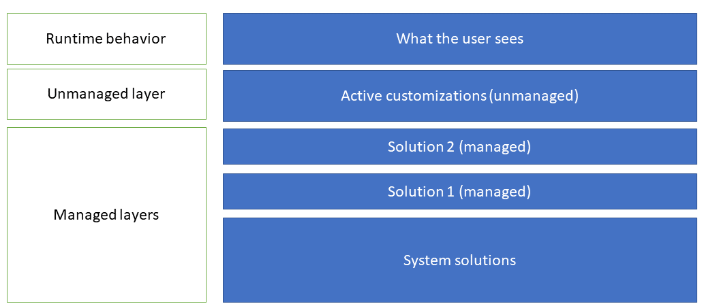

Microsoft Power Platform uses the solution feature of Microsoft Dataverse to track and manage apps, flows, tables, and even developer code components like JavaScript and plug-ins. Solutions are containers that can be used the transport project assets from one environment to another. Solutions are a core part of Microsoft Power Platform application lifecycle management (ALM) strategy.

## Solutions can be unmanaged or managed

-   **Unmanaged solutions** - Used in development environments while you make changes to your components. New components can be created within the solution and any existing components within the Dataverse environment can be added as well. Unmanaged solutions can be exported either as unmanaged or managed. Exported unmanaged versions of your solutions should be checked into your source control system. A tool named SolutionPackager can be used to prepare solutions to be checked in. You can automate this process using the [Microsoft Power Platform Build Tools](/power-platform/alm/devops-build-tools/?azure-portal=true).

-   **Managed solutions** - Used to deploy to any environment that isn't a development environment for that solution. Managed solution components can't be directly modified in, or removed from the managed solution, nor can any new components be added. You can however include the component in another, unmanaged solution, and make changes there. This creates a dependency on the managed solution. Managed solutions can be serviced independently from other managed solutions in an environment. While you can manually export an unmanaged solution as managed, managed solutions are recommended to be generated as a build artifact from an automated build process.

Solutions can be created and managed via the maker portal (make.powerapps.com) and can also be created and managed by developers using the platform API. There are also tools like SolutionPackager, Package Deployer, and DevOps and GitHub build tasks and actions that can be used by developers to perform and automate various solution-related tasks.

## Solutions can be layered

Multiple solutions can co-exist within an environment. To manage these solutions, Dataverse tracks them using a layer concept at the individual solution component level. All unmanaged solutions are tracked as a single layer, while each managed solution is tracked separately. When multiple layers of managed solutions exist, the managed solution last installed in an environment is used over previously imported managed solutions. Some components support merging instead of a last-one-wins approach. For example, a form for a Power Apps model-driven app, might be modified by three managed solutions, each changing different sections of the form. In this example, the merged result would be a combined form, including changes from all three managed solutions. The unmanaged layer, however, is always at the top, and a change in the unmanaged layer will override any change from managed solutions in an environment. Ultimately, a user sees a combination of all the solution layers in an environment. The following image illustrates this concept.

> [!div class="mx-imgBorder"]
> [](../media/solution-layers.png#lightbox)

The layering concept is key to allowing multiple solutions to work together in a single environment. It also facilitates allowing further customizations of components from a manages solution. 

## Solution dependencies 
Solution components often depend on other solution components. The solution runtime tracks these dependencies to ensure that solutions can't be removed if they are depended on by another solution. 

## Use Power Platform CLI to work with solutions
In addition to using the maker portals, developers can also use the Power Platform CLI to perform many solution management tasks.

For example, the following would initialize a directory with a new Dataverse solution project, and then adds a reference to a slider PCF component that the developer created.

```
pac solution init --publisher-name developer --publisher-prefix dev
pac solution add-reference --path c:\Users\Downloads\SliderComponent
```

## Solution packaging

Solutions exported from a Dataverse environment are simply a compressed zip file with the metadata included. As a single binary file, it isn't effective or useful when placed into a source control repository.

To facilitate source control solution packaging tooling can unpack a Dataverse solution into a series of XML files and other files so that these files can be easily managed by a source control system. Solution packaging tools can also repack the solution zip file using the extracted components.

Developers can use the following tools that implement solution packaging support:

* Power Platform CLI
* Power Platform Build Tools to implement automation
* SolutionPackager tool 

## Solution packaging using Power Platform CLI
For example, the following would export a solution from Dataverse and unpack all the individual files using the SolutionPackager logic.

```
pac solution pack --zipfile C:\MyProject.zip --folder .\MyProjectUnpacked\.
pac solution unpack --zipfile C:\MyProject.zip --folder .\MyProjectUnpacked\.
```

## SolutionPackager tool

The SolutionPackager tool is distributed as part of the NuGet package [Microsoft.CrmSdk.CoreTools](https://www.nuget.org/packages/Microsoft.CrmSdk.CoreTools/?azure-portal=true). 

The SolutionPackager tool is an executable that you can use to conduct the following actions:

-   Extract: Extract solution .zip file to a folder

-   Pack: Pack a folder into a .zip file

It supports various command-line arguments that you can use to perform specific actions as part of your solution extract/pack operation. For in-depth details on how to use the SolutionPackager tool, see the [SolutionPackager Tool](/power-apps/developer/common-data-service/compress-extract-solution-file-solutionpackager/?azure-portal=true) article.

Sometimes it's necessary to manage items, such as web resources or plug-in assemblies that are created and managed in separate projects. That requires files within a solution to be mapped from their default location in an extract folder to their location in the relevant project directory. For example, a plug-in assembly will typically be located in the bin output folder of the plug-in assembly project. To accomplish this, you can use the /map argument to manage the mapping of these locations. For a detailed explanation on how to build an XML mapping document, see [Use the /map Command Argument](/power-apps/developer/common-data-service/compress-extract-solution-file-solutionpackager?azure-portal=true#use-the-map-command-argument).

While SolutionPackager can be manually run standalone, more commonly it's run as part of an automated build process. Both Microsoft Power Platform Azure DevOps builds tasks and GitHub Actions have steps that use SolutionPackager to unpack and pack a solution.

