In this exercise you will create a custom connector in your Power Platform environment from your web API in Visual Studio.

Power Platform enables web API developers to quickly build mobile or web applications using a Power Apps canvas app as a front end. With the Power Platform Connected Service in Visual Studio 2022, ASP.NET web API developers can easily create a custom connector for use with Power Apps.

> [!NOTE]
> If you want to use Visual Studio and Power Apps in this exercise, you will need to:
>
>- Install Visual Studio 2022 17.7 with the ASP.NET and web development workload installed. You need to be signed in to Visual Studio to create and use dev tunnels. The feature is not available in Visual Studio for Mac.
>
>- Create a free Power Platform developer environment.
>
>- Download this [sample API from GitHub][samples]. 

## Add Power Platform as a connected service ##


1. Open this [sample API from GitHub][samples] with Visual Studio. This is an ASP.NET Core Web API project.

1. In your project, from **Solution Explorer**, right-click the **Connected Services** node and select **Add > Microsoft Power Platform**
    > [!div class="mx-imgBorder"]
    > [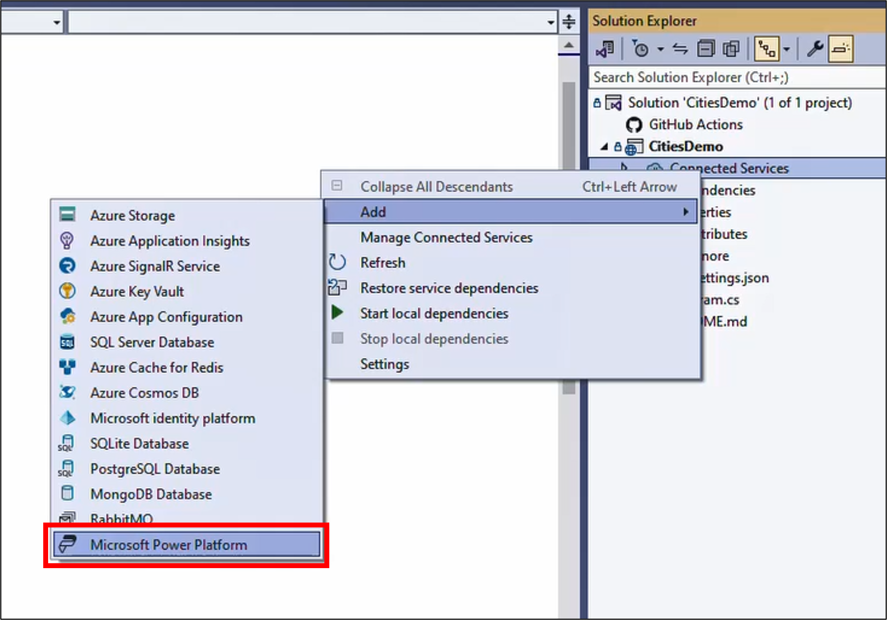](../media/create-custom-connector-visual-studio-1.png)

1. Select or input the following values:
    - **Power Platform environments**: `select your developer environment`
    - **Power Platform Solutions**: `Common Data Service Default Solution`
    - **Custom Connector**: select the + icon and enter `InventoryLocations_Connector`
    > [!div class="mx-imgBorder"]
    > [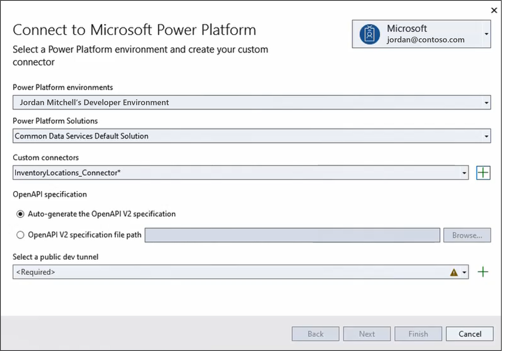](../media/create-custom-connector-visual-studio-2.png)

1. For the field **Select a public dev tunnel**, select the + icon and the following values:
    - **Name**: `devtunnel`
    - **Tunnel Type**: `Persistent`
    - **Access**: `Public`
    > [!div class="mx-imgBorder"]
    > [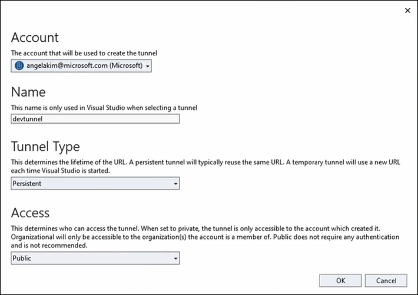](../media/create-custom-connector-visual-studio-3.png)

1. Select **OK** and **Finish**. 
    Once the connected service is configured, you may select **Close**.
    > [!div class="mx-imgBorder"]
    > [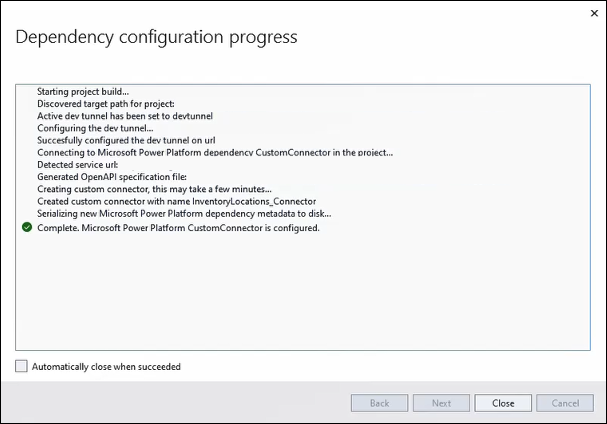](../media/create-custom-connector-visual-studio-4.png)

You have now created a custom connector for inventory locations, which leverages [dev tunnels][devtunnels] to connect your API to Power Platform. Here in the inner loop you are running your API in your local environment.

## Run your API ##

When Visual Studio runs a web app and a tunnel is active, the web browser opens to a tunnel URL instead of a localhost URL.

1. Run your Visual Studio solution and start debugging.
    > [!div class="mx-imgBorder"]
    > [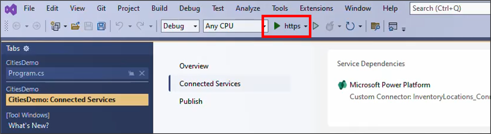](../media/create-custom-connector-visual-studio-5.png)

1. When the browser opens, a warning page opens with the first request sent to the tunnel URL. Select **Continue**.
    > [!div class="mx-imgBorder"]
    > [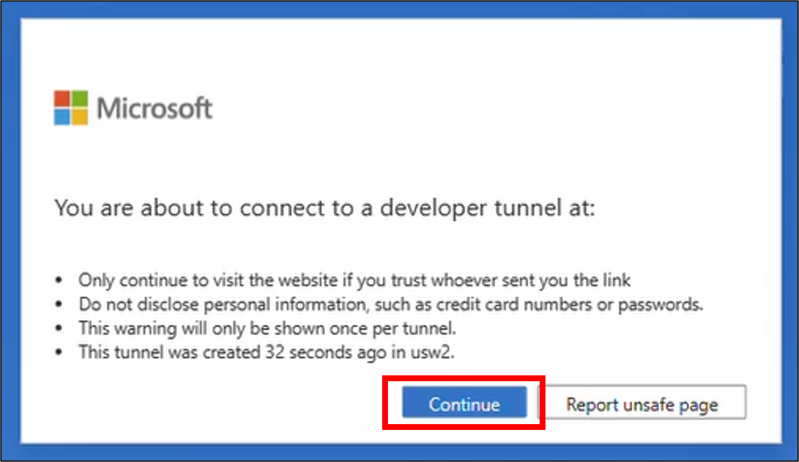](../media/create-custom-connector-visual-studio-6.png)

> [!IMPORTANT] 
> Remember to keep the API running while building your Power App.

## Create an app from the API ##

> [!NOTE]
> To use the sample app provided in this step, you will need to install [Power Platform tools for Visual Studio Code.][pptools]

1. Open Visual Studio Code and create a new authentication for your user using the Power Platform CLI command. Change the url to your developer environment URL found in the [admin center][ppac].
    ```powershell
    pac auth create --url https://yourenvironment.crm.dynamics.com
    ```

1. Get the custom connector you just created. Copy the connector ID.
    ```powershell
    pac connector list
    ```

1. Generate a canvas app (*.msapp file), based on the operations of your API. 
    ```powershell
    pac canvas create --connector-id your connector id --msapp your file name.msapp
    ```

## Preview the app ##
1. Open [Power Apps.][powerapps]
1. Select **Blank app**. From **Canvas app from blank** select **Create**.
    > [!div class="mx-imgBorder"]
    > [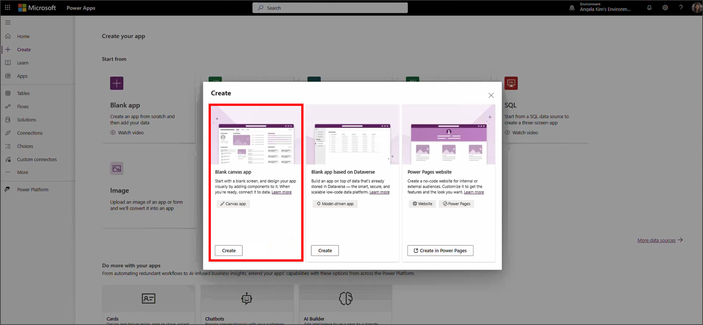](../media/create-custom-connector-visual-studio-7.png)

1. Enter the app name `Inventory app` and select **Tablet** format. Select **Create**.
    > [!div class="mx-imgBorder"]
    > [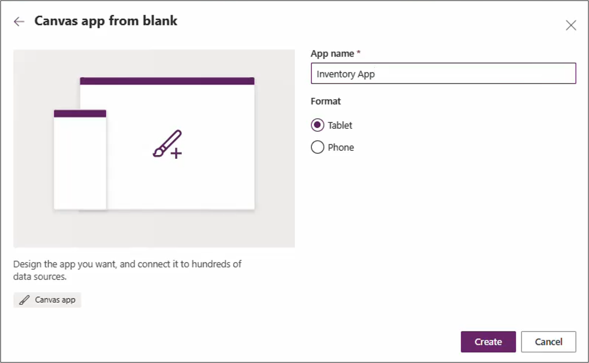](../media/create-custom-connector-visual-studio-8.png)

1. From the command bar, select **...** and **Open**.
    > [!div class="mx-imgBorder"]
    > [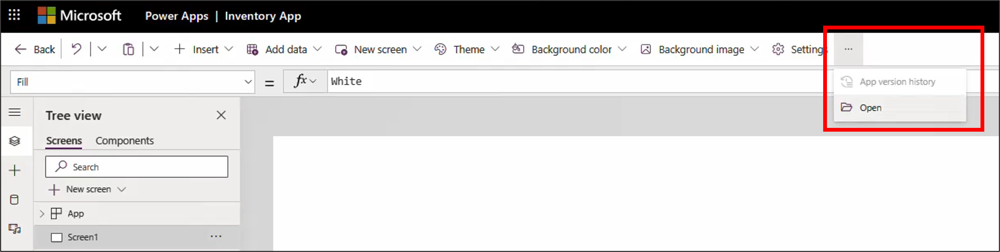](../media/create-custom-connector-visual-studio-9.png)

1. Browse to open the *.msapp file you created in Step 3. This will load your sample app in the studio.
    > [!div class="mx-imgBorder"]
    > [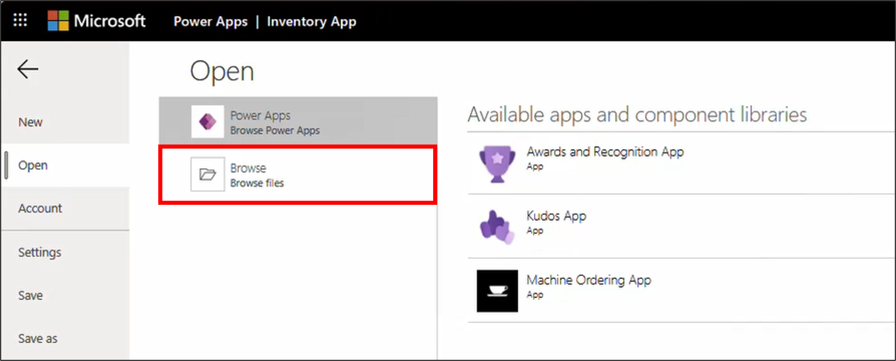](../media/create-custom-connector-visual-studio-10.png)

1. From the left bar, select the data icon and **Add data**. Search for `InventoryLocations_Connector` to select **Connect**. This is the custom connector that was created from the web API.
    > [!div class="mx-imgBorder"]
    > [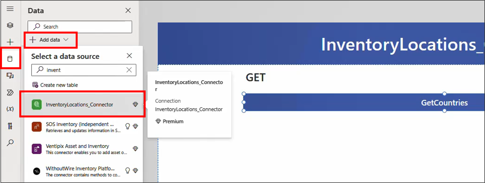](../media/create-custom-connector-visual-studio-11.png)

1. To preview this app, select the play icon.
    > [!div class="mx-imgBorder"]
    > [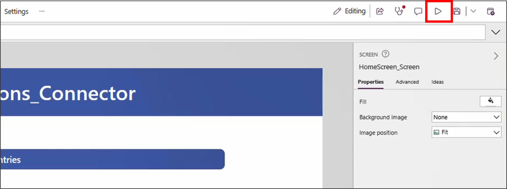](../media/create-custom-connector-visual-studio-12.png)

1. Select the **GET** app button to view a list of inventory locations.
    > [!div class="mx-imgBorder"]
    > [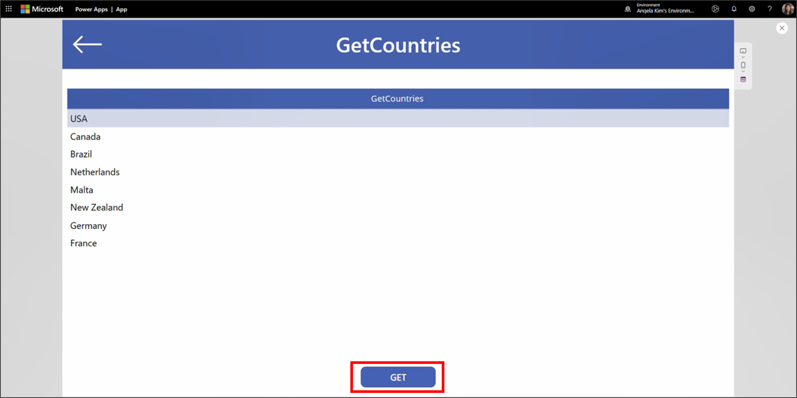](../media/create-custom-connector-visual-studio-13.png)

1. Select the close icon on the top-right of the app to return to the Studio. Click the publish icon to save your work.
    > [!div class="mx-imgBorder"]
    > [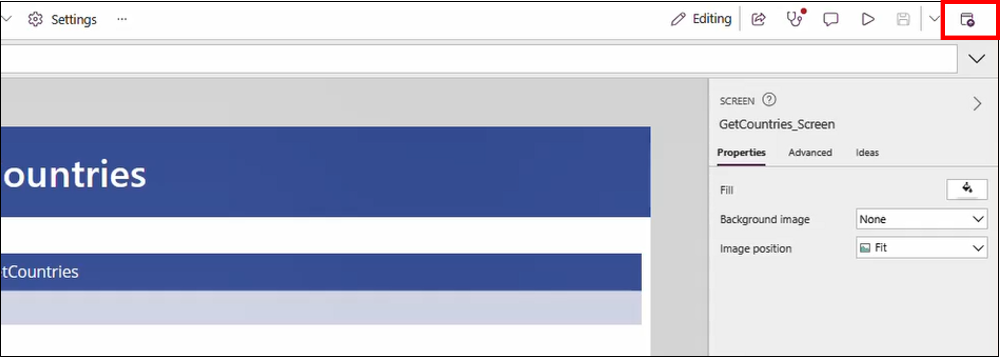](../media/create-custom-connector-visual-studio-14.png)

> [!TIP]
> - Not returning any countries from the sample API? Make sure the API is running as you build your app.
> - Since you are using dev tunnels here, you can iterate on your API in real-time, including debugging and hot reload.

You have completed creating an app and custom connector from a web API.

[samples]: https://github.com/marcelbf/CitiesDemo
[devtunnels]: /aspnet/core/test/dev-tunnels
[pptools]: https://marketplace.visualstudio.com/items?itemName=microsoft-IsvExpTools.powerplatform-vscode
[ppac]: https://admin.powerplatform.microsoft.com/environments
[powerapps]: https://make.powerapps.com/templates
