Designing for performance is an important part of the process and so is performance testing. When conducting performance testing, try to replicate in your tests where the volume of data is close to your production system. That will give you a good understanding of app performance in general and for the areas to optimize.

So how can you diagnose what's going on with your app and analyze your tests? In this unit, we'll do a more thorough introduction to some tools that are available to help you do these things.

## Monitor

### Overview

Monitor, which we introduced previously, is a tool that offers makers the ability to view a stream of events from a user's session to diagnose and troubleshoot problems. Makers of canvas apps can use Monitor either to view events while building a new app in Power Apps Studio or to monitor published apps during runtime.

### Benefits

Monitor can help you diagnose and troubleshoot problems faster and build more reliable apps. It provides a deep view of your app by logging all the key activities that occur in the app as it runs. Monitor also provides a better understanding of how the events and formulas contained in your app work, so you can improve performance and identify any errors or problems.

### Debugging an app

The key to debugging a problem is to gain a better understanding of what your app does, and how it does it. Sometimes it's difficult to isolate a problem by just looking at the app formulas, or even by reviewing runtime errors. Watching the events as they occur in your app can help you understand the order of events and how your app is performing, to spot errors and diagnose problems faster.

### Monitor dashboard

The Monitor dashboard enables you to review properties for each app event. You'll get an idea of what happens when you select a control, the duration of the process, and the outcome of the operation.

Here's an image of what the Monitor dashboard looks like, and after the image is a summary of what information each column in the dashboard contains.

> [!div class="mx-imgBorder"]
> [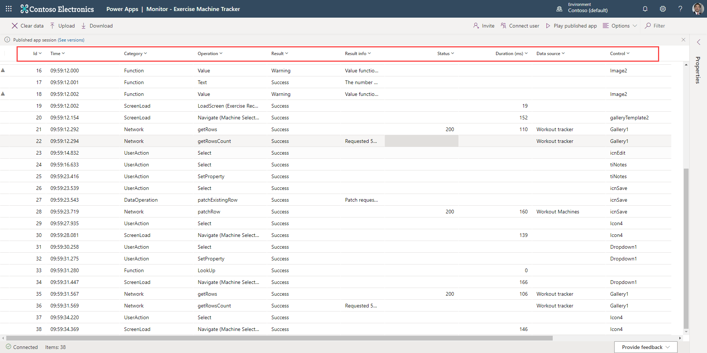](../media/monitor.png#lightbox)

### Monitor properties panel

The Properties panel is available for a selected operation. To view the panel, select **Properties** from the side rail on the right. The Properties panel has tabs portraying details about the event. Every event will have a **Details** and **Formula** tab, and if an event triggers an HTTP request/response, you'll also see tabs for **Request** and **Response**. This image depicts the **Details** tab for a SortByColumns event:

> [!div class="mx-imgBorder"]
> [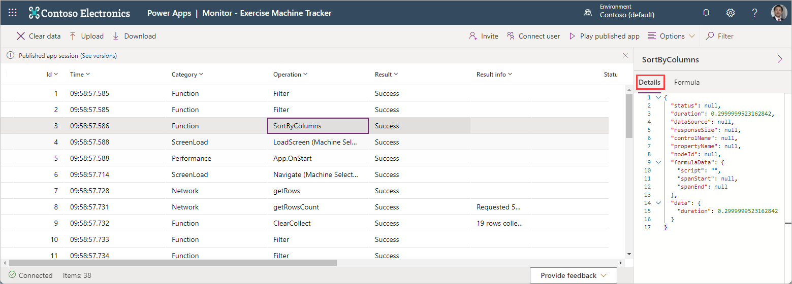](../media/details-tab.png#lightbox)

### Starting Monitor

You can activate Monitor in two ways. When you're editing a canvas app, you can open **Advanced tools**, and then select **Monitor**.

> [!div class="mx-imgBorder"]
> 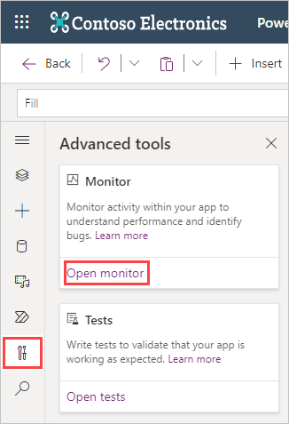

Another way to open it is by going to your Apps from the Maker portal, selecting any app, and then selecting **Details** and **Monitor** from the header ribbon.

The Monitor dashboard opens in a new browser instance, allowing you to invite or connect with users so that you can monitor their interactions with the app. Or you can select **Play published app** to enter into your own session.

> [!div class="mx-imgBorder"]
> [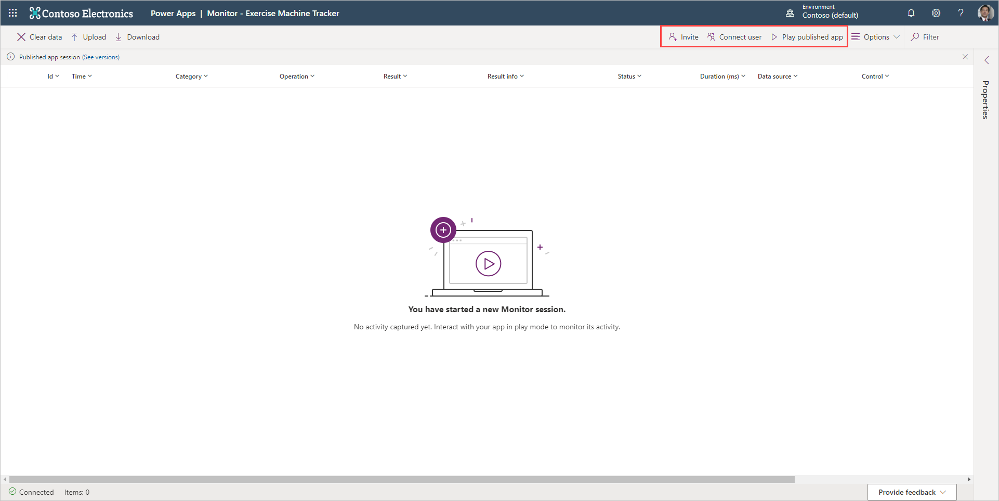](../media/monitor-buttons.png#lightbox)

Whichever option you select causes Monitor to record any interactions with the app. If you opt to **Play published app**, a visual recording indicator appears beside your app to let you know that Monitor is active.

> [!div class="mx-imgBorder"]
> 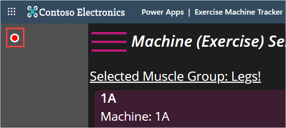

Learn more about using Monitor to debug Power Apps by consulting the available [documentation](/power-apps/maker/monitor-overview/?azure-portal=true) and a [blog post](https://powerapps.microsoft.com/blog/introducing-monitor-to-debug-apps-and-improve-performance/?azure-portal=true) on the subject.

## Introducing Power Apps analytics

To help you analyze your app, Microsoft has provided **Power Apps analytics**, a series of reports providing a view into environment level usage, errors, service performance, and change management services to users. These reports are available for your canvas apps.

If you're an environmental admin, Power Platform admin or Microsoft 365 Global admin, then you'll have access to these reports.  You can access them by signing into the Power Platform admin center and select **Analytics > Power Apps**.  Reports will appear in a menu bar at the top of the page. We'll cover the different reports available next.

> [!div class="mx-imgBorder"]
> 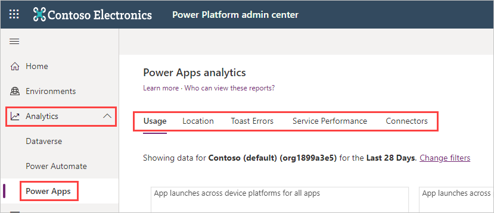

### Available reports

The **Usage** report is shown by default when logging into the admin center. It provides total app launches and daily active users across all apps in the environment. Admins can filter the view with attributes like device platform, player version, country/region, state, and city.

> [!div class="mx-imgBorder"]
> 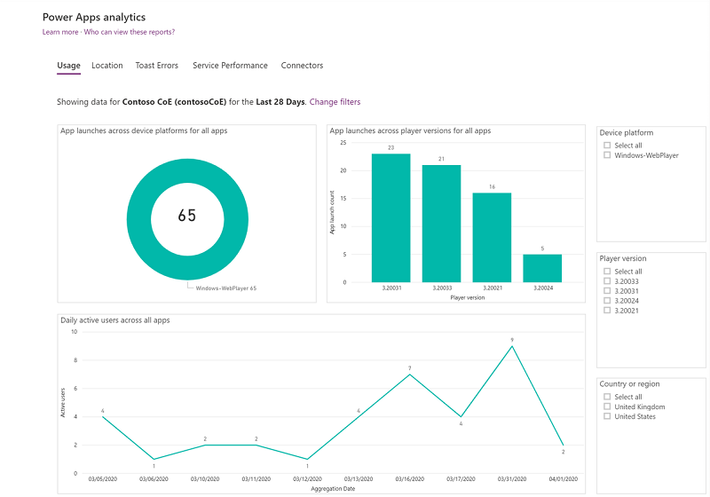

The **Location** report provides a map-based view of usage. It gives an insight into regional adoption and usage trends.

> [!div class="mx-imgBorder"]
> 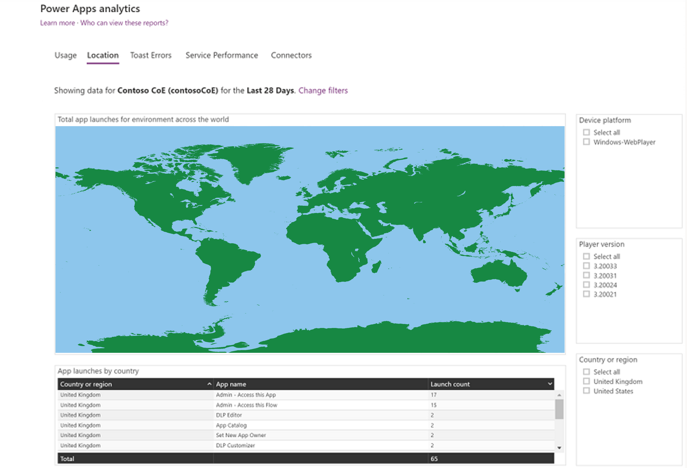

The **Toast Errors** report provides insights into the toast error trends, types, and counts per app to help drive improvements in app quality. The toast errors are errors displayed to the end users of the app.

> [!div class="mx-imgBorder"]
> 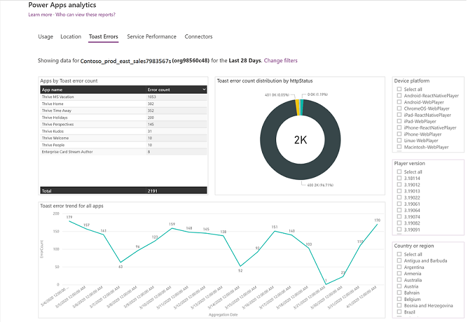

The **Service Performance** report provides details of all standard and custom connectors to understand performance bottlenecks and client versus service API issues. An environment admin will get insights into:

- Connectors used in the environment.
- Best and least performant service and the API service response times.
- Success rates for each service to determine areas that need attention.
- The 50th, 75th, and 90th percentile response times for each service.
- The number of HTTP 500 error codes of connectors indicating issues around the server not responding to calls from the client.
- The number of successful connection requests.

All the service performance KPIs can be filtered with attributes like a specific service or connector, device platform, player version, and country/region, state, or city to drill down into the specific API.

> [!div class="mx-imgBorder"]
> 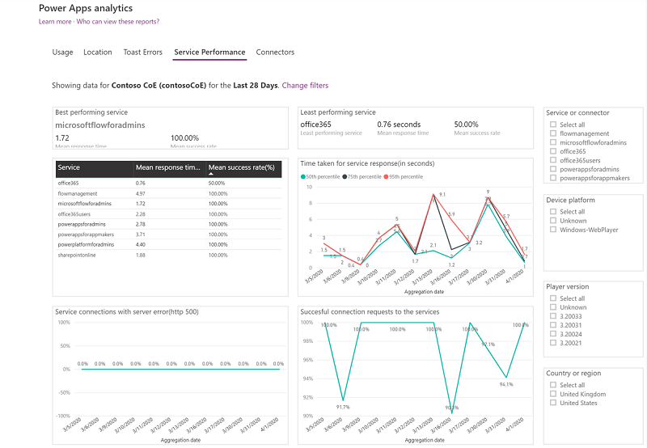

The **Connectors report** provides visibility into the standard and custom connectors being used by canvas apps. The last 28 days of data are visible at the environment level.

Admins can gain insights into the number of connectors associated with each app, the specific connectors being used by each app, and the owner of the connector. It also provides data on the number of times the app has been shared, the number of app sessions, and the last accessed time for visibility into high usage apps and connectors.

> [!div class="mx-imgBorder"]
> 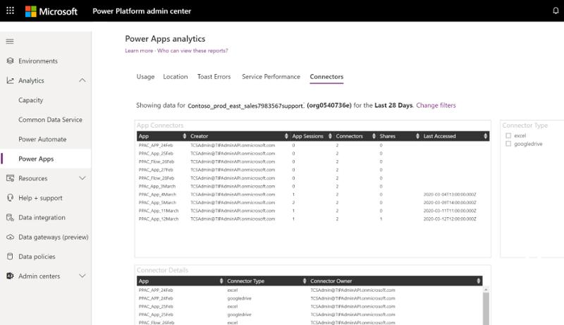

It's possible to download reports and change environments within the app. Refer to [Power Apps analytics](/power-platform/admin/analytics-powerapps/?azure-portal=true) to learn more.
