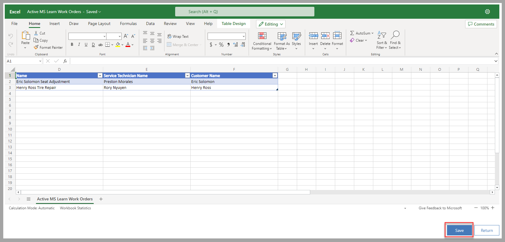
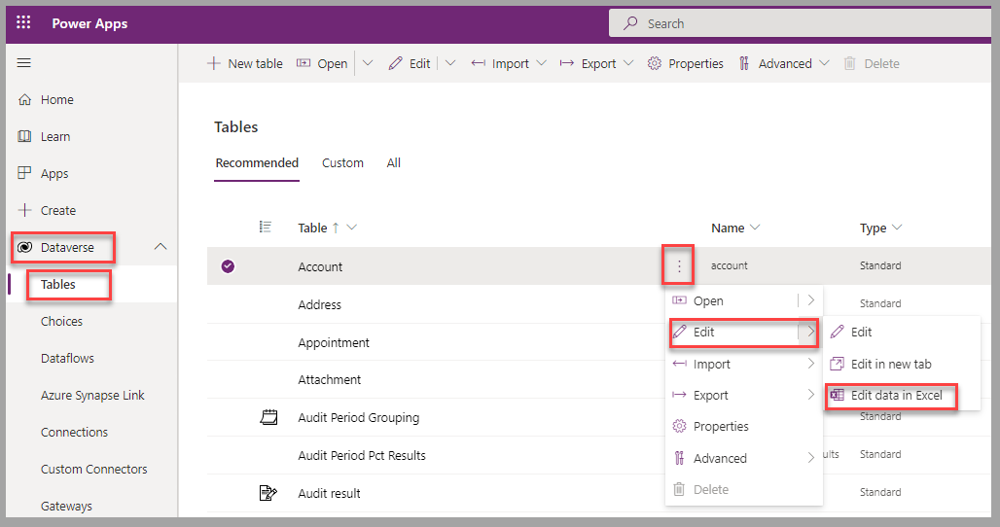
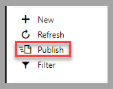

Based on the selected option for the file under **Export to Excel**, you can import the updated records back into Dataverse.

Keep the following considerations in mind when you're importing updated records into Dataverse:

- **Open in Excel Online** - You can manage the process to update the records back to Excel by using the **Save** option of that file.

    > [!div class="mx-imgBorder"]
    > 

- **Dynamic PivotTable** - Because this type of file export doesn't include the required hidden columns, you can't import by using the **Import from Excel** option.

    > [!div class="mx-imgBorder"]
    > 

- **For all other Export to Excel options**:

  - Hidden column values can't be modified.

  - Avoid new columns that have been added in the spreadsheet.

  - In general, you can use automatic mapping if column headers weren't modified.

  - If the original record has been modified between the last time when the Excel spreadsheet was exported (for static worksheets) or refreshed (for dynamic worksheets) and the time when the file is imported, an error will be generated and the record will be identified as such in the import log.

    > [!div class="mx-imgBorder"]
    > 

## Update records in Dataverse with data edited in Excel

When you're done editing the records in Excel, follow these steps to update the related Dataverse table:

1. In a model-driven app, from any view for the table to update, select **Import from Excel**.

    > [!div class="mx-imgBorder"]
    > 

1. In the displayed form, select **Choose File** to find the Excel spreadsheet that you want to import. If necessary, modify the default **Owner For Imported Records** with the appropriate user. Select **Next** to proceed to the next steps.

    > [!div class="mx-imgBorder"]
    > 

1. If rows were added in the Excel file, and if potential duplicates might be detected, select the **Duplicate Data Settings** option that's appropriate for your business scenario. To proceed with importing the file, select **Finish Import**.

    > [!div class="mx-imgBorder"]
    > 

1. In the last form for the **Import from Excel** process, select **Track Progress** to know when the records have been imported in Dataverse.

    > [!div class="mx-imgBorder"]
    > 

1. Select **OK** to confirm that you accept leaving the page to open the import log page.

    > [!div class="mx-imgBorder"]
    > 

1. Select **Refresh** a few times until the **Status Reason** for the imported file has changed to **Completed**.

    > [!div class="mx-imgBorder"]
    > 

## Use the Office Add-ins option

In some scenarios, a user might be expected to edit Dataverse records in Excel (desktop version) and to publish changes back to Dataverse directly.

This option is available when you use the **Microsoft PowerApps Office Add-in**.

Keep the following considerations in mind when using the add-in:

- Make sure that you install the add-in individually for each user.

- Validations and full lookup options are available to help ensure quality of data.

- Security permissions are applied based on the user who's connected.

- You can publish modifications, including adding new rows and deleting existing rows, to Dataverse.

- All rows and columns are visible in Excel. This option isn't available from a view in a model-driven app.

To install the add-in option in Excel, follow these steps:

1. In Microsoft Excel, under the **Insert** menu, select the **Get Add-ins** option. In the **CRM** category, select **Add** next to **Microsoft PowerApps Office Add-in**.

    > [!div class="mx-imgBorder"]
    > 

1. Review the license terms and privacy policy. If appropriate, select **Continue**.

    > [!div class="mx-imgBorder"]
    > 

1. Close Excel and then sign in to the [Power Apps portal](https://make.powerapps.com/?azure-portal=true). Select the ellipsis next to the appropriate table, and then select **Edit > Edit data in Excel**.

    > [!div class="mx-imgBorder"]
    > 

1. Open the generated Excel spreadsheet. If a notification message displays, select **Enable Editing**.

    > [!div class="mx-imgBorder"]
    > 

1. If you're not connected, select **Sign in** from the **Add-In** pane and then provide the credentials that you use to connect to Dataverse.

    > [!div class="mx-imgBorder"]
    > 

1. After modifications have completed in Excel, select **Publish** in the **Add-in** pane to update Dataverse.

    > [!div class="mx-imgBorder"]
    > 

## Next steps

You've now learned how to edit data in Excel and update the related Dataverse table. Next, you'll edit account information in Excel and visualize the modifications in Dataverse.
