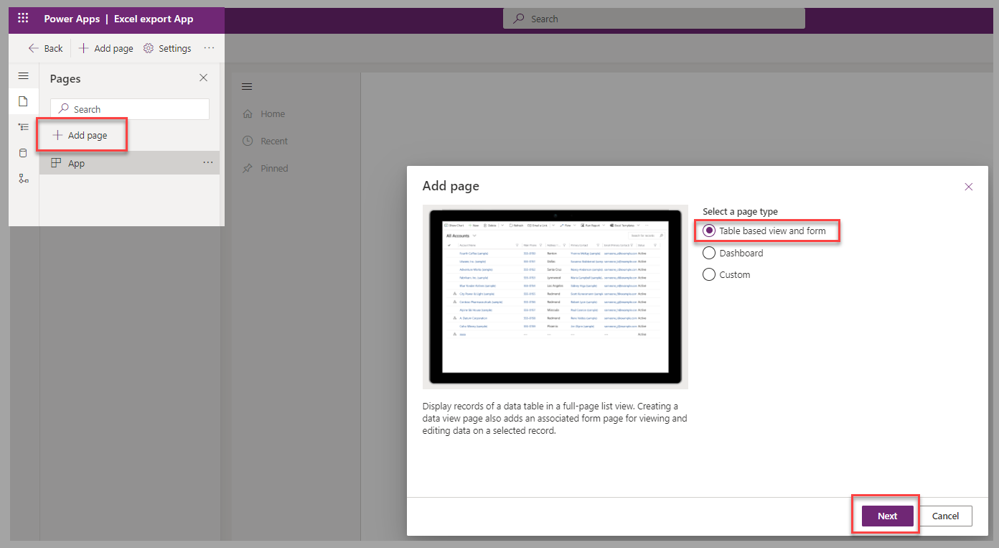

In this exercise, you'll apply your learned knowledge to create an Excel spreadsheet that will allow you to proceed with bulk validation of the data.

## Scenario

You're responsible for your organization's Dataverse environment. The marketing department manager requires validation of street addresses before they mail a new promotional brochure to potential franchise owners.

To proceed, you'll provide an Excel spreadsheet to a colleague who will use different address validation tools that are specific to different states.

## Prepare Dataverse and the data

For this exercise, data will be exported from the **Account** core table.

A model-driven app with at least one view for the **Account** table is required. If it isn't already available, you can create it by following these steps:

1. From the Power Apps portal, select **Model-driven** from the **New app** dropdown menu.

    > [!div class="mx-imgBorder"]
    > 

1. In the **Name** field, enter a name for the app and then select **Create**.

    > [!div class="mx-imgBorder"]
    > 

1. Select **Add page** in the left navigation pane and then select **Table based view and form** as the page type. Select **Next** to proceed to the next step.

    > [!div class="mx-imgBorder"]
    > 

1. In the list of existing tables, select **Account**. Select **Add** to proceed to the next step.

    > [!div class="mx-imgBorder"]
    > 

1. Finalize the creation of the app by selecting **Save** and then **Publish**.

    > [!div class="mx-imgBorder"]
    > 

Now, the application will be available so that you can proceed with this exercise in Microsoft Power Apps Studio.

If you've already gone through the **Add new accounts from a text file** exercise in the [Use Power Query to load data in Dataverse](/training/modules/use-power-query/?azure-portal=true) module, you can skip to the next section of the current exercise.

To identify accounts as potential franchise owners and import records into the **Account** table, proceed with the steps in [Exercise – Add new accounts from a text file](/training/modules/use-power-query/exercise-add-accounts/?azure-portal=true).

## Exercise

You now have a model-driven app that contains navigation to the **Account** table, which contains the column to identify the potential franchise owner. Next, you can follow these steps to export the required data to a dynamic worksheet for bulk validation:

1. Go to any available view for the **Account** table. Select **Dynamic Worksheet** as the option to **Export to Excel**.

    > [!div class="mx-imgBorder"]
    > 

1. Select the following columns to export:

    - **Account Name**
    - **Address 1: Street 1**
    - **Address 1: Street 2**
    - **Address 1: Street 3**
    - **Address 1: City**
    - **Address 1: State/Province**
    - **Address 1: ZIP/Postal Code**
    - **Potential Franchisee**

    When you're finished, select **Export**.

    > [!div class="mx-imgBorder"]
    > 

1. Open the generated Excel spreadsheet. If a notification message is displayed, select **Enable Editing**.

    > [!div class="mx-imgBorder"]
    > 

1. Depending on the security settings, you might also receive a notification message that requires you to select **Enable Content**.

    > [!div class="mx-imgBorder"]
    > 

1. The scenario requires that you filter the rows for the potential franchise owners.

    > [!div class="mx-imgBorder"]
    > 

1. To validate the addresses in bulk and specify the logical sequence, apply a sort on the **Address 1: State/Province** column.

    > [!div class="mx-imgBorder"]
    > 

## Next steps

You've now learned how to export Dataverse records to Excel and manipulate this data to complete scenarios where bulk validation might apply. Next, you'll learn how to update Dataverse after you've edited the records in an exported Excel spreadsheet.
