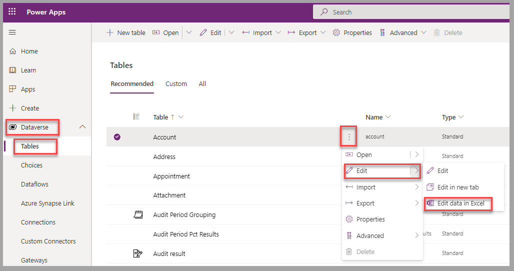
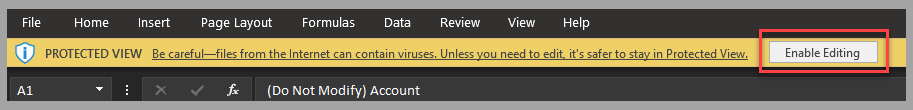
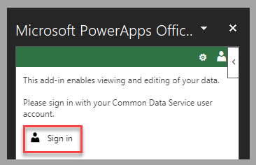
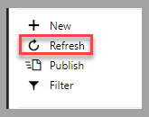
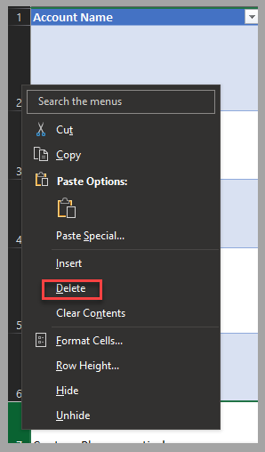
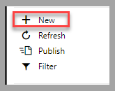
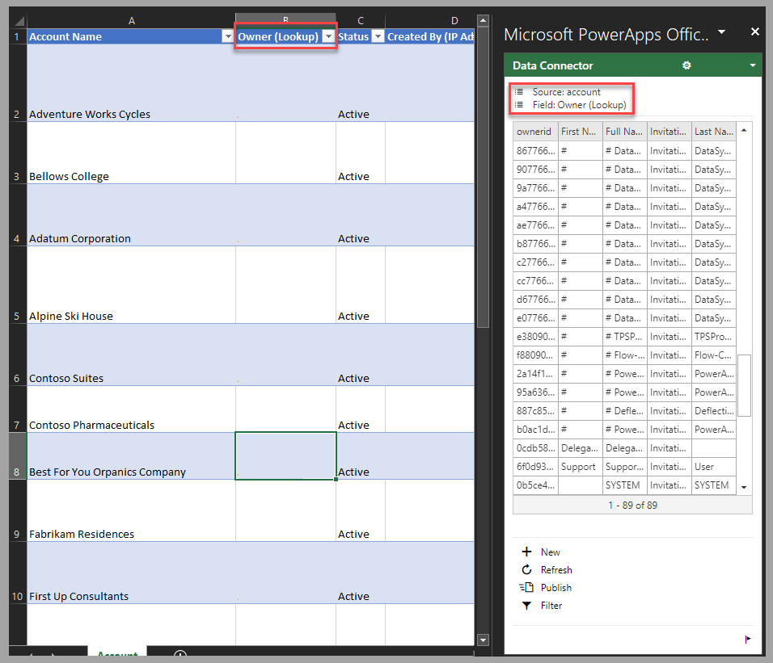
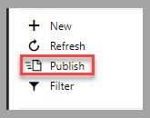

In this exercise, you'll apply your learned knowledge to edit account information in Excel and validate that modifications have been applied in Dataverse.

## Preparation

To complete this exercise, you'll need to have set up the **Microsoft PowerApps Office Add-in** for Excel, as outlined in the steps from the previous unit.

## Exercise

Follow these steps in a Dataverse environment where you can modify **Account** records, such as a dedicated training or development environment:

1. Sign in to the [Power Apps portal](https://make.powerapps.com/?azure-portal=true).

1. Next to the **Account** table, select the ellipsis and then select **Edit > Edit data in Excel**.

    > [!div class="mx-imgBorder"]
    > 

1. Open the generated Excel spreadsheet. If a notification message displays, select **Enable Editing**.

    > [!div class="mx-imgBorder"]
    > 

1. If you're not connected, select **Sign in** from the **Add-in** pane and then provide the credentials that you use to connect to Dataverse.

    > [!div class="mx-imgBorder"]
    > 

1. Records are automatically refreshed when the file is opened. Situations might occur where other users who have access to the organization's data have modified it. Therefore, you can refresh the Excel table by selecting **Refresh** in the **Add-in** pane.

    > [!div class="mx-imgBorder"]
    > 

1. Remove an account in the list by selecting the **Delete** option for the row in Excel.

    > [!div class="mx-imgBorder"]
    > 

1. Add a new account by selecting **New** in the **Add-in** pane. Enter values for columns, such as the **Account Name** and **Address** fields.

    > [!div class="mx-imgBorder"]
    > 

1. Modify an existing record by changing the value of a lookup column, such as **Owner**.

    > [!div class="mx-imgBorder"]
    > 

1. Update Dataverse with the modifications that you've made in Excel by selecting **Publish** in the **Add-in** pane.

    > [!div class="mx-imgBorder"]
    > 

Modifications will be applied in Dataverse and will be visible when you're viewing the rows for the **Account** table.

## Next steps

You've now learned how to edit data in Excel, such as account information, and you've learned how to update Dataverse directly. Next, you'll validate the learned concepts for this module.
