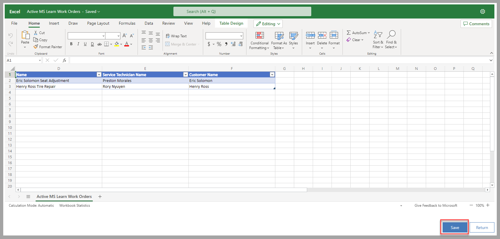
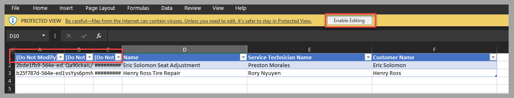
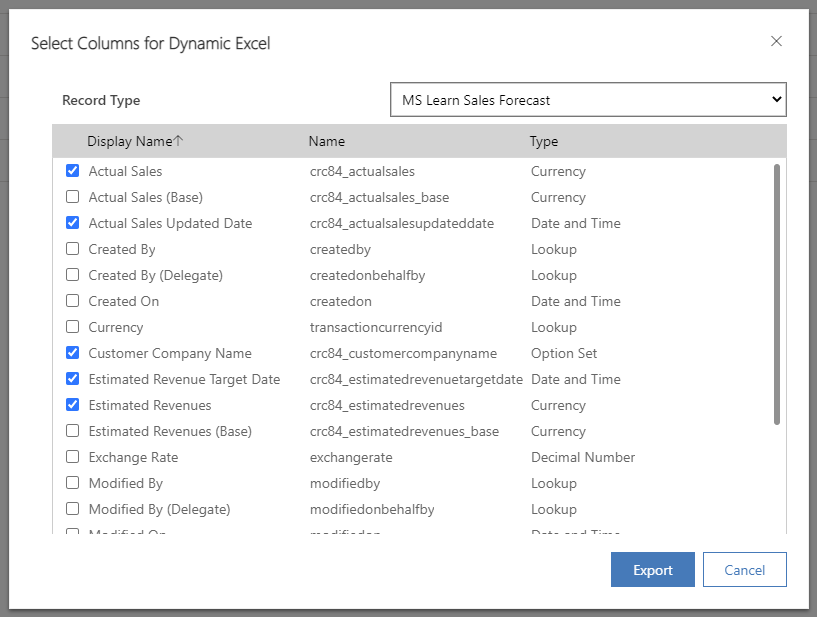
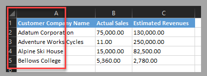

From a model-driven app, you can select a view, or you can filter rows from a view, add columns to it, and then export the records to Excel.

Different export options are available:

- **Open in Excel Online** - Opening records directly in Excel Online allows you to manipulate data.

- **Static Worksheet** - Provides a snapshot of the data and allows you to share the data with users who don't have access to Dataverse.

- **Static Worksheet (Page only)** - The same as Static Worksheet but only for the records that are visible in the current page of the view.

- **Dynamic Worksheet** - A file that is updated when opened and requires credentials that have access to the Dataverse source table.

- **Dynamic PivotTable** - The same as the Dynamic Worksheet but presented in a PivotTable format.

## Open in Excel Online

The **Open in Excel Online** option targets scenarios where a user wants to manipulate data directly in Excel with simple synchronization between the Excel spreadsheet and the source Dataverse table.

Other features of this option include:

- The rows are stored temporarily for use in Excel Online.

- Modifications from the source table are updated in this spreadsheet after a few minutes.

- Updates to Dataverse from Excel are propagated back when you select **Save**.

    > [!div class="mx-imgBorder"]
    > 

## Static Worksheet and Static Worksheet (Page only)

The **Static Worksheet** and **Static Worksheet (Page only)** options target scenarios where a user wants to share Dataverse records with users who don't have access to Dataverse, such as partners or service providers.

Other features of these options include:

- Unless the **Page only** option is selected, all rows that are applicable to the selected views will be exported (up to 100,000 rows).

- The data isn't updated after it's been exported; modifications that you make in Dataverse after the export won't be visible in the file.

- You can share the file with users who don't have access to Dataverse.

- The Excel table includes three hidden columns that you can use as a reference when importing the file to update Dataverse. Don't modify those values.

    > [!div class="mx-imgBorder"]
    > 

## Dynamic Worksheet

The **Dynamic Worksheet** option targets scenarios where a user wants to manipulate or use current and updated data for analysis in Excel.

Other features of this option include:

- The security permissions and restrictions will be applied when the Excel file is opened, based on the user's profile in Dataverse. For example, consider a scenario where you export a dynamic worksheet, where **Record A** is shown. You share this file with another user who doesn't have read access to **Record A**. That record won't be visible when this user opens the file.

- The Excel table includes three hidden columns that you can use as a reference when you import the file to update Dataverse. Don't modify those values.

- This option allows you to add or remove columns to be exported without requiring you to modify the view.

    > [!div class="mx-imgBorder"]
    > 

## Dynamic PivotTable

The **Dynamic PivotTable** option targets scenarios where a user wants to use current and updated data for analysis in Excel.

Other features of this option include:

- The security permissions and restrictions will be applied when the Excel file is opened, based on the user's profile in Dataverse. For example, consider a scenario where you export a dynamic PivotTable, where **Record A** is shown. You share this file with another user who doesn't have read access to **Record A**. That record won't be visible when this user opens the file.

- This option allows you to add or remove columns to be exported without requiring you to modify the view.

- The PivotTable isn't automatically created in the Excel spreadsheet.

- The Excel table doesn't include the three hidden columns that you can use as a reference when importing the file to update Dataverse.

    > [!div class="mx-imgBorder"]
    > 

## Next steps

You've now learned how to export Dataverse data to an Excel file. The next topic provides a scenario where you can generate an Excel file to use for bulk validation of Dataverse records.
