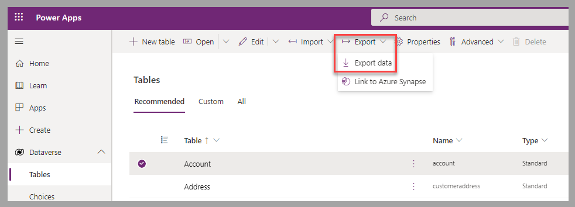
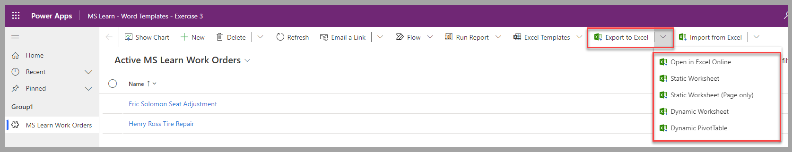

Occasionally, you could consider Microsoft Excel as the tool of choice to edit Microsoft Dataverse records. Advantages of choosing this scenario over using an app from Microsoft Power Apps might include the ability to:

- View all rows, without scrolling through pages, when a high number of records exist.

- Perform bulk editing on multiple rows in a streamlined fashion.

- Offer a focus edition for a set of data to users who don't require access to the source app.

- Provide a platform for *what if* scenarios.

- Allow data to be shared with stakeholders who don't have access to the source Dataverse environment.

## Export options

You can export Dataverse data to Excel from two main areas:

- **Power Apps portal, on a selected table** - Export all records to a zip file that contain the data in comma-separated value (CSV) format. You can reimport the file to Dataverse by using the import option with Power Query. All steps to process import rows are available in the [Use Power Query to load data in Dataverse](/training/modules/use-power-query/?azure-portal=true) module of this learning path.

    > [!div class="mx-imgBorder"]
    > 

- **From a selected view in a model-driven app from Power Apps** - Export records for different scenarios based on the requested option. The next unit will focus on these options.

    > [!div class="mx-imgBorder"]
    > 

## Next steps

You've now learned the fundamentals of how to manage Dataverse data by using Excel. Next, you'll learn about the options that will allow you to export Dataverse data to Excel.
