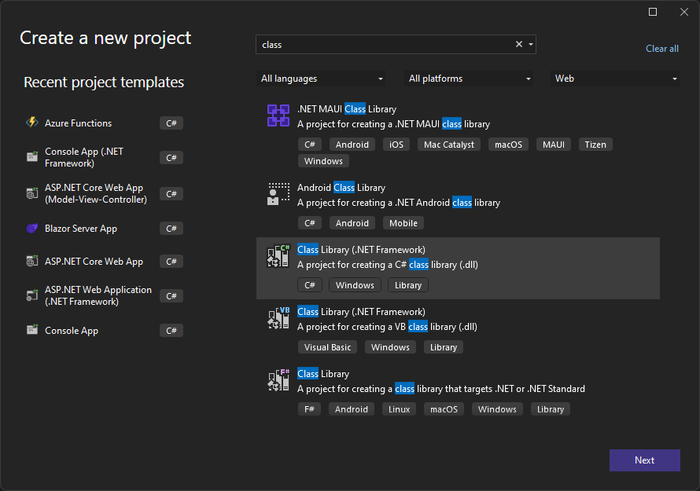

In this scenario, an organization needs to ensure that phone number data is entered in a consistent format. To achieve this objective, you'll create a plug-in to run on create/update that strips out all non-numeric characters from a phone number before saving to Dataverse. You'll then create another plug-in that will run on Contact retrieve/retrievemultiple to reformat the phone number to include parentheses and dashes, if the data exists. 

## Exercise 1: Create/update plug-in 

In this exercise, you'll create a plug-in that will run on create and update. This plug-in will strip out all non-numeric characters from a phone number.

Each exercise consists of a scenario and learning objectives. The scenario describes the purpose of the exercises, while the objectives are listed and have bullet points.

> [!NOTE]
> If you don't have the Dynamics 365 SDK tools, see [Download tools from NuGet](/dynamics365/customerengagement/on-premises/developer/download-tools-nuget) to download.

### Task 1: Create a plug-in

1. Start Visual Studio 2022.

1. Select **File > New > Project**.

1. Select **Class Library (.NET Framework)** and select **Next**.

	> [!div class="mx-imgBorder"]
	> [](../media/class-library.png#lightbox)

1. Enter **D365PackageProject** for **Project Name**, select a location to save the project, select **.NET Framework 4.6.2** for **Framework**, and then select **Create**.

	> [!div class="mx-imgBorder"]
	> [](../media/configure-new-project.png#lightbox)

1. Right-click the project and select **Manage NuGet Packages**.

	> [!div class="mx-imgBorder"]
	> [](../media/manage-nuget-packages.png#lightbox)

1. Select the **Browse** tab, search for and select **microsoft.crmsdk.coreassemblies**, and then select **Install**.

	> [!div class="mx-imgBorder"]
	> [](../media/install.png#lightbox)

1. Read the license terms and then select **Accept** if you agree.

1. Close the NuGet package manager.

1. Right-click **Class1.cs** and **Delete**.

1. Right-click the project and then select **Add > Class**.

1. Name the new class **PreOperationFormatPhoneCreateUpdate** and select **Add**.

	> [!div class="mx-imgBorder"]
	> [](../media/name.png#lightbox)

1. Add the using statements to the new class as follows:

	```c#
	using Microsoft.Xrm.Sdk;

	using System.Text.RegularExpressions;
	```

1. Make the class public and implement the **IPlugin** interface.

	> [!div class="mx-imgBorder"]
	> [](../media/public.png#lightbox)

1. Implement the interface member.

	> [!div class="mx-imgBorder"]
	> [](../media/implement-interface.png#lightbox)

    Your class should now look like the following image.

	> [!div class="mx-imgBorder"]
	> [](../media/class-example.png#lightbox)

### Task 2: Format a phone number

1. Get the execution context from the service provider. Replace the exception in the Execute method with the following snippet.

	```c#
	IPluginExecutionContext context =
	(IPluginExecutionContext)serviceProvider.GetService(typeof(IPluginExecutionContext));
	```

1. Check the input parameter for Target. Add the following snippet to the Execute method.

	```c#
	if (!context.InputParameters.ContainsKey("Target"))
	
	throw new InvalidPluginExecutionException("No target found");
	```

1. Add the following snippet to the Execute method. This snippet will get the target entity from the input parameter and then check if its attributes contain telephone1 (Business Phone for Contacts, Phone for Accounts).

	```c#
	var entity = context.InputParameters["Target"] as Entity;
	
	if (!entity.Attributes.Contains("telephone1"))
	
	return;
	```

1. Add the following snippet to the Execute function. This snippet will remove all non-numeric characters from the user-provided phone number.

	```c#
	string phoneNumber = (string)entity["telephone1"];
	
	var formattedNumber = Regex.Replace(phoneNumber, @"[^\d]", "");
	```

1. Set telephone1 to the formatted phone number. Add the following snippet to the Execute method.

	```c#
	entity["telephone1"] = formattedNumber;
	```
	The Execute method should now look like the following image.

	> [!div class="mx-imgBorder"]
	> [](../media/execute-method.png#lightbox)

1. Right-click the project and select **Properties**.

	> [!div class="mx-imgBorder"]
	> [](../media/properties.png#lightbox)

1. Select the **Signing** tab and select **New Key File**.

	> [!div class="mx-imgBorder"]
	> [](../media/new-key-file.png#lightbox)

1. Enter **contoso.snk** in the **Key file name** field, clear the **Protect my key file with a password** check box, and then select **OK**.

	> [!div class="mx-imgBorder"]
	> [](../media/key-file-name.png#lightbox)

1. Close the **Properties** tab.

1. Build the project and make sure that the build succeeds.

### Task 3: Register a plug-in and steps

> [!NOTE]
> If you don't have the Dynamics 365 SDK tools, see [Download tools from NuGet](/dynamics365/customerengagement/on-premises/developer/download-tools-nuget) to download.

1. Start the plug-in registration tool application.

1. Select **Create New Connection**.

	> [!div class="mx-imgBorder"]
	> [](../media/new-connection.png#lightbox)

1. Select **Microsoft 365,** select the **Show Advanced** check box, provide your credentials, and then select **Login**.

	> [!div class="mx-imgBorder"]
	> [](../media/login.png#lightbox)

1. Select **Register** and then select **Register New Assembly**.

	> [!div class="mx-imgBorder"]
	> [](../media/new-assembly.png#lightbox)

1. Select **Browse**.

	> [!div class="mx-imgBorder"]
	> [](../media/browse.png#lightbox)

1. Browse to the **Bin > Debug** folder of the class library that you created, select **D365PackageProject.dll**, and then select **Open**.

	> [!div class="mx-imgBorder"]
	> [](../media/open.png#lightbox)

1. Select **Register Selected Plugins**.

	> [!div class="mx-imgBorder"]
	> [](../media/register-selected-plugins.png#lightbox)

1. Select **OK**.

1. Expand the newly registered assembly.

	> [!div class="mx-imgBorder"]
	> [](../media/assembly.png#lightbox)

1. Right-click the plug-in and select **Register New Step**.

	> [!div class="mx-imgBorder"]
	> [](../media/register-new-step.png#lightbox)

1. Select **Create** for **Message** and select **contact** for **Primary Entity**.

	> [!div class="mx-imgBorder"]
	> [](../media/contact-primary-entity.png#lightbox)

1. Select **PreOperation** for **Event Pipeline Stage of Execution** and then select **Register New Step**.

	> [!div class="mx-imgBorder"]
	> [](../media/preoperation.png#lightbox)

1. Select **Close**.

1. Right-click the plug-in and select **Register New Step** again.

	> [!div class="mx-imgBorder"]
	> [](../media/step.png#lightbox)

1. Select **Update** for **Message**, select **contact** for **Primary Entity**, and then select the **Attributes** lookup.

	> [!div class="mx-imgBorder"]
	> [](../media/attributes-lookup.png#lightbox)

1. Clear the **Select All** check box, select the **Business Phone** check box, and then select **OK**.

	> [!div class="mx-imgBorder"]
	> [](../media/select-attributes.png#lightbox)

1. Select **PreOperation** for **Event Pipeline Stage of Execution** and then select **Register New Step**.

### Task 4: Test the plug-in

1. Go to your [Maker Portal](https://make.powerapps.com/) and make sure you have the correct environment selected.

1. Select **Apps** and launch the **Fundraiser** application.

	> [!div class="mx-imgBorder"]
	> [](../media/fundraiser.png#lightbox)

1. Select **Dashboard** and open one of the contacts.

	> [!div class="mx-imgBorder"]
	> [](../media/dashboard.png#lightbox)

1. Select **+ New**.

	> [!div class="mx-imgBorder"]
	> [](../media/new-contacts.png#lightbox)

1. Enter **Test** for **First Name**, **Contact** for **Last Name**, **(123)-555-0100** for **Business Phone**, and then select **Save**.

	> [!div class="mx-imgBorder"]
	> [](../media/save-contact.png#lightbox)

	The record should be saved, and the **Business Phone** should show only the numeric values.

	> [!div class="mx-imgBorder"]
	> [](../media/business-phone.png#lightbox)

1. Change the **Business Phone** to **001-123-555-0100** and wait for a few seconds.

	The record should be updated, and the **Business Phone** should show only the numeric values.

	> [!div class="mx-imgBorder"]
	> [](../media/numeric-values.png#lightbox)

## Exercise 2: Create/Retrieve multiple plug-ins 

In this exercise, you'll create a plug-in that will run on retrieve and retrieve multiple. This plug-in will add parentheses and dashes to the phone numbers.

Each exercise consists of a scenario and learning objectives. The scenario describes the purpose of the exercises, while the objectives are listed and have bullet points.

### Task 1: Create a plug-in

1. Start Visual Studio.

1. Open the project that you created in Exercise 1.

1. Right-click the project and select **Add > Class**.

	> [!div class="mx-imgBorder"]
	> [](../media/add-class.png#lightbox)

1. In the **Name** field, enter **PostOperationFormatPhoneOnRetrieveMultiple** for the class and then select **Add**.

1. Add the using statements to the new class as follows:

	```c#
	using Microsoft.Xrm.Sdk;
	```

1. Make the class public and implement the **IPlugin** interface.

1. Implement the interface member. Your class should now look like the following image.

	> [!div class="mx-imgBorder"]
	> [](../media/example.png#lightbox)

### Task 2: Format phone number for retrieve

1. Get the execution context from the service provider. Replace the exception in the Execute method with the following snippet.

	```c#
	IPluginExecutionContext context =
	(IPluginExecutionContext)serviceProvider.GetService(typeof(IPluginExecutionContext));
	```

1. Check if the message name is Retrieve or RetrieveMultiple. Add the following snippet to the Execute method.

	```c#
	if (context.MessageName.Equals("Retrieve"))	
	{
	
	}	
	else if(context.MessageName.Equals("RetrieveMultiple"))	
	{
	
	}
	```

1. Check if the output parameters contain a business entity and that it's a type of entity. Paste the following snippet inside the `if` retrieve condition.

	```c#
	if (!context.OutputParameters.Contains("BusinessEntity") && context.OutputParameters["BusinessEntity"] is Entity)
	throw new InvalidPluginExecutionException("No business entity found");
	```

1. Get the entity and check if it contains telephone1 field. Add the following snippet inside the `if` retrieve condition.

	```c#
	var entity = (Entity)context.OutputParameters["BusinessEntity"];
	
	if (!entity.Attributes.Contains("telephone1"))	
	    return;
	```

1. Add the following snippet to the `if retrieve` condition. This snippet will try to parse telephone1 as *long* and will return if the parsing doesn't succeed.

	```
	if (!long.TryParse(entity["telephone1"].ToString(), out long phoneNumber))
	
	return;
	```

1. Format the phone number by adding parentheses and dashes. Add the following snippet inside the `if retrieve` condition.

	```
	var formattedNumber = String.Format("{0:(###) ###-####}", phoneNumber);
	entity["telephone1"] = formattedNumber;
	```

The retrieve part of the Execute method should now look like the following image.

> [!div class="mx-imgBorder"]
> [](../media/retrieve-part.png#lightbox)

### Task 3: Format phone number for retrieve multiple

1. Add the following snippet to the inside of the `retrieve multiple` condition. This snippet will check if the output parameters contain BusinessEntityCollection and if it is of the type EntityCollection.

	```c#
	if(!context.OutputParameters.Contains("BusinessEntityCollection") && context.OutputParameters ["BusinessEntityCollection"] is EntityCollection)
	    throw new InvalidPluginExecutionException("No business entity collection found");
	```

1. Get the entity collection from the output parameters. Add the following snippet inside the `retrieve multiple` condition.

	```c#
	var entityCollection = (EntityCollection)context.OutputParameters["BusinessEntityCollection"];
	```

1. Iterate through each entity in the entity collection.

	```c#
	foreach (var entity in entityCollection.Entities)	
	{
	
	}
	```

1. Add the following snippet inside the `foreach` condition. This snippet will do the same thing that the `retrieve` condition is doing.

	```c#
	if (entity.Attributes.Contains("telephone1") && entity["telephone1"] != null)
	{
        if (long.TryParse(entity["telephone1"].ToString(), out long phoneNumber))
        {
            var formattedNumber = String.Format("{0:(###) ###-####}", phoneNumber);
            entity["telephone1"] = formattedNumber;
        }
	}
	```

	The retrieve multiple part of the Execute method should now look like the following image.

	> [!div class="mx-imgBorder"]
	> [](../media/retrieve-multiple.png#lightbox)

1. Rebuild the project and make sure that the build succeeds.

### Task 4: Update plug-in assembly and register steps

1. Start the plug-in registration tool and select **Create New Connection**.

	> [!div class="mx-imgBorder"]
	> [](../media/create-new-connection.png#lightbox)

1. Select **Microsoft 365**, provide your credentials, and then select **Login**.

1. Select the assembly that you registered in Exercise 1 and then select **Update**.

	> [!div class="mx-imgBorder"]
	> [](../media/update.png#lightbox)

1. Select **Browse**.

1. Browse to the debug folder of your project, select **D365PackageProject.dll**, and then select **Open**.

	> [!div class="mx-imgBorder"]
	> [](../media/assembly-file.png#lightbox)

1. Select the plug-ins and then select **Update Selected Plugins**.

	> [!div class="mx-imgBorder"]
	> [](../media/update-selected-plugins.png#lightbox)

1. Select **OK**.

1. Right-click the new plug-in and select **Register New Step**.

1. Select **Retrieve** for **Message**, select **contact** for
    **Primary Entity**, and then select **PostOperation** for **Event Pipeline Stage of Execution**. Make sure that you have **Synchronous** selected for **Execution Mode** and then select **Register New Step**.

	> [!div class="mx-imgBorder"]
	> [](../media/synchronous.png#lightbox)

1. Right-click the plug-in and select **Register New Step** again.

1. Select **RetrieveMultiple** for **Message**, select **contact** for **Primary Entity**, and then select **PostOperation** for **Event Pipeline Stage of Execution**. Make sure that you have **Synchronous** for **Execution Mode** selected, and then select **Register New Step**.

### Task 5: Test the plug-in

1. Go to your **Maker Portal** and make sure you are in the correct environment.

1. Select **Apps**. Then select the **Fundraiser** application, and then select **Edit**. You'll add the Contact table to the application.

	> [!div class="mx-imgBorder"]
	> [](../media/edit.png#lightbox)

1. Select **+ New** page.

1. Select **Dataverse table** and then select **Next**.

1. Select **Existing table**. Then select the **Contact** table, and then select **Add**.

	> [!div class="mx-imgBorder"]
	> [](../media/new-page.png#lightbox)

1. Select **Play**.

	> [!div class="mx-imgBorder"]
	> [](../media/play.png#lightbox)

1. Select **Save and continue**.

1. Select **Play** again.

1. Select **Contacts**.

1. The existing records that weren't saved with the new format won't change. Select **+ New**.

	> [!div class="mx-imgBorder"]
	> [](../media/contacts-new.png#lightbox)

1. Provide the following information and then select **Save**. The record should be saved, and the plug-in should apply the new format.

1. Select **Contacts** again. The record that you created should have the new format.

	> [!div class="mx-imgBorder"]
	> [](../media/new-format.png#lightbox)

1. Select one of the existing contacts to open it.

	> [!div class="mx-imgBorder"]
	> [](../media/open-existing-contact.png#lightbox)

1. Edit the **Business Phone**, as follows:

	> [!div class="mx-imgBorder"]
	> [](../media/edit-business-phone.png#lightbox)

1. Select **Save**. The new format should be applied. Select **Contacts** one more time.

	> [!div class="mx-imgBorder"]
	> [](../media/click-contacts.png#lightbox)

The edited phone should have the new format.

> [!div class="mx-imgBorder"]
> [](../media/format.png#lightbox)
 
