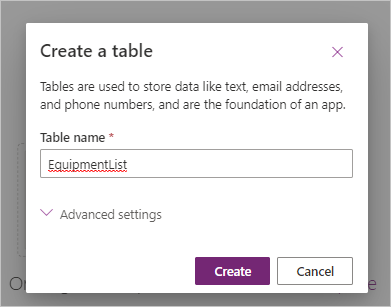
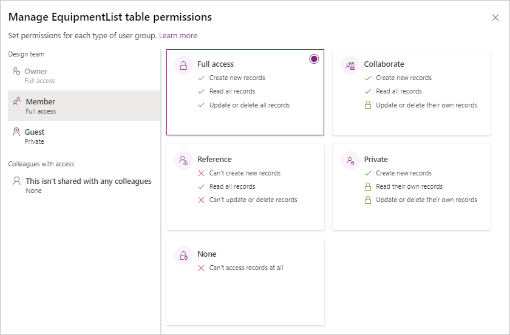

Now that you've provisioned a Dataverse for Teams environment for the team that you specified, you can begin creating solutions. Power Apps, Power Automate flows, and chatbots are ineffective without data to drive them, so the first step in this process is to create a table within your environment to store your data.

## Power Apps visual table editor

To access the Power Apps visual table editor, follow these steps:

1. While editing an app in the Power Apps editor for Teams, select the data button from the Power Apps side rail and then select the **Create new table** button.

	> [!div class="mx-imgBorder"]
	> 

1. Enter **EquipmentList** in the **Table name** field because you want the table to hold a list of equipment. Select **Create** to complete the process.

	> [!div class="mx-imgBorder"]
	> 

    After a few seconds, your table will be provisioned and will display in the visual table editor. The visual table editor enables you to quickly populate your table with the **+ New row** and **+ New Column** options.

    To exemplify the process of using the **Edit table** editor to populate your table, the following steps show how to add a **Location** column that will have two choices of **Engineering Bay** and **Testing Lab**.

1. Select **+ New column** from the header ribbon.

	> [!div class="mx-imgBorder"]
	> 

1. A **New column** pane will appear on the right side of your screen. In the **Display name** column, enter: `Location`

1. To indicate the type of data that the table will contain, Under **Data type** select **Choice > Choice**.

	> [!div class="mx-imgBorder"]
	> 

1. Now we have to define what choices we're going to use for this column. To do that, under **Sync this choice with**, select **+ New choice**. 

	> [!div class="mx-imgBorder"]
	> 

1. A **New choice** pane opens over your column editor giving you the ability to add a new list of choices. In the Display name field, enter: `Equipment location choices`. Next under **Choices** add: `Engineering Bay`, then select **+ New choice** and add: `Testing Lab`.

	> [!div class="mx-imgBorder"]
	> 

1. Select **Save** when finished, and the **New choice** pane disappears.

1. Next we need to synch our new choice with our new column. Under **Synch this choice with**, put your cursor in the field and begin entering the search term: `Equipment`. Notice that the behavior of this search field is a combo-box, where it also gives you the ability to scroll through a list of pre-existing choices but also filters the list of available options based on your entry in the field. Select your new **Equipment location choices** as the choice option.

1. Once your choice list is properly chosen and displayed you can select **Save** to complete creation of your new choice column, and automatically return to the table editor.

	> [!div class="mx-imgBorder"]
	> 

    From the table editor, you can use any of the following data types.
    
    |     Data type      | Description                                                          |
    |--------------------|---------------------------------------------------------------------|
    |     Text           |     Includes single and multiple lines of plain text, rich text, email, phone number, ticker symbol and URL                  |
    |     Number         |     Includes whole number, decimal, float, language code, duration and time zone|
    |     Date and Time  |  Includes Date and time, or Date only options              |
	|     Lookup         |     References a primary column in another table                |
    |     Choice         |     Allows people to select a choice from a list, also includes Yes/No choice options              |
    |     Currency       |   Column behavior and formatting are set to replicate currency   |
	|     Autonumber     |   Defines an autogenerated number sequence |
	|     File           |   Allows you to place an image or file in the column |
	|     Formula		 |  A preview feature that allows input of an *fx* formula into the column |

1. Next, let's add some data to our list. Select **+ New row** to add several rows to your table with data.

	> [!div class="mx-imgBorder"]
	> 

1. After you have finished editing the table, select **Close** from the bottom of the editor to return to the app. Now that you have data for the app, you can begin building your app.

## Power Apps table editor

Occasionally, you'll want to edit your table from the table editor. Though the available column types are identical, the table editor enables you to define Relationships and Views for your data.

1. To open your table in the table editor, select **Build** and then select the **See all** option.

	> [!div class="mx-imgBorder"]
	> 

1. Your display will show all of the available apps, flows, tables etc. available for this Team. Select **Tables** and then select the table you want to edit. Simply selecting the table brings up the table editor.

	> [!div class="mx-imgBorder"]
	> 

1. In the table editor, just like we did previously, you can add columns and data to your table via the **columns and data** pane at the bottom of the screen. Take a moment to look at the other columns, which have been created with your table by selecting the **+N more** button (where "N" is an integer). You'll see checks placed by the columns that are currently displayed and some others that you could display simply by selecting the checkbox next to the column. With the "EquipmentList" table we created, let's select our **Location** column and then **Save**.

	> [!div class="mx-imgBorder"]
	> 

	Now you should see your **Location** column displayed in your table.

1. The table editor also allows you to drag and drop columns to reorder them. Select your **Location** column and drag it to the left of the **Created On** column so that your list looks similar to this:

	> [!div class="mx-imgBorder"]
	> 

## Management interface overview

Now that you've provisioned your environment and have created a table with columns of your choosing, you can set administrative settings on your table. Dataverse for Teams includes a management interface for you to complete that task, if you're a team owner. Members of a team can't change the permissions.

1. While editing your table within Power Apps **Build**, select **Manage Permissions** from the ribbon menu. This option doesn't appear if you aren't a team owner.

	> [!div class="mx-imgBorder"]
	> 

1. On the **Manage permissions** pane that appears on the right side of your screen, you can define different levels of access to your table and its data. Different privilege levels are available for the team and colleagues who have this table shared with them.

	Five different permission options include:
	
	- **Full access** - Allows users and groups full access to create new records, read all records, and update or delete records. This level of access should only be granted to users who need full control over the data.
	
	- **Collaborate** - Allows the creation of new records and the ability to read existing records, but it denies the ability to update existing records or delete them unless they were created by the user. This level of privilege is beneficial for typical users who shouldn't have administrative level access over the data that they're connecting with, but who still need the ability to create new records in the table and edit or delete records that they created in the past. This level of privilege is the most commonly assigned for most use cases.
	
	- **Reference** - Allows the assigned user or group the ability to read all records from the table but not to interact with the data in any other way. For example, this level of privilege is useful for look-up tables where an administrator should define the data that exists while the users should only be able to read from it as a reference for their work.
	
	- **Private** - A unique privilege level because it allows the users or groups to create new records in the table (which **Reference** doesn't), but it doesn't allow users or groups to read records that weren't created by them. It also allows the user or group to update and delete their own records, but not records that were created by other users. This level of privilege is best used in situations where sensitive information is held within the table that shouldn't be exposed to typical users.
	
	- **None** - Denies access entirely; the user or group can't view or modify records within the table and they can't delete them.
	
	All levels of privilege can be assigned to either users or groups, depending on your requirements. It isn't uncommon to add guest users to a team, and those users might need to have a different level of access than internal organization users. For this reason, the **Manage table permissions** section will allow you to manage members separately from guests.

	> [!div class="mx-imgBorder"]
	> 

1. Try selecting one of the Design team categories (or users/groups under the Colleagues section, if available) and changing the level of access. If your team has multiple owners, the **Owners** option will be visible, and you can define access for those users as well. In the preceding screenshot, members of the team have been granted **Full access**. With any changes you make, select **Save** to continue.

Congratulations, you've now successfully created a data table in Dataverse for Teams, added columns to your table, used the table editor, and managed the table permissions. Let's do a quick knowledge check to confirm what you've learned.