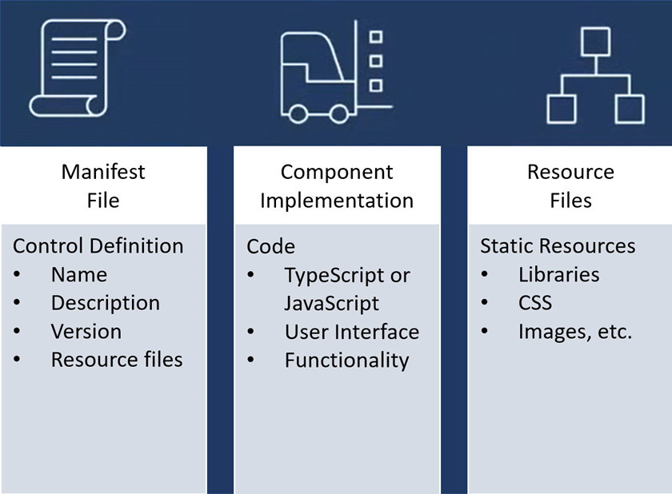
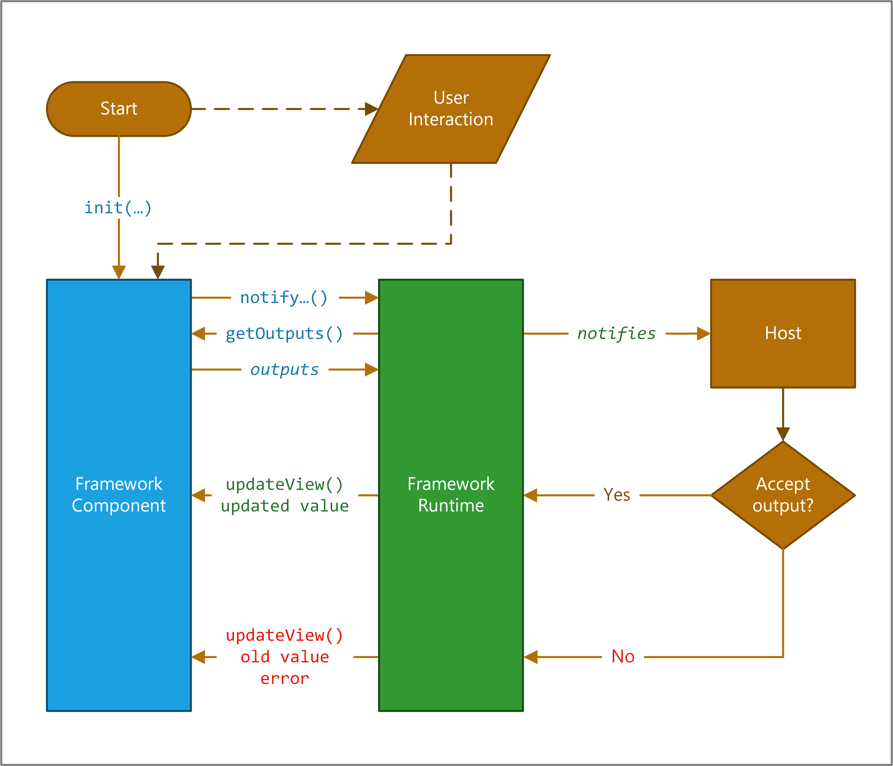

You can implement code components using HTML, CSS, and TypeScript. While you aren't required to use any particular UI Framework, [React](https://reactjs.org/?azure-portal=true) and [Fluent UI](https://developer.microsoft.com/fluentui#/) are popular choices.

## Component composition

The following image shows the three key areas of a Power Apps component: a manifest input file, its implementation, and any other resource files that the component might need.

> [!div class="mx-imgBorder"]
> 

A manifest is used to identify any properties that are available for use by the application hosting the component. When app makers use the code component, they can statically set a value for the properties. Or they can dynamically bind it to one of the available data columns in the application. Properties allow the application and the component to communicate about data without the app having to understand the implementation of the component.

When you create a component, your code needs to implement an interface that provides a consistent way for the hosting app to interact with your component. Your code component accomplishes this by implementing the **StandardControl** interface.

`export class FirstControl implements ComponentFramework.StandardControl<IInputs, IOutputs> {}`

## Power Apps component life cycle

When you develop a component, you implement all or some of the **StandardControl** interface methods in the following table depending on your component requirements. These methods allow the hosting runtime to manage the life cycle of the code component.

| Method     | Description                                                  |
| ---------- | ------------------------------------------------------------ |
| **init**     | Required. Use this method to initialize the component instance. Components can kick off remote server calls and other initialization actions in this method. You can't initialize dataset values with this method; you must use the updateView method. |
| **updateView** | Required. This method is called when any value in the component’s property bag has changed. If you started any load data requests in the init method that might not be finished, your code must handle this state and provide a visual loading indicator. |
| **getOutputs** | Optional. Called by the framework before the receipt of new data. Use this method when dynamically managing bound properties in a   control. |
| **destroy**  | Required. Invoked when the component is to be removed from the DOM tree. Use the destroy method for cleanup and release any memory the component uses. For example, if you're using React, use ReactDOM.unmountComponentAtNode inside the destroy method. This prevents any performance issues caused by code components being loaded and unloaded within a given browser session.|

These methods are invoked through a framework runtime process in a standardized life cycle, as shown in the following illustration.

> [!div class="mx-imgBorder"]
> 

At the top of the image, the framework calls your component's **init()** function. If your component is interactive, you also need to notify the host that the component's output has changed by calling the **notifyOutputChanged** method.

The framework runtime then calls the **getOutputs** method to get values for all bound properties of your component.

The runtime then notifies the host, which validates the output. If the output is valid, it calls the **updateView** method on your component. If it isn't valid for whatever reason (for example, a business rule found the new output invalid), it calls your **updateView** method and passes the old value along with an error message. In either scenario, your component can update the user interface and display an error message if appropriate.
