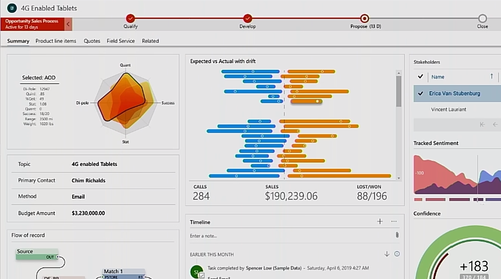

Microsoft Power Apps component framework enables you to create reusable code components that you can use within your Power Apps applications and Power Pages websites. The component framework empowers developers to build code components when the out-of-the-box components don't fit an app maker's needs. Code components are visual controls that help you create a custom user experience. These components can also include business logic that complements the visualization to enforce rules unique to the scenario you're implementing.

For example, an existing app detail form might resemble the following image.

> [!div class="mx-imgBorder"]
> 

However, if you reconfigured your app to use custom code components, your app might look something like the following image.

> [!div class="mx-imgBorder"]
> 

Before the Power Apps component framework existed, you would have used HTML web resources to provide any custom presentation to an app's form. Now, you can use a more modernized framework that allows you to expose capabilities to your app that would otherwise be impossible to access or, even worse, be unsupported by Microsoft.

## Power Apps component framework advantages

Power Apps components are built on top of a robust framework that supports modern web practices. As a result, a few of the advantages are:

- Access to a rich set of framework APIs that expose capabilities like component lifecycle management, contextual data, and metadata.

- Support of client frameworks such as React and AngularJS.

- Seamless server access through Web API, utility and data formatting methods, and device features like camera, location, and microphone.

- Optimization for performance.

- Reusability.

- Use of responsive web design principles to provide an optimal viewing and interaction experience for any screen size, device, or orientation.

- Ability to bundle all files into a single solution file with other app resources.

## Types of components that you can create

- **Field** - A custom control for a field on a form. For example, you could use a custom code component to render a slider instead of a simple text box to input a number. The slider could have custom business logic that limited the stops on the slider based on other data available and bound to the component.

- **Dataset** - A custom control to display rows of data. For example, you could build a daily scheduler code component instead of a common grid with rows and columns to display today's appointments. The code component could include features like drag and drop to reschedule appointments.

## Creator Kit components

The Power Platform Creator Kit is a collection of several commonly used Power Apps component framework controls. Additionally, the kit includes a set of templates and other utilities to help improve developer productivity. All of the components included use the [Fluent UI framework](https://developer.microsoft.com/fluentui/?azure-portal=true) to provide consistency. These components can be ready to use or provide inspiration for code components you might build. You can find all the source code for the components on [GitHub](https://github.com/microsoft/powercat-creator-kit/?azure-portal=true).

## Community components

The Power Apps community has been active in building open-source code components and sharing them with others. For example, validating user input against a regular expression is a common requirement. You could write client script to perform this validation or even write and use your own Power Apps code component. But it might be beneficial for you to check if someone else has already solved this problem for you. Numerous samples can be found at [PCF Gallery](https://pcf.gallery/?azure-portal=true).

## Where to find help

If you encounter areas where you need assistance, the best place to start is the [Power Apps component framework, ALM & Pro Dev community forum](https://powerusers.microsoft.com/t5/Power-Apps-Component-Framework/bd-p/pa_component_framework/?azure-portal=true). There, you can find a wealth of questions and answers on a wide variety of topics, and you can submit your own questions as well.
