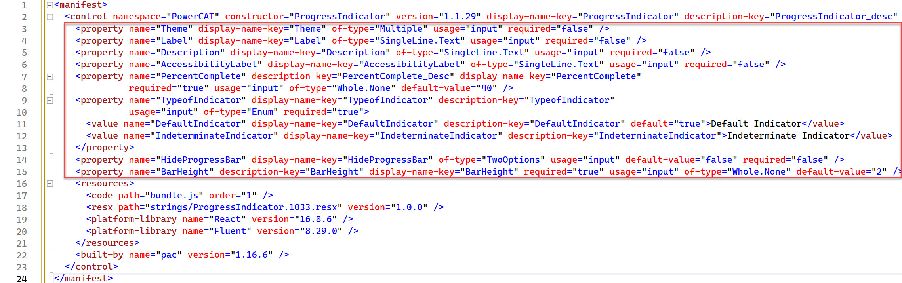
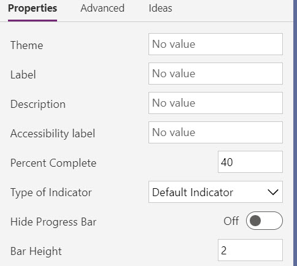

Configuring the component manifest is an essential step in building a code component. The ControlManifest.Input.xml file is initialized with some of your choices, like name and type of component, when you use the pac pcf init command. You must still customize the file to specify any properties and resources you're using and to enable any of the framework's features that you use in the component.

## Component properties

Properties define a contract between the code component and the hosting application. They should abstract the maker from how you implement the component but still provide configurable capabilities for the maker using the component. The following are some of the common types of properties you might need to add properties to a component:

- Allow business data to pass into and from the code component. For example, by passing a geolocation into the component, the component could show a map highlighting a specific location.
- Allow controlling component features and behaviors. For example, using our map example, a property could be added that indicates if the user can zoom in or out on the map.
- Allow some aspects of the component style to be customized. For example, on the map, the component might allow you to customize the pin color by providing a property the maker can configure.

The following screenshot is an example manifest showing the properties defined for a progress indicator component.

> [!div class="mx-imgBorder"]
> [](../media/progress-manifest-properties.jpg#lightbox)

When a maker configures a code component, the properties defined in the manifest are available for configuration. This image shows how the above manifest for a progress indicator component is shown to a maker in the application designer. It allows them to see the available properties and customize them.

> [!div class="mx-imgBorder"]
> [](../media/progress-properties.jpg#lightbox)

### Property attributes

There are a [number of](/power-apps/developer/component-framework/manifest-schema-reference/property?azure-portal=true#properties) attributes on a property you can configure depending on your needs. The following are the more common ones you should consider:

- **of-type** - This attribute defines the data type of the property. There are many types to choose from, like **SingleLine.Text** to **Enum**. Some types, like **Enum** offer a more rich configuration experience for the maker by providing a fixed list to select from. Others limit the data content based on the type that can pass from the hosting app. Some are more appropriate for data binding, like **Lookup.Simple**. Always try to avoid changing data types once you have published your component.

- **usage** - This attribute identifies if the property is input, output or bound. This is for model-driven apps. The bound option expects to have a table data column associated to provide the data value.

- **required** - Indicates if a value for the property is required. If adding new properties after a component is published, consider the impact of making the property required on existing apps that use the component.

- **default-value** - This attribute has the default value provided to the component. In model-driven apps, this property is only allowed on properties with a usage type of input. Providing a default value can be helpful to makers to provide an idea of how you intend the property to be set. When you add a new property to an existing component, the default value is often set to the value the component used before it became configurable via the property.

As you evaluate the properties you plan to add, here are a few things to consider:

- Avoid having too many properties on your component, requiring  the maker to navigate a long list of options.
- Use names for properties that are clear. When possible, provide enough details in the description to inform the maker on its purpose.
- Consider adding some properties to allow makers to style your component. These properties can be important when you might use the component in a wide variety of applications.
- Avoid renaming or removing properties after you publish your component, as these will be a breaking change for existing consuming apps.

## Component resources

The resource node in the manifest identifies the resource files that the component requires. In a new component, this initially only contains the required **code** element. You can add other resources your component depends on. The most common are **css** and **resx**.

The **css** element allows you to identify a CSS (Cascade Style Sheet) file that should be loaded. You can optionally specify an order to load them in if you have multiple. The following code is an example of loading two CSS files.

```css
<css path="css/ComponentCommon.css" order="1" />
<css path="css/ProgressIndicator.css" order="2" />
```

The **resx** node in the manifest identifies the file used to manage the localized strings you define. If you're going to localize, it's easier to add this on a new component and update as you add properties. Properties in the manifest value of the display-name-key and description-key attributes are used to look up the localized value if it can be located in a loaded **resx** resource file.

For example, review the following property definition and how those attributes are defined.

```xml
 <property name="PercentComplete" description-key="PercentComplete_Desc" display-name-key="PercentComplete" required="true" usage="input" of-type="Whole.None" default-value="40" />
```

In a **resx** file, which is an XML file that uses the Microsoft ResX Schema, you would define the following data elements for the property keys.

```xml
<data name="PercentComplete" xml:space="preserve">
        <value>Percent Complete</value>
</data>
<data name="PercentComplete_Desc" xml:space="preserve">
        <value>Percent Complete is the current value for how much has been completed.</value>
</data>
```

You would then create a separate **resx** file for each language you support.

Next, in your manifest resource node you would add the following **resx** nodes to load the files when the component is used.

```xml
<resx path="strings/ProgressIndicator.1033.resx" version="1.0.0" />
<resx path="strings/ProgressIndicator.1035.resx" version="1.0.0" />
<resx path="strings/ProgressIndicator.3082.resx" version="1.0.0" />
```

## Component feature usage

The framework's device, utility, and WebAPI features are available for use by components that you use in a model-driven app. To use one of these features, you must declare it in the manifest in the feature-usage node by adding a uses-feature node. The following code is an example of enabling the use of the WebAPI feature.

```xml
<feature-usage>
    <uses-feature name="WebAPI" required="true" />
 </feature-usage>
```
