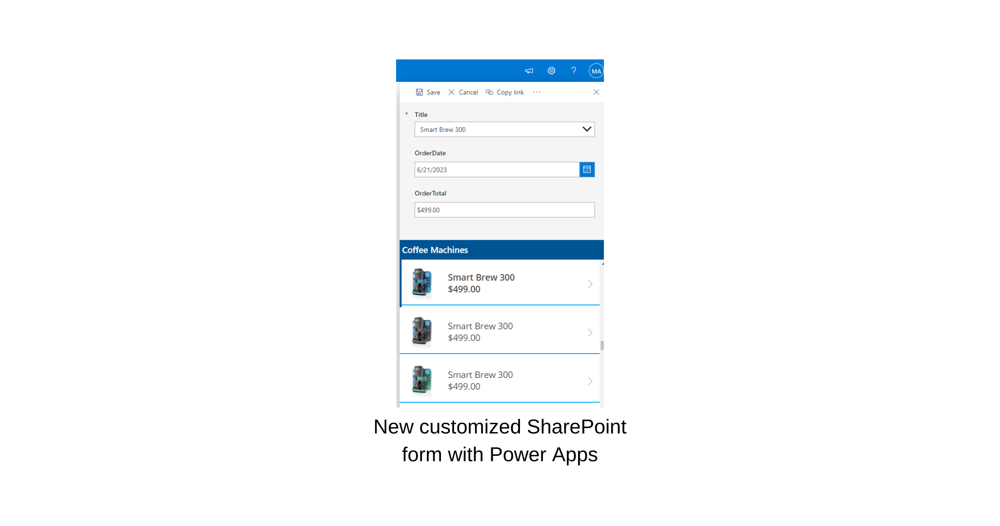
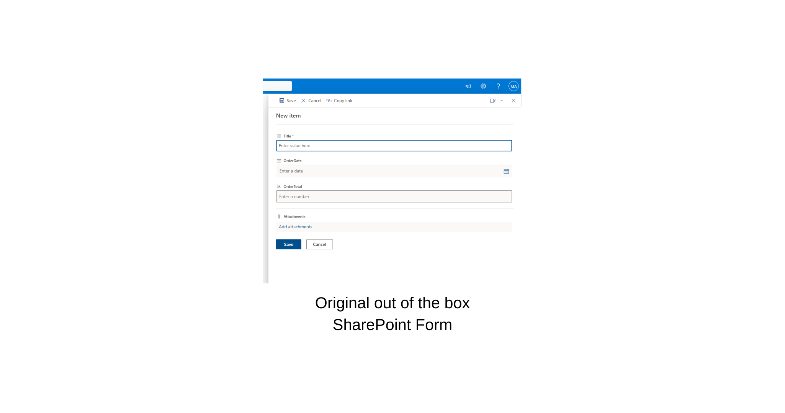
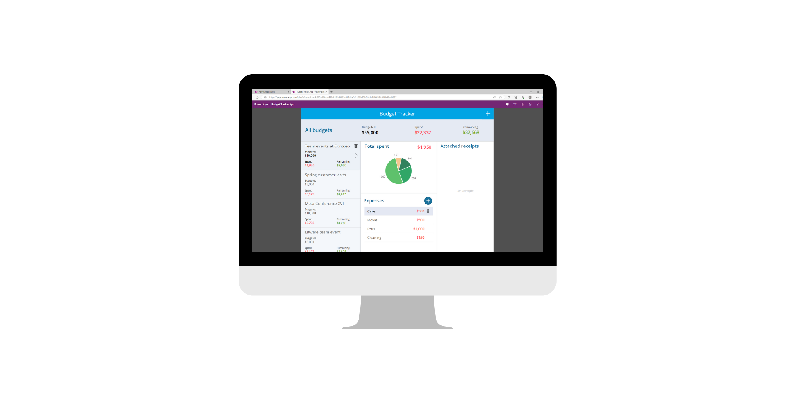
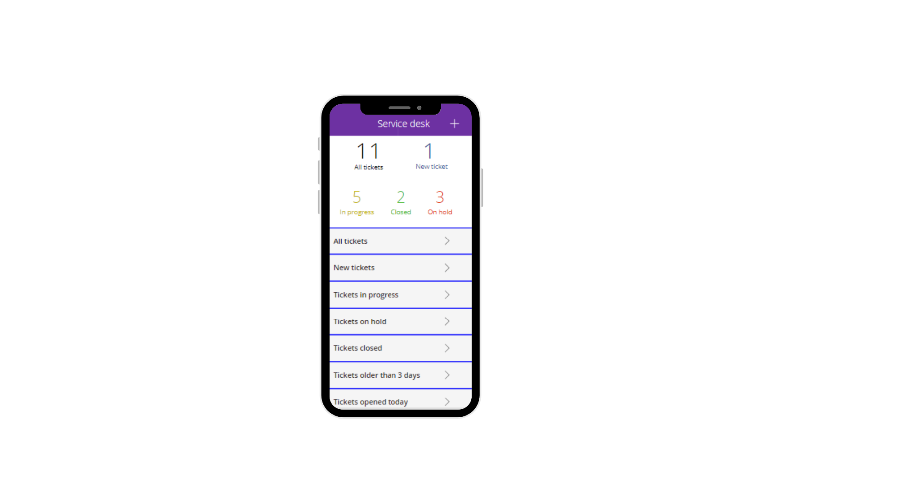

## SharePoint vs. Dataverse

SharePoint and Microsoft Dataverse (formerly known as Common Data Service) are data storage options for Power Apps. SharePoint is well-suited for document management, collaboration, and content-centric applications. It provides a familiar interface if you're already accustomed to SharePoint's capabilities. Conversely, Dataverse offers a more structured and scalable data model, which is more suitable for building complex business applications with the following components:

- Advanced relationships

- Data validation

- Security requirements

SharePoint and Dataverse offer robust security features, but they differ in their focus and implementation. The SharePoint security model primarily revolves around securing sites, lists, libraries, and content within a hierarchical structure (such as your existing Microsoft Office 365 groups or departments). Contrarily, Dataverse's security model focuses on securing individual records within tables/entities, providing fine-grained, row-level control over data access.

Make sure that you carefully plan and set up security settings in SharePoint and Dataverse to ensure that your data and resources are protected in accordance with your organization's requirements and compliance standards.

## Licensing

> [!NOTE]
> Dataverse is a Power Apps Premium connector. Using Dataverse in your Power Apps applications might require extra licensing or subscription beyond your basic Power Apps license. Premium connectors have licensing costs that are associated with them, and using them in your Power Apps applications will require that everyone whom you share that app with also has a premium license. However, SharePoint is part of your normal Power Apps license and doesn't require extra cost, which might be the strongest reason why you might consider using SharePoint with Power Apps.

If your company is a part of Government Community Cloud (GCC), GCC High, or Department of Defense (DoD), refer to this documentation regarding the differences in the [US Government Microsoft Power Platform](/power-platform/admin/powerapps-us-government/?azure-portal=true).

## Control of data source

Power Apps offers seamless integration with SharePoint as a data source. You can connect to SharePoint lists and libraries, retrieve data, and perform actions on them within your Power Apps applications. If you need to make changes to a column or row of data, refresh the SharePoint data source in your Power Apps application, and then the change is immediately visible. This integration allows for a balanced user experience and gives you control over the data source, ensuring data consistency and reliability.

## Examples of Power Apps with SharePoint

SharePoint and Power Apps are complementary in the following ways:

- **Custom forms** - You can use Power Apps to build custom forms for SharePoint lists and libraries, providing a more user-friendly and tailored interface for data entry and manipulation.

  > [!div class="mx-imgBorder"]
  > 

  > [!div class="mx-imgBorder"]
  > 

- **Workflow automation** - With Power Apps, you can create custom workflows that automate business processes that involve SharePoint. For instance, you can design approval workflows, notifications, or reminders that trigger based on specific conditions or events within SharePoint.

- **Data visualization** - You can use Power Apps to fetch SharePoint data and create interactive visualizations, such as charts, graphs, and dashboards. This feature helps you gain valuable insights and present data in a more intuitive and informative manner.

  > [!div class="mx-imgBorder"]
  > 

- **Mobile apps** - You can build mobile apps with Power Apps that connect to SharePoint, providing on-the-go access to SharePoint data and functionality. This feature empowers users to stay productive and access critical information from their mobile devices outside the office.

  > [!div class="mx-imgBorder"]
  > 

By combining Power Apps and SharePoint, you can enhance collaboration, automate workflows, create tailored interfaces, and enable mobile access, ultimately improving productivity and efficiency within your organization.
