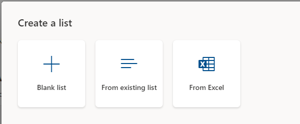
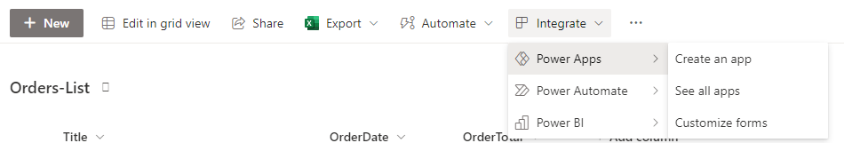
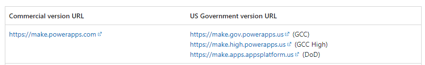

You can create a Power Apps application from SharePoint in multiple ways. However, you might first need to create a data source for your app, such as a list.

1. On your desired SharePoint home page, select **New > List**.

1. You can choose from any of the following options:

   - **Blank list** creates an empty list where you can add your own columns.

   - **From existing list** copies the structure from another list that you have access to and then creates a new list with that same structure.

   - **From Excel** helps you import an Excel table into SharePoint and then creates columns and data from that table.

   > [!div class="mx-imgBorder"]
   > 

For a sample Excel workbook that you can download and import, go to the [Machine Order Data](https://github.com/MicrosoftDocs/mslearn-developer-tools-power-platform/blob/master/power-apps/machine-order-data/Machine-Order-Data.xlsx) Excel file.

## Create apps

After you've created your SharePoint list, you can choose from several different options to create a corresponding Power Apps application.

> [!div class="mx-imgBorder"]
> 

1. On the SharePoint list, select **Integrate > Power Apps > Create an app**.

1. Enter a name for your app and then select **Create** to create a predesigned app that's already connected to your list. You can use this app to quickly add, edit, or delete existing records.

1. Add features or design elements that you want into this app.

Alternatively, on the SharePoint list, select **Integrate > Power Apps > Customize forms** to go directly to the Power Apps editor. By using this method, you can quickly customize the form that's associated with that SharePoint list. Then, when you add or edit an item directly on the list, SharePoint uses this custom design instead of your own creation.

Go to [https://make.powerapps.com](https://make.powerapps.com/?azure-portal=true) (`make.us.powerapps.gov` for GCC), select **Create** on the left, select **Blank app**, select **blank canvas app**, and then enter a name and format. This step creates a blank canvas for you to design an app however you want. Your only task is to connect the app to your SharePoint list, and then your options are almost limitless.

If your company is part of GCC, GCC High, or DoD, the URLs for Power Apps differ, as shown in the following image.

> [!div class="mx-imgBorder"]
> 
